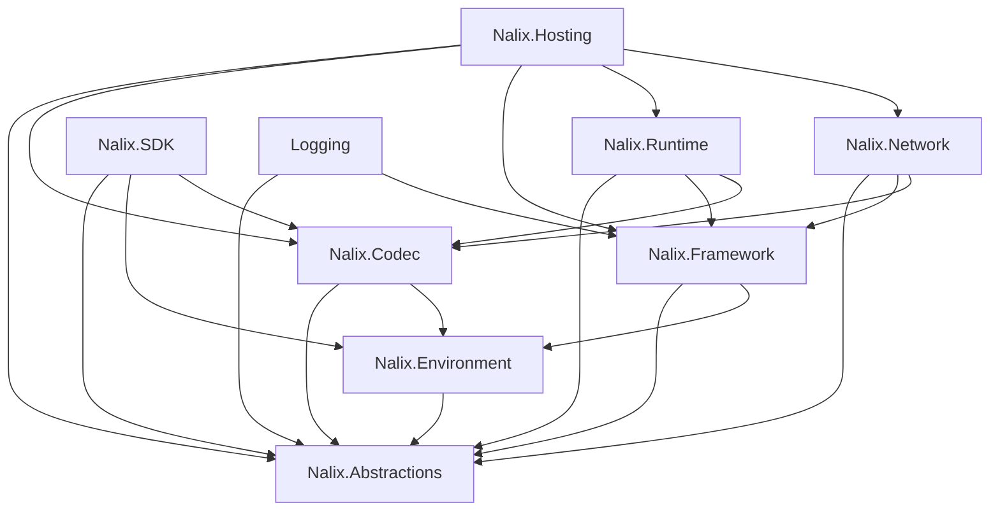

# Packages Overview

Nalix is composed of focused packages that can be used together or independently. This page provides a map of all packages, their responsibilities, and guidance on choosing the right combination.

!!! tip "Safe defaults"
    **Server:** Start with `Nalix.Hosting` — it brings in the core networking and runtime.  
    **Client:** Start with `Nalix.SDK` — it includes `Nalix.Codec` and `Nalix.Environment` transitively.

## Package Map

| Package | Purpose | Key Types |
| :--- | :--- | :--- |
| :fontawesome-solid-cube: [**Nalix.Abstractions**](./nalix-abstractions.md) | Base contracts, packet attributes, and core networking abstractions | `IPacket`, `IConnection`, `PacketOpcodeAttribute`, `PacketControllerAttribute`, `NetworkTransport` |
| :fontawesome-solid-leaf: [**Nalix.Environment**](./nalix-environment.md) | Configuration, environment IO, random generation, and monotonic time | `ConfigurationManager`, `Directories`, `IRandomProvider`, `Clock` |
| :fontawesome-solid-code: [**Nalix.Codec**](./nalix-codec.md) | Serialization, buffer leasing, transforms, and compression | `BufferLease`, `LiteSerializer`, `LZ4Codec`, `FrameCipher`, `FrameCompression` |
| :fontawesome-solid-box-open: [**Nalix.Framework**](./nalix-framework.md) | Shared runtime services, instance registration, scheduling, and identifiers | `InstanceManager`, `TaskManager`, `Snowflake`, `TimingScope` |
| :fontawesome-solid-gears: [**Nalix.Runtime**](./nalix-runtime.md) | Packet dispatch, built-in protection middleware, and throttling primitives | `PacketDispatchChannel`, `ConcurrencyGate`, `PolicyRateLimiter`, `TokenBucketLimiter`, `PermissionMiddleware` |
| :fontawesome-solid-network-wired: [**Nalix.Network**](./nalix-network.md) | TCP/UDP listeners, connections, protocol bridge, and session store | `TcpListenerBase`, `UdpListenerBase`, `Protocol`, `ConnectionHub`, `SocketConnection` |
| :fontawesome-solid-microchip: [**Nalix.Hosting**](./nalix-hosting.md) | Fluent server bootstrap, packet discovery, and application lifecycle | `NetworkApplication`, `INetworkApplicationBuilder`, `Bootstrap` |
| :fontawesome-solid-mobile-screen: [**Nalix.SDK**](./nalix-sdk.md) | Client transport sessions, request/response correlation, and session flows | `TransportSession`, `TcpSession`, `UdpSession`, `TransportOptions`, `RequestOptions` |
| :fontawesome-solid-list-ul: [**Nalix.Logging**](./nalix-logging.md) | Structured logging with batched async sinks | `NLogix`, `NLogixOptions`, `INLogixTarget` |

## Dependency Graph

## Minimum Package Sets

| Scenario | Packages |
| :--- | :--- |
| **Hosted server** (recommended) | `Nalix.Hosting`, `Nalix.Logging` |
| **Manual server** | `Nalix.Network`, `Nalix.Runtime`, `Nalix.Framework`, `Nalix.Logging` |
| **Client only** | `Nalix.SDK` |
| **Shared contracts** | `Nalix.Abstractions`, `Nalix.Codec` |

## Package Detail Pages

- [Nalix.Abstractions](./nalix-abstractions.md)
- [Nalix.Environment](./nalix-environment.md)
- [Nalix.Codec](./nalix-codec.md)
- [Nalix.Framework](./nalix-framework.md)
- [Nalix.Runtime](./nalix-runtime.md)
- [Nalix.Network](./nalix-network.md)
- [Nalix.Hosting](./nalix-hosting.md)
- [Nalix.SDK](./nalix-sdk.md)
- [Nalix.Logging](./nalix-logging.md)

