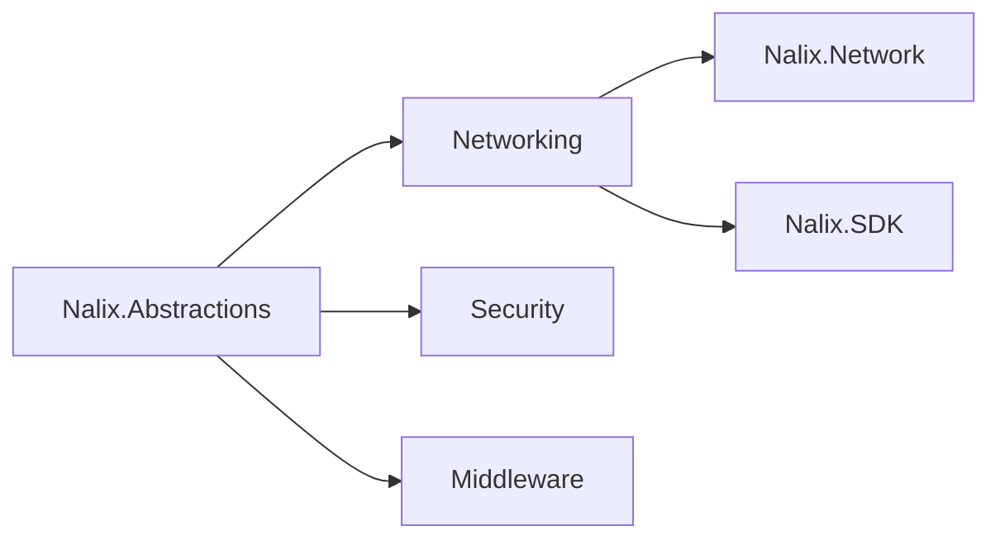

# Nalix.Abstractions

Base contracts, packet attributes, and core networking abstractions used across the entire Nalix ecosystem.

## Where it fits



### Core Abstractions

These contracts keep SDK and server code aligned. They cover both built-in packet types and custom packet types through the generic packet context model.

`**Key Components**`

- `IPacket` — Base interface for all Nalix packets.
- `IConnection` — Abstraction for a network connection (TCP/UDP).
- `PacketControllerAttribute` — Marks a class as a packet handler collection.
- `PacketOpcodeAttribute` — Binds a handler method to a specific opcode.
- `PacketTransportAttribute` — Specifies the required transport for a packet.

### Quick example

```csharp
[PacketController("SamplePingHandlers")]
public class SamplePingHandlers
{
    [PacketOpcode(1)]
    [PacketTransport(NetworkTransport.TCP)]
    public Control HandlePing(PacketContext<Control> request)
        => request.Packet;
}
```

!!! note "`PacketContext<T>` lives in `Nalix.Runtime.Dispatching`"
    The concrete `PacketContext<T>` class is provided by `Nalix.Runtime`, not `Nalix.Abstractions`. The abstraction layer defines the `IPacketContext<T>` interface only.

### Networking Primitives

`Nalix.Abstractions` defines the fundamental building blocks of the network layer.

`**Key Components**`

- `NetworkTransport` — Enum for TCP and UDP.
- `INetworkEndpoint` — Abstraction for network addresses.
- `IProtocol` — Interface for custom communication protocols.
- `IListener` — Base interface for server-side listeners.

### Middleware Contracts

Middleware runs over packet contexts and can short-circuit outbound flows.

`**Key Components**`

- `IPacketMiddleware<TPacket>`
- `IPacketContext<TPacket>`
- `IPacketSender<TPacket>`

### Quick example 

```csharp
public sealed class SamplePacketMiddleware : IPacketMiddleware<IPacket>
{
    public async ValueTask InvokeAsync(
        IPacketContext<IPacket> context,
        Func<CancellationToken, ValueTask> next)
    {
        // Pre-processing
        await next(context.CancellationToken);
        // Post-processing
    }
}
```

### Security Abstractions

Base interfaces for encryption, hashing, and permission management.

`**Key Components**`

- `PermissionLevel` — Enum defining access levels (e.g. `USER`, `ADMIN`).
- `IPacketPermission` — Metadata contract for packet-level permission checks.

## Key API pages

- [Packet Contracts](../api/abstractions/packet-contracts.md)
- [Connection Contracts](../api/abstractions/connection-contracts.md)
- [Session Contracts](../api/abstractions/session-contracts.md)
- [Packet Attributes](../api/abstractions/packet-attributes.md)
- [Packet Metadata](../api/abstractions/packet-metadata.md)
- [Concurrency Contracts](../api/abstractions/concurrency-contracts.md)

