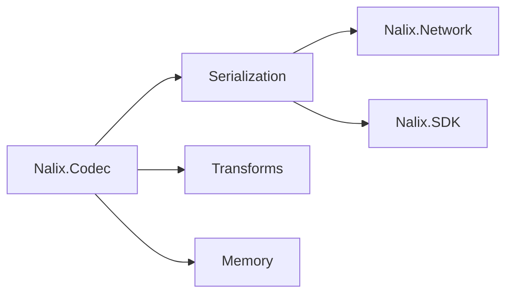
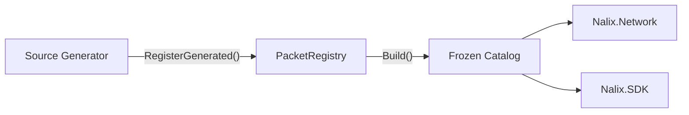

# Nalix.Codec

`Nalix.Codec` handles the transformation of data between objects and wire formats. It includes serialization, compression, and security transforms.

## Key Responsibilities

- **Serialization**: Fast, low-allocation binary serialization for packets.
- **Compression**: Integrated LZ4 compression for reducing network bandwidth.
- **Security**: Framed packet encryption and hashing.
- **Memory**: Efficient buffer leasing and IO primitives (`DataReader`, `DataWriter`).

## Where it fits


```mermaid
flowchart LR
    A["Nalix.Codec"] --> B["Serialization"]
    A --> C["Transforms"]
    A --> D["Memory"]
    B --> E["Nalix.Network"]
    B --> F["Nalix.SDK"]
```

## Core Components

### `LiteSerializer`

A high-performance binary serializer that uses attributes to define layout.

### `BufferLease`

A lightweight wrapper around pooled memory that ensures safe disposal and reuse.

### `FrameCipher` and `FrameCompression`

Helpers for applying encryption and compression to framed packets.

### `LZ4Codec`

A pooled implementation of the LZ4 compression algorithm.

## Registry flow


```mermaid
flowchart LR
    A["Source Generator"] -- "RegisterGenerated()" --> B["PacketRegistry"]
    B -- "Build()" --> C["Frozen Catalog"]
    C --> D["Nalix.Network"]
    C --> E["Nalix.SDK"]
```

### Purpose

- Define built-in frames.
- Build an immutable packet registry.
- Provide shared serialization helpers.
- Provide pooled LZ4 compression primitives.
- Provide shared framed packet transform helpers (`FrameCipher` and `FrameCompression`).

### Key components

- `FrameBase` / `PacketBase<TSelf>` — base abstractions for headers, auto-magic, serialization, and pooling.
- `SerializePackableAttribute` / `SerializeOrderAttribute` / `SerializeIgnoreAttribute` / `SerializeHeaderAttribute` / `SerializeDynamicSizeAttribute` — low-level serialization layout controls.
- `LiteSerializer` / `FormatterProvider` / `IFormatter<T>` — serializer entry points and formatter resolution.
- `DataReader` / `DataWriter` / `HeaderExtensions` — low-level read/write and header inspection helpers.
- `PacketRegistry` — process-wide registry for packet discovery and deserialization.
- `Handshake` — default handshake frame used to exchange ephemeral keys, nonces, proofs, and transcript hash.
- `SessionResume` — unified session signal packet for resume request/response flows (uses `SessionResumeStage` for stage disambiguation).
- `Control` — built-in frame type.
- `FragmentHeader` / `FragmentAssembler` / `FragmentOptions` — chunk large payloads and reassemble them safely.
- `FrameCipher` / `FrameCompression` — framed packet encrypt/decrypt and compress/decompress helpers.
- `LZ4Codec` — pooled block compression and decompression.

### Quick example

```csharp
using Nalix.Codec.DataFrames;
using Nalix.Codec.DataFrames.SignalFrames;
using Nalix.Codec.Memory;

// Initialize the registry (usually called by NetworkApplicationBuilder)
PacketRegistry.Configure(poolManager); // optional: enable packet pooling
PacketRegistry.Build(); // Freeze the registry

// Handshake frame
Handshake hs = new(
    HandshakeStage.CLIENT_HELLO,
    new Bytes32(publicKeyBytes),
    new Bytes32(nonceBytes),
    flags: PacketFlags.SYSTEM | PacketFlags.RELIABLE);
hs.UpdateTranscriptHash("nalix-default-handshake"u8);
byte[] bytes = hs.Serialize();
```

## Key API pages

- [Serialization](../api/codec/serialization/serialization-basics.md)
- [Buffer Management](../api/framework/memory/buffer-management.md)
- [LZ4](../api/codec/lz4.md)
- [Frame Model](../api/codec/packets/frame-model.md)
- [Packet Registry](../api/codec/packets/packet-registry.md)
- [Built-in Frames](../api/codec/packets/built-in-frames.md)
- [Fragmentation](../api/codec/packets/fragmentation.md)
- [Cryptography](../api/security/cryptography.md)
