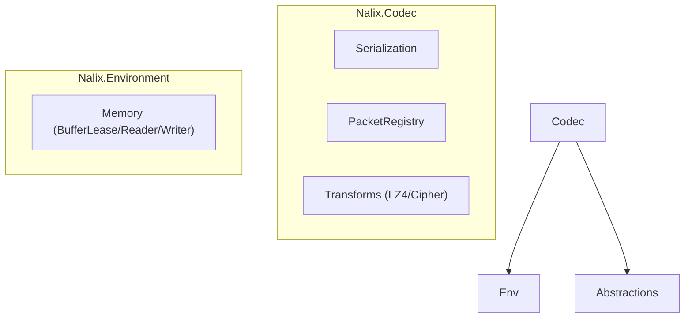
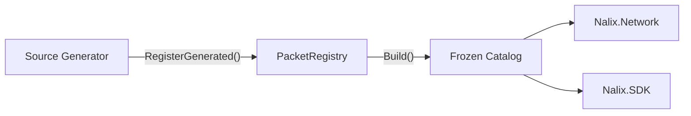

# Nalix.Codec

`Nalix.Codec` handles the transformation of data between objects and wire formats. It includes serialization, compression, and security transforms.

## Key Responsibilities

- **Serialization**: Fast, low-allocation binary serialization for packets.
- **Compression**: Integrated LZ4 compression for reducing network bandwidth.
- **Security**: Framed packet encryption and hashing.
- **Registry**: Process-wide catalog for packet discovery and deserialization.

## Where it fits


```mermaid
flowchart TD
    subgraph Core ["Nalix.Codec"]
        Serialization["Serialization"]
        Registry["PacketRegistry"]
        Transforms["Transforms (LZ4/Cipher)"]
    end

    subgraph Base ["Nalix.Environment"]
        Memory["Memory (BufferLease/Reader/Writer)"]
    end

    Codec --> Env
    Codec --> Abstractions
```

## Core Components

### `PacketRegistry`

The process-wide catalog for packet discovery and deserialization.

### `FrameCipher` and `FrameCompression`

Helpers for applying encryption and compression to framed packets.

### `LZ4Codec`

A pooled implementation of the LZ4 compression algorithm.

## Registry flow


```mermaid
flowchart LR
    A["Source Generator"] -- "RegisterGenerated()" --> B["PacketRegistry"]
    B -- "Build()" --> C["Frozen Catalog"]
    C --> D["Nalix.Network"]
    C --> E["Nalix.SDK"]
```

### Purpose

- Define built-in frames.
- Build an immutable packet registry.
- Provide shared serialization helpers.
- Provide pooled LZ4 compression primitives.
- Provide shared framed packet transform helpers (`FrameCipher` and `FrameCompression`).

### Key components

- `FrameBase` / `PacketBase<TSelf>` — base abstractions for headers, static opcode, serialization, and pooling.
- `SerializePackableAttribute` / `SerializeOrderAttribute` / `SerializeIgnoreAttribute` / `SerializeHeaderAttribute` / `SerializeDynamicSizeAttribute` — low-level serialization layout controls.
- `LiteSerializer` / `FormatterProvider` / `IFormatter<T>` — serializer entry points and formatter resolution.
- `PacketRegistry` — process-wide registry for packet discovery and deserialization.
- `SessionInit` / `SessionChallenge` / `SessionProof` / `SessionEstablished` — session protocol frames for the X25519 handshake flow.
- `SessionTofu` — Trust-On-First-Use frame for retrieving the server's static public key.
- `SessionResume` — unified session signal packet for resume request/response flows (uses `SessionResumeStage` for stage disambiguation).
- `Control` — built-in frame type.
- `FragmentHeader` / `FragmentAssembler` / `FragmentOptions` — chunk large payloads and reassemble them safely.
- `FrameCipher` / `FrameCompression` — framed packet encrypt/decrypt and compress/decompress helpers.
- `LZ4Codec` — pooled block compression and decompression.

!!! info "Memory Primitives"
    While `Nalix.Codec` performs serialization, the low-level memory primitives (`BufferLease`, `DataReader`, `DataWriter`) reside in **`Nalix.Environment`**.

### Quick example

```csharp
using Nalix.Codec.DataFrames;
using Nalix.Codec.ProtocolFrames;
using Nalix.Environment.Memory;

// Initialize the registry (usually called by NetworkApplicationBuilder)
PacketRegistry.Build(); // Freeze the registry

// Session init frame (first step of handshake)
var init = SessionInit.Create();
init.Initialize(
    new Bytes32(publicKeyBytes),
    new Bytes32(nonceBytes),
    PacketFlags.SYSTEM | PacketFlags.RELIABLE);
byte[] bytes = init.Serialize();
```

## Key API pages

- [Serialization](../api/codec/serialization/serialization-basics.md)
- [Buffer Management](../api/environment/memory/buffer-management.md)
- [LZ4](../api/codec/lz4.md)
- [Frame Model](../api/codec/packets/frame-model.md)
- [Packet Registry](../api/codec/packets/packet-registry.md)
- [Built-in Frames](../api/codec/packets/built-in-frames.md)
- [Fragmentation](../api/codec/packets/fragmentation.md)
- [Cryptography](../api/security/cryptography.md)
