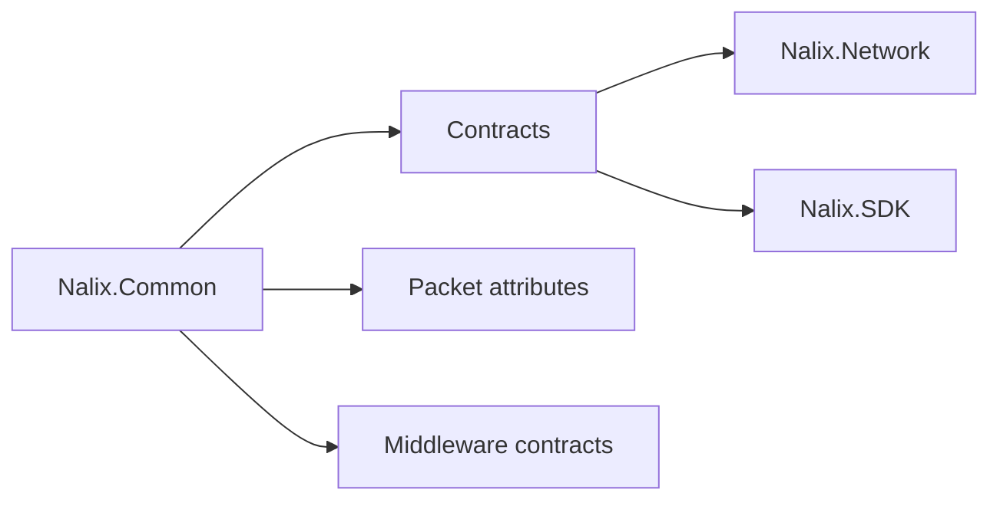

# Nalix.Common

Shared contracts, packet metadata, and middleware primitives used across SDK and server code.

## Where it fits



### Core contracts
These contracts keep SDK and server code aligned.
They cover both built-in packet types and custom packet types through the generic packet context model.

**Key Components**
- `IPacket`
- `IConnection`
- `PacketControllerAttribute`
- `PacketOpcodeAttribute`

### Quick example

```csharp
[PacketController("SamplePingHandlers")]
public class SamplePingHandlers
{
    [PacketOpcode(1)]
    public Control HandlePing(PacketContext<Control> request)
        => request.Packet;
}
```

Custom packet handlers are fully supported. `PacketContext<TPacket>` is the preferred shape when you need context, sender, or metadata access, while legacy `(TPacket, IConnection[, CancellationToken])` handlers remain available for compatibility.

### Metadata and attributes
Metadata is built once during handler registration and later exposed through `PacketContext<TPacket>`.

**Key Components**
- `PacketMetadata`
- `IPacketContext<TPacket>`

```csharp
// Metadata attributes are applied to handlers or packets
[PacketOpcode(1)]
[SampleTenantMetadata("Tenant-A")]
public Control HandlePing(PacketContext<Control> request) => request.Packet;
```

### Middleware primitives
Middleware runs over packet contexts and can short-circuit outbound flows.
The same middleware contracts work with custom packet types as long as the generic argument matches the handler pipeline.

**Key Components**
- `IPacketMiddleware<TPacket>`
- `IPacketContext<TPacket>`
- `IPacketSender<TPacket>`

### Quick example

```csharp
public sealed class SamplePacketMiddleware : IPacketMiddleware<IPacket>
{
    public async Task InvokeAsync(
        PacketContext<IPacket> context,
        Func<CancellationToken, Task> next)
    {
        await next(context.CancellationToken);
    }
}
```

Swap `IPacket` for a custom packet type when your middleware is bound to a custom handler pipeline.

### Shared enums
Enums keep policies consistent across the stack.

**Key Components**
- `CipherSuiteType`
- `DropPolicy`

## Key API pages

- [Packet Contracts](../api/common/packet-contracts.md)
- [Connection Contracts](../api/common/connection-contracts.md)
- [Session Contracts](../api/common/session-contracts.md)
- [Packet Attributes](../api/runtime/routing/packet-attributes.md)
- [Packet Metadata](../api/runtime/routing/packet-metadata.md)
- [Concurrency Contracts](../api/common/concurrency-contracts.md)
