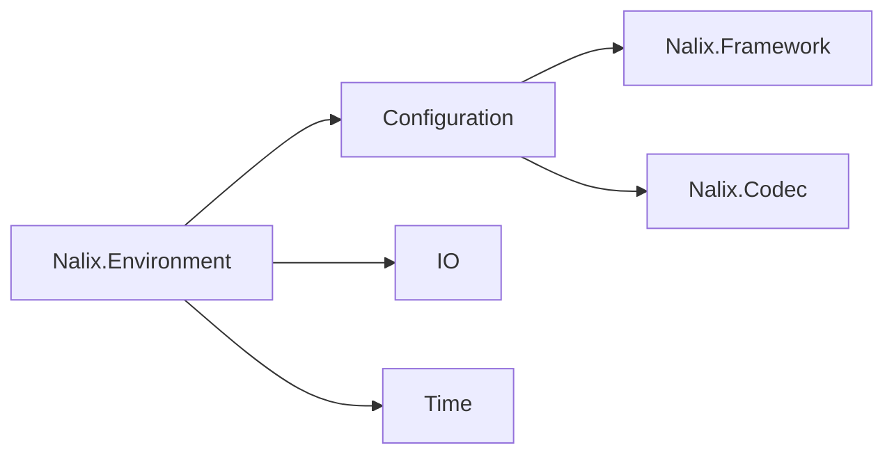

# Nalix.Environment

`Nalix.Environment` provides the foundation for configuration, IO, and cross-platform environmental helpers.

## Key Responsibilities

- **Configuration**: Loading and managing typed options from INI files.
- **IO**: Specialized file and directory handling for Nalix applications.
- **Time**: Monotonic clock, time-related primitives, and `TimingScope` for lightweight latency measurement.
- **Random**: Thread-safe random number generation.

## Where it fits

## Core Components

### `ConfigurationManager`

The central registry for typed options. It supports hot-reloading and automatic persistence to `.ini` files.

### `Directories`

Provides standardized paths for configuration, logs, and data across different operating systems.

### `Clock`

A monotonic time source that is immune to system time changes, essential for network timing.

### `IRandomProvider`

Abstracts random number generation to allow for predictable testing or high-entropy production sources.

## Key API pages

- [Configuration](../api/environment/configuration.md)
- [Directories](../api/environment/directories.md)
- [Clock](../api/environment/clock.md)
- [Random](../api/environment/random.md)

