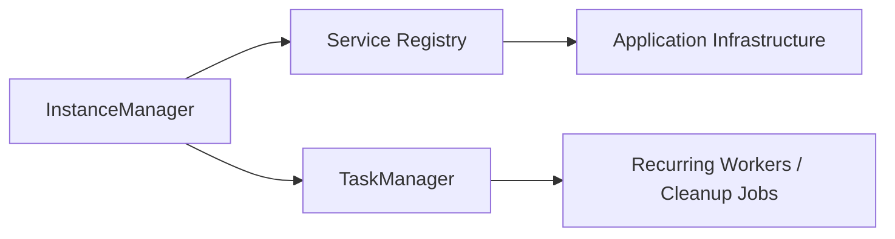

# Nalix.Framework

`Nalix.Framework` provides core runtime services for dependency injection, task scheduling, system-wide identifiers, and high-level memory management.

## Runtime Services Map



## What belongs here

- `InstanceManager` for registering and resolving shared services and infrastructure.
- `TaskManager` for managing named background workers and recurring jobs.
- `Snowflake` for generating 64-bit compact, sortable identifiers.
- `TimingScope` (in `Nalix.Environment`) for lightweight, high-precision latency measurement.
- `BufferPoolManager` and `ObjectPoolManager` for managing shared resource pools.

## Instance Registration

`InstanceManager` is the common registry used across the stack. It can register existing instances or lazily create new ones. It is the preferred way to publish infrastructure such as loggers and packet registries.

### Quick Example

```csharp
// Register a logger
InstanceManager.Instance.Register<ILogger>(logger);

// Resolve or create a task manager
TaskManager taskManager = InstanceManager.Instance.GetOrCreateInstance<TaskManager>();
```

## Background Work

`TaskManager` manages the execution and lifecycle of background tasks and recurring jobs. It provides features like group concurrency limits, named workers, and execution reporting.

### Quick Example

```csharp
TaskManager manager = InstanceManager.Instance.GetOrCreateInstance<TaskManager>();

manager.ScheduleRecurring(
    "session.cleanup",
    TimeSpan.FromSeconds(30),
    async ct => await CleanupExpiredSessionsAsync(ct));
```

## Identifiers and Timing

- `Snowflake` provides unique, time-sortable 64-bit IDs suitable for tasks, sessions, and packets.
- `TimingScope` allows for easy measurement of operation duration with minimal overhead.

## Memory Management

`Nalix.Framework` owns the management logic for resource pools. While the actual leasing primitives (like `BufferLease`) live in `Nalix.Codec`, the managers that own the underlying arrays and objects live here.

- `BufferPoolManager`: Manages sharded byte array pools.
- `ObjectPoolManager`: Manages pools of reusable class instances to minimize GC pressure.

## Key API Pages

- [Instance Manager (DI)](../api/framework/instance-manager.md)
- [Task Manager](../api/framework/task-manager.md)
- [Timing Scope](../api/environment/timing-scope.md)
- [Snowflake](../api/framework/snowflake.md)
- [Buffer Management](../api/framework/memory/buffer-management.md)
- [Object Pooling](../api/framework/memory/object-pooling.md)
- [Object Map](../api/framework/memory/object-map.md)
- [Typed Object Pools](../api/framework/memory/typed-object-pools.md)
