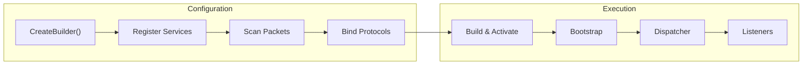

# Nalix.Hosting

`Nalix.Hosting` provides Microsoft-style host and builder APIs for Nalix servers. It wires packet registry discovery, packet dispatch, configuration application, and transport lifecycle into a familiar builder/build/run workflow.

## Hosting Flow



## What it gives you

- `NetworkApplication.CreateBuilder()`
- Fluent `INetworkApplicationBuilder` configuration
- Automatic packet registry creation from assembly scanning
- Application lifecycle management through `ActivateAsync`, `DeactivateAsync`, and `RunAsync`
- Optimized server defaults through `Bootstrap` (Module Initializer)
- Integrated dependency injection via `InstanceManager`

## Core APIs

### `NetworkApplication`

`NetworkApplication` is the runnable entry point. It manages the coordinated startup and shutdown of all server components.

### `INetworkApplicationBuilder`

The builder exposes fluent methods for configuring the server:

- `ConfigureLogging(...)`
- `ConfigureConnectionHub(...)`
- `ConfigureBufferPoolManager(...)`
- `ConfigureObjectPoolManager(...)`
- `ConfigureCertificate(...)`
- `ConfigurePacketRegistry(...)`
- `ConfigureDispatch(...)`
- `Configure<TOptions>(...)`
- `AddPacket<TMarker>()`
- `AddPacketNamespace(...)`
- `AddHandlers<TMarker>()`
- `AddHandler<THandler>()`
- `AddMetadataProvider<TProvider>()`
- `AddTcp<TProtocol>(...)`
- `AddTcp<TProtocol>(ushort port)`
- `AddUdp<TProtocol>(...)`
- `AddUdp<TProtocol>(Func<IConnection, EndPoint, ReadOnlySpan<byte>, bool> authen)`

### `Bootstrap`

The `Bootstrap` static class provides global initialization, tuning the ThreadPool for server workloads and setting up high-precision timers on Windows.

## Minimal example

```csharp
using Microsoft.Extensions.Logging;
using Nalix.Hosting;
using Nalix.Network.Options;

var app = NetworkApplication.CreateBuilder()
    .Configure<NetworkSocketOptions>(options =>
    {
        options.Port = 57206;
    })
    .AddPacket<MyPacket>()
    .AddHandlers<MyHandlers>()
    .AddTcp<MyProtocol>()
    .Build();

await app.RunAsync();
```

## Related packages

- [Nalix.Network](./nalix-network.md): Transport and listeners.
- [Nalix.Runtime](./nalix-runtime.md): Dispatcher and middleware.
- [Nalix.Abstractions](./nalix-abstractions.md): Shared primitives and contracts.

## Suggested reading

1. [Network Application API](../api/hosting/network-application.md)
2. [Hosting Options](../api/options/hosting/hosting-options.md)
3. [Nalix.Network](./nalix-network.md)

