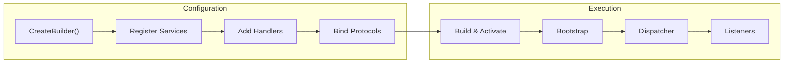

# Nalix.Hosting

`Nalix.Hosting` provides Microsoft-style host and builder APIs for Nalix servers. It wires packet registry discovery, packet dispatch, configuration application, and transport lifecycle into a familiar builder/build/run workflow.

## Source Mapping

- `src/Nalix.Hosting/NetworkApplication.cs`
- `src/Nalix.Hosting/NetworkApplicationBuilder.cs`
- `src/Nalix.Hosting/INetworkApplicationBuilder.cs`
- `src/Nalix.Hosting/Bootstrap.cs`
- `src/Nalix.Hosting/DefaultProtocol.cs`

## Hosting Flow


```mermaid
flowchart LR
    subgraph Config ["Configuration"]
        A["CreateBuilder()"] --> B["Register Services"]
        B --> C["Add Handlers"]
        C --> D["Bind Protocols"]
    end

    subgraph Runtime ["Execution"]
        D --> E["Build & Activate"]
        E --> F["Bootstrap"]
        F --> G["Dispatcher"]
        G --> H["Listeners"]
    end
```

## What it gives you

- `NetworkApplication.CreateBuilder()`
- Fluent `INetworkApplicationBuilder` configuration
- Handler registration with source-generated dispatch via `PacketHandlerGenerator`
- Application lifecycle management through `ActivateAsync`, `DeactivateAsync`, and `RunAsync`
- Optimized server defaults through `Bootstrap` (Module Initializer)
- Integrated dependency injection via `InstanceManager`

## Core APIs

### `NetworkApplication`

`NetworkApplication` is the runnable entry point. It manages the coordinated startup and shutdown of all server components.

### `INetworkApplicationBuilder`

The builder exposes fluent methods for configuring the server:

- `Configure<TOptions>(...)`
- `ConfigureDispatchOptions(...)`
- `ConfigureDispatch(...)`
- `UseLogger(...)`
- `UseConnectionHub(...)`
- `UseConnectionGuard(...)`
- `UseBufferPoolManager(...)`
- `UseObjectPoolManager(...)`
- `UseSecureConnections(...)`
- `UseSessions(...)`
- `MapHandlers<THandler>()`
- `MapHandlers(Type controllerType)`
- `ListenTcp<TProtocol>().Bind()`
- `ListenTcp<TProtocol>().OnPort(port).Bind()`
- `ListenUdp<TProtocol>().Bind()`
- `ListenUdp<TProtocol>().WithAuthentication(authen).Bind()`

### `Bootstrap`

The `Bootstrap` static class provides global initialization, including server-side configuration defaults, optional ThreadPool tuning, diagnostic subscription, and high-precision timers on Windows.

## Minimal example

```csharp
using Microsoft.Extensions.Logging;
using Nalix.Hosting;
using Nalix.Network.Options;

var app = NetworkApplication.CreateBuilder()
    .Configure<NetworkSocketOptions>(options =>
    {
        options.Port = 57206;
    })
    .MapHandlers<MyHandlers>()
    .ListenTcp<MyProtocol>().Bind()
    .Build();

await app.RunAsync();
```

## Related packages

- [Nalix.Network](./nalix-network.md): Transport and listeners.
- [Nalix.Runtime](./nalix-runtime.md): Dispatcher and middleware.
- [Nalix.Abstractions](./nalix-abstractions.md): Shared primitives and contracts.

## Suggested reading

1. [Network Application API](../api/hosting/network-application.md)
2. [Hosting Options](../api/options/hosting/hosting-options.md)
3. [Nalix.Network](./nalix-network.md)
