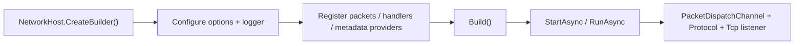

# Nalix.Network.Hosting

`Nalix.Network.Hosting` adds a Microsoft-style builder and host lifecycle on top of `Nalix.Network`.

Use it when you want Nalix server startup to feel more like a single bootstrap pipeline instead of manually wiring `ConfigurationManager`, `InstanceManager`, `PacketRegistryFactory`, `PacketDispatchChannel`, `Protocol`, and `TcpListenerBase` yourself.

!!! tip "Best fit"
    This package is most useful for TCP server projects that want one fluent startup path with automatic packet discovery, handler registration, and host lifecycle management.

## Hosting flow



## What it gives you

- `NetworkHost.CreateBuilder()`
- fluent `INetworkBuilder` / `NetworkBuilder` configuration
- automatic packet registry creation from packet and handler assemblies
- packet metadata provider registration
- packet dispatch bootstrap with shared logger wiring
- TCP server activation through `StartAsync`, `StopAsync`, and `RunAsync`

## Core APIs

### `NetworkHost`

`NetworkHost` is the runnable entry point. It owns startup and shutdown order for:

- option application through `ConfigurationManager`
- logger and registry registration through `InstanceManager`
- metadata provider registration
- `PacketDispatchChannel` creation and activation
- hosted TCP protocol creation
- TCP listener activation and disposal

You can use:

- `StartAsync(...)` when something else manages the process lifetime
- `RunAsync(...)` when you want the host to stay active until cancellation
- `StopAsync(...)` for graceful shutdown
- `Activate(...)` / `Deactivate(...)` when you need to plug into Nalix activation contracts

### `INetworkBuilder`

The builder exposes fluent methods for the common bootstrap concerns:

- `UseLogger(...)`
- `Configure<TOptions>(...)`
- `AddPacketsFromAssembly(...)`
- `AddPacketHandlersFromAssembly(...)`
- `AddPacketHandler<THandler>(...)`
- `AddPacketMetadataProvider<TProvider>(...)`
- `ConfigurePacketDispatcher(...)`
- `AddTcpServer<TProtocol>(...)`

For a method-by-method breakdown, see the dedicated API page: [Network Hosting](../api/network/runtime/network-hosting.md).

The host currently focuses on TCP server startup. The builder registers protocol factories and creates listener hosts during startup.

## Minimal example

```csharp
using Microsoft.Extensions.Logging;
using Nalix.Common.Networking;
using Nalix.Common.Networking.Packets;
using Nalix.Framework.DataFrames;
using Nalix.Network.Hosting;
using Nalix.Network.Options;
using Nalix.Network.Protocols;
using Nalix.Network.Routing;

NetworkHost host = NetworkHost.CreateBuilder()
    .UseLogger(logger)
    .Configure<NetworkSocketOptions>(options =>
    {
        options.Port = 57206;
        options.Backlog = 512;
    })
    .AddPacketsFromAssemblyContaining<Handshake>()
    .AddPacketHandlersFromAssemblyContaining<SampleHandlers>()
    .AddTcpServer<SampleProtocol>()
    .Build();

await host.RunAsync(cancellationToken);

[PacketController("SampleHandlers")]
public sealed class SampleHandlers
{
    [PacketOpcode(0x1001)]
    public ValueTask<Control> Handle(Control request, IConnection connection)
        => ValueTask.FromResult(new Control { Type = ControlType.PONG });
}

public sealed class SampleProtocol : Protocol
{
    private readonly IPacketDispatch _dispatch;

    public SampleProtocol(IPacketDispatch dispatch) => _dispatch = dispatch;

    public override void ProcessMessage(object sender, IConnectEventArgs args)
        => _dispatch.HandlePacket(args.Lease, args.Connection);
}
```

## When to use it

Choose `Nalix.Network.Hosting` when you want:

- one central startup composition point
- less repeated bootstrap code across multiple servers
- assembly-based packet and handler discovery
- a simple host abstraction for service or worker-style processes

Stay with raw `Nalix.Network` wiring when you want:

- full manual control over dispatch and listener composition
- custom startup order beyond what `NetworkHost` manages
- a server shape that does not map cleanly to the builder abstraction

## Relationship to other packages

- `Nalix.Network.Hosting` builds on top of `Nalix.Network`
- it still relies on runtime services from `Nalix.Framework`
- packet contracts and attributes still come from `Nalix.Common` and `Nalix.Framework`

In other words, this package simplifies bootstrap, but it does not replace the underlying transport and dispatch runtime.

## Suggested reading

Read these next if you are using the hosting package:

1. [Nalix.Network](./nalix-network.md)
2. [Network Hosting API](../api/network/runtime/network-hosting.md)
3. [Server Blueprint](../guides/server-blueprint.md)
4. [Packet Dispatch](../api/routing/packet-dispatch.md)
5. [Packet Registry](../api/framework/packets/packet-registry.md)
6. [Configuration](../api/framework/runtime/configuration.md)
