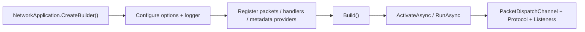

# Nalix.Network.Hosting

`Nalix.Network.Hosting` adds a Microsoft-style builder and application lifecycle on top of `Nalix.Network` and `Nalix.Runtime`.

Use it when you want Nalix server startup to feel more like a single bootstrap pipeline instead of manually wiring listeners, dispatchers, and protocols yourself.

!!! tip "Standard Entry Point"
    This package is the recommended way to build Nalix servers. It provides a familiar fluent API for configuring everything from logging and options to handlers and server bindings.

## Hosting Flow



## What it gives you

- `NetworkApplication.CreateBuilder()`
- fluent `INetworkApplicationBuilder` configuration
- automatic packet registry creation from packet and handler assemblies
- packet metadata provider registration
- automatic UDP and TCP server listener management
- application lifecycle activation through `ActivateAsync`, `DeactivateAsync`, and `RunAsync`

## Core APIs

### `NetworkApplication`

`NetworkApplication` is the runnable entry point. It owns startup and shutdown order for:

- packet dispatcher activation
- protocol instantiation
- TCP/UDP listener management

### `INetworkApplicationBuilder`

The builder exposes fluent methods for common bootstrap concerns:

- `ConfigureLogging(...)`
- `Configure<TOptions>(...)`
- `AddPacketAssemblies(...)`
- `AddHandlers(...)`
- `AddMetadataProvider(...)`
- `ConfigureDispatch(...)`
- `AddTcp<TProtocol>(...)`
- `AddUdp<TProtocol>(...)`

For a method-by-method breakdown, see the dedicated API page: [Network Application](../api/hosting/network-application.md).

## Minimal example

```csharp
var app = NetworkApplication.CreateBuilder()
    .ConfigureLogging(logger)
    .Configure<NetworkSocketOptions>(options =>
    {
        options.Port = 57206;
    })
    .AddPacketAssembly<Handshake>()
    .AddHandlers<SampleHandlers>()
    .AddTcp<SampleProtocol>()
    .Build();

await app.RunAsync(cancellationToken);

[PacketController("SampleHandlers")]
public sealed class SampleHandlers
{
    [PacketOpcode(0x1001)]
    public ValueTask<Control> Handle(IPacketContext<Control> request)
        => ValueTask.FromResult(new Control { Type = ControlType.PONG });
}

public sealed class SampleProtocol : Protocol
{
    private readonly IPacketDispatch _dispatch;

    public SampleProtocol(IPacketDispatch dispatch) => _dispatch = dispatch;

    public override void ProcessMessage(object sender, IConnectEventArgs args)
        => _dispatch.HandlePacket(args.Lease, args.Connection);
}
```

Custom packet handlers fit the same hosting model through `PacketContext<TPacket>` and the generic dispatch pipeline.

## Related packages

- [Nalix.Network](./nalix-network.md): Transport and listeners.
- [Nalix.Runtime](./nalix-runtime.md): Dispatcher and middleware.
- [Nalix.Common](./nalix-common.md): Shared primitives and attributes.

## Suggested reading

1. [Network Application API](../api/hosting/network-application.md)
2. [Packet Dispatch](../api/runtime/routing/packet-dispatch.md)
3. [Nalix.Network](./nalix-network.md)
