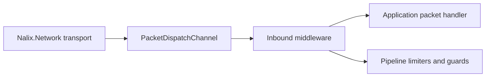

# Nalix.Network.Pipeline

`Nalix.Network.Pipeline` contains the inbound packet middleware and protection primitives used by Nalix servers after transport decoding and before runtime handler execution.

!!! note "Source boundary"
    This package does not own TCP/UDP socket I/O. Transports live in `Nalix.Network`, dispatch orchestration lives in `Nalix.Runtime`, and this package supplies middleware plus limiter services that can be inserted into the runtime packet pipeline.

## Source Map

| Area | Source | Responsibility |
|---|---|---|
| Inbound middleware | `src/Nalix.Network.Pipeline/Inbound/*.cs` | Permission checks, rate limiting, per-opcode concurrency, handler timeout enforcement. |
| Throttling | `src/Nalix.Network.Pipeline/Throttling/*.cs` | Shared `ConcurrencyGate`, `PolicyRateLimiter`, and endpoint `TokenBucketLimiter`. |
| Timekeeping | `src/Nalix.Network.Pipeline/Timekeeping/TimeSynchronizer.cs` | Optional periodic Unix-millisecond tick service. |
| Internal guard | `src/Nalix.Network.Pipeline/Internal/DirectiveGuard.cs` | Per-connection cooldown for repeated failure/timeout directives. |
| Options | `src/Nalix.Network.Pipeline/Options/*.cs` | `TokenBucketOptions`, `ConcurrencyOptions`, and `DirectiveGuardOptions`. |

## Where It Fits

`PacketDispatchChannel` deserializes the transport buffer and executes packet handlers. Middleware in this package participates in that handler execution path through the runtime middleware abstraction.

## Inbound Middleware

| Middleware | Order | Stage | Source-verified behavior |
|---|---:|---|---|
| `PermissionMiddleware` | `-50` | `Inbound` | Fail-closed: the packet proceeds only when `[PacketPermission]` exists and its required level is less than or equal to `context.Connection.Level`. Missing permission metadata is denied. |
| `ConcurrencyMiddleware` | `50` | `Inbound` | Enforces `[PacketConcurrencyLimit]`. Queued limits call `ConcurrencyGate.EnterAsync`; non-queued limits use `TryEnter`. Rejections send a transient `RATE_LIMITED` directive subject to directive cooldown. |
| `RateLimitMiddleware` | `50` | `Inbound` | Uses `PolicyRateLimiter` when `[PacketRateLimit]` exists; otherwise falls back to the global per-endpoint `TokenBucketLimiter`. Rejections send `FAIL/RATE_LIMITED/RETRY` with retry and credit data. |
| `TimeoutMiddleware` | `75` | `Inbound` | Uses `[PacketTimeout]` milliseconds when present. A timeout sends `TIMEOUT/TIMEOUT/RETRY` and marks the directive transient. No timeout attribute, or a non-positive timeout, passes through unchanged. |

!!! warning "Permission default is deny"
    `PermissionMiddleware` intentionally rejects handlers without permission metadata. Do not add it globally unless packet handlers are annotated with the required permission attributes.

## Protection Primitives

### TokenBucketLimiter

`TokenBucketLimiter` tracks per-endpoint token state across sharded dictionaries. It consumes one token per evaluation, refills using `Stopwatch` ticks and fixed-point token precision, escalates repeated soft violations to hard lockout, and rejects new endpoint state when `MaxTrackedEndpoints` is reached.

Use [Token Bucket Options](../api/network/options/token-bucket-options.md) for the exact defaults, ranges, and validation rules.

### PolicyRateLimiter

`PolicyRateLimiter` evaluates handler-specific policy from `[PacketRateLimit]` metadata. `RateLimitMiddleware` selects it only when the current packet metadata contains a rate-limit attribute.

### ConcurrencyGate

`ConcurrencyGate` creates per-opcode entries from `[PacketConcurrencyLimit]` metadata. It supports immediate admission, optional queuing, idle entry cleanup, reports, and a circuit breaker based on aggregate rejection rate.

Use [Concurrency Options](../api/network/options/concurrency-options.md) for the exact circuit-breaker and cleanup defaults.

### DirectiveGuard

Directive emission for unauthorized, timeout, and rate-limited responses is cooldown-protected per connection. This prevents repeated failures from spamming response directives under hostile or noisy traffic.

Use [Directive Guard Options](../api/network/options/directive-guard-options.md) for the exact cooldown default and range.

## TimeSynchronizer

`TimeSynchronizer` is an optional activatable service that emits `TimeSynchronized` events at `DefaultPeriod = 16 ms`. The `Period` property must be positive and is applied on restart when changed during execution. `FireAndForget` controls whether handlers run on the ThreadPool instead of blocking the tick loop.

## Registration Notes

The default constructors for middleware use `InstanceManager` to locate or create shared services such as `ILogger`, `ConcurrencyGate`, `PolicyRateLimiter`, and `TokenBucketLimiter`. Explicit constructors are available for tests or controlled host composition.

Prefer the hosting/runtime builder APIs where available. If manually composing dispatch channels, verify the active runtime API in `Nalix.Runtime.Dispatching.PacketDispatchChannel` and `PacketDispatchOptions<TPacket>` before copying snippets.

## Related Pages

- [Middleware Pipeline](../api/runtime/middleware/pipeline.md)
- [Concurrency Gate](../api/runtime/middleware/concurrency-gate.md)
- [Policy Rate Limiter](../api/runtime/middleware/policy-rate-limiter.md)
- [Token Bucket Limiter](../api/runtime/middleware/token-bucket-limiter.md)
- [Permission Middleware](../api/runtime/middleware/permission-middleware.md)
- [Timeout Middleware](../api/runtime/middleware/timeout-middleware.md)
- [Token Bucket Options](../api/network/options/token-bucket-options.md)
- [Concurrency Options](../api/network/options/concurrency-options.md)
- [Directive Guard Options](../api/network/options/directive-guard-options.md)
