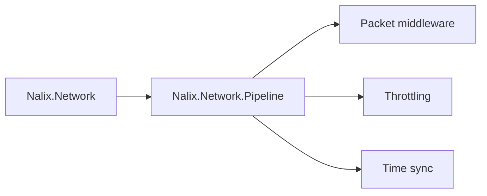

# Nalix.Network.Pipeline

`Nalix.Network.Pipeline` provides packet middleware, throttling, and time synchronization helpers used by `Nalix.Network`.

## What it gives you

- packet middleware for permission, concurrency, rate-limit, and timeout checks
- throttling primitives for opcode- and endpoint-based protection
- time synchronization support for the network runtime

## Core entry points

- `ConcurrencyGate`
- `PolicyRateLimiter`
- `TokenBucketLimiter`
- `TimeSynchronizer`
- `TokenBucketOptions`

## Where it fits

## Related pages

- [Network Middleware](../api/middleware/pipeline.md)
- [Concurrency Gate](../api/middleware/concurrency-gate.md)
- [Policy Rate Limiter](../api/middleware/policy-rate-limiter.md)
- [Token Bucket Limiter](../api/middleware/token-bucket-limiter.md)
