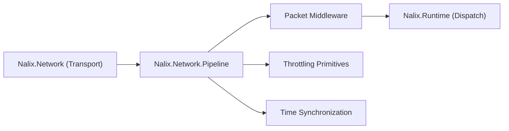

# Nalix.Network.Pipeline

`Nalix.Network.Pipeline` provides production-grade middleware, throttling primitives, and time synchronization helpers for the Nalix network runtime. It sits between `Nalix.Network` (transport) and the application dispatch layer, providing the protection and policy enforcement that production servers require.

!!! note "When to add this package"
    Add this package when your server needs built-in rate limiting, concurrency gating, permission enforcement, timeout management, or time synchronization. For development and testing, these features can be added incrementally.

## Where It Fits



## Core Components

### Packet Middleware

Pipeline middleware runs in the packet middleware layer — after deserialization but before handler execution. Each middleware has access to the full `PacketContext<TPacket>`, including handler metadata, connection state, and cancellation.

| Middleware | Purpose |
|---|---|
| `PermissionMiddleware` | Enforces `[PacketPermission]` requirements. Rejects packets from connections below the required permission level. |
| `TimeoutMiddleware` | Enforces `[PacketTimeout]` limits. Cancels handler execution that exceeds the declared timeout. |
| `ConcurrencyMiddleware` | Enforces `[PacketConcurrencyLimit]` metadata using the shared `ConcurrencyGate`. |
| `RateLimitMiddleware` | Applies per-handler and fallback per-endpoint throttling via `PolicyRateLimiter` and `TokenBucketLimiter`. |

### Throttling Primitives

Throttling primitives can be used independently or composed through the middleware pipeline.

**Token Bucket Limiter**

```csharp
// Configure via options
Configure<TokenBucketOptions>(options =>
{
    options.TokensPerInterval = 100;
    options.IntervalMillis = 1000;
    options.BurstSize = 50;
});
```

**Policy Rate Limiter**

The `PolicyRateLimiter` reads `[PacketRateLimit]` attributes from handler metadata and applies per-opcode rate limits. It supports configurable policy rules loaded from configuration.

**Concurrency Gate**

```csharp
// Runtime allocates and manages the shared gate instance
var gate = new ConcurrencyGate();

// Per-opcode capacity is configured via [PacketConcurrencyLimit]
[PacketConcurrencyLimit(32, queue: true, queueMax: 128)]
public ValueTask HandleAsync(IPacketContext<MyPacket> context) => ValueTask.CompletedTask;
```

### Time Synchronization

`TimeSynchronizer` provides server-client time alignment for latency-sensitive applications. It handles clock offset calculation and drift compensation.

## Usage with PacketDispatchChannel

Register pipeline middleware when building the dispatch channel:

```csharp
PacketDispatchChannel dispatch = new(options =>
{
    options.WithLogging(logger)
           .WithMiddleware(new PermissionMiddleware())
           .WithMiddleware(new TimeoutMiddleware())
           .WithMiddleware(new ConcurrencyMiddleware())
           .WithHandler(() => new MyHandlers());
});
```

## Usage with NetworkApplication.CreateBuilder

```csharp
var app = NetworkApplication.CreateBuilder()
    .ConfigureDispatch(options =>
    {
        options.WithMiddleware(new PermissionMiddleware());
        options.WithMiddleware(new RateLimitMiddleware());
    })
    .AddHandlers<MyHandlers>()
    .AddTcp<MyProtocol>()
    .Build();
```

## Related Pages

- [Middleware Pipeline](../api/runtime/middleware/pipeline.md) — Pipeline execution model
- [Concurrency Gate](../api/runtime/middleware/concurrency-gate.md) — API reference
- [Policy Rate Limiter](../api/runtime/middleware/policy-rate-limiter.md) — API reference
- [Token Bucket Limiter](../api/runtime/middleware/token-bucket-limiter.md) — API reference
- [Permission Middleware](../api/runtime/middleware/permission-middleware.md) — API reference
- [Timeout Middleware](../api/runtime/middleware/timeout-middleware.md) — API reference
- [Token Bucket Options](../api/network/options/token-bucket-options.md) — Configuration options
