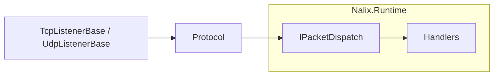

# Nalix.Network

`Nalix.Network` is the core transport layer of the Nalix framework. It handles listeners (TCP/UDP), connection management, and protocol logic.

!!! note "This package is the networking core"
    Concerns such as accepting socket traffic, managing the lifecycle of connections, and tracking active sessions live here.

## Runtime map



## Core Components

### Listeners

- `TcpListenerBase`: High-performance TCP listener using `SocketAsyncEventArgs`.
- `UdpListenerBase`: High-performance UDP listener using `SocketAsyncEventArgs`.

### [Protocol](../api/network/protocol.md)

The `IProtocol` interface and `Protocol` base class define how raw network data is interpreted and passed to the dispatcher.

### [Connections](../api/network/connection/connection.md)

- `IConnection`: Abstract representation of a client connection.
- `SocketConnection`: Concrete implementation for socket-based transports.
- `ConnectionHub`: Manages collections of active connections.

### [Session Store](../api/network/session-store.md)

`Nalix.Network.Sessions` contains the default runtime session-store implementations.
It covers the shared creation flow, the in-memory implementation, and the TTL-based session retention options.

## Relationship with Nalix.Runtime

`Nalix.Network` focuses on **how** data is moved between the network and the server. It delegates **what** to do with that data to the `IPacketDispatch` interface, which is typically implemented in `Nalix.Runtime`.

## Usage

Typically, you don't use this package directly unless you are building a custom host. Instead, use `Nalix.Network.Hosting`.

```csharp
// Example of concrete listener implementation
var protocol = new MyProtocol(dispatcher);
var listener = new MyTcpListener(protocol);
listener.Activate();
```

## Related Packages

- [Nalix.Runtime](./nalix-runtime.md): The request pipeline and dispatcher.
- [Nalix.Network.Hosting](./nalix-network-hosting.md): Standard bootstrap.
- [Nalix.Common](./nalix-common.md): Shared primitives and attributes.
