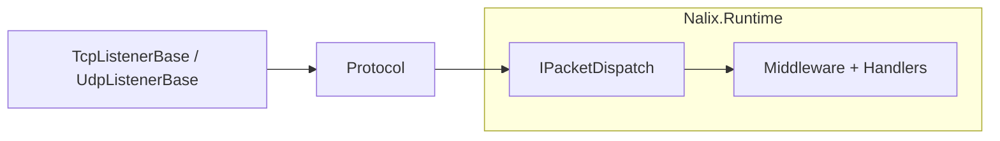

# Nalix.Network

`Nalix.Network` is the core transport layer of the Nalix framework. It handles TCP and UDP listeners, connection lifecycle management, protocol bridge logic, session storage, and socket-level infrastructure.

!!! note "For most projects, start with Nalix.Hosting"
    `Nalix.Hosting` wraps this package with a fluent builder that handles startup wiring automatically. Use `Nalix.Network` directly only when you need full control over listener and protocol construction.

## Where It Fits



## Core Components

### Listeners

| Listener | Transport | Description |
|---|---|---|
| `TcpListenerBase` | TCP | High-performance listener using `SocketAsyncEventArgs`. Handles socket acceptance, connection lifecycle, and framed receive loops. |
| `UdpListenerBase` | UDP | Stateless datagram listener with session-authenticated endpoint mapping. |

Both listeners support:

- `Activate(CancellationToken)` / `Deactivate(CancellationToken)`
- `GenerateReport()` for runtime diagnostics
- Configurable backlog, timeout enforcement, and time synchronization

### Protocol

The `IProtocol` interface and `Protocol` base class define how raw network data is interpreted and forwarded to the dispatch layer.

Key responsibilities:

- **Connection acceptance** — `ValidateConnection(IConnection)` controls whether new connections are accepted
- **Receive loop management** — `OnAccept(IConnection)` starts listening for incoming frames
- **Frame forwarding** — `ProcessMessage(object sender, IConnectEventArgs args)` pushes validated frames into `PacketDispatchChannel`
- **Connection state** — `IsAccepting` controls whether the protocol accepts new connections

```csharp
public sealed class MyProtocol : Protocol
{
    private readonly IPacketDispatch _dispatch;

    public MyProtocol(IPacketDispatch dispatch) => _dispatch = dispatch;

    public override void ProcessMessage(object sender, IConnectEventArgs args)
        => _dispatch.HandlePacket(args.Lease, args.Connection);

    protected override bool ValidateConnection(IConnection connection)
    {
        // Custom admission control
        return true;
    }
}
```

### Connections

- **`IConnection`** — Abstract representation of a client connection with identity, transport adapters, permission level, and cipher state.
- **`SocketConnection`** — Concrete socket-based implementation.
- **`ConnectionHub`** — In-memory registry of active connections. Supports lookup by ID, username mapping, forced disconnects, bulk broadcast, and `GenerateReport()`.
- **`ConnectionGuard`** — Socket-level admission control that rejects endpoints before application resources are allocated.

### Session Store

`Nalix.Network.Sessions` contains the runtime session-store implementations. The `ISessionStore` interface provides:

- Session creation and retrieval
- TTL-based session retention
- Connection state snapshot and restore (for session resume flows)

## Options

Nalix.Network provides focused option types for each transport concern:

| Options class | Controls |
|---|---|
| `NetworkSocketOptions` | Port, backlog, timeout enforcement |
| `ConnectionLimitOptions` | Maximum connections, per-IP limits |
| `ConnectionHubOptions` | Hub behavior and capacity |
| `TimingWheelOptions` | Idle timeout configuration |
| `PoolingOptions` | Buffer pool, accept context pool, receive context pool sizes |
| `NetworkCallbackOptions` | Callback flood protection thresholds |
| `CompressionOptions` | LZ4 compression settings |
| `TokenBucketOptions` | Rate limiter configuration |

All option types support `Validate()` for startup-time verification.

## Relationship with Nalix.Runtime

`Nalix.Network` focuses on **how** data moves between the network and the server. It delegates **what** to do with that data to `IPacketDispatch`, which is implemented in `Nalix.Runtime` via `PacketDispatchChannel`.

## Related Packages

- [Nalix.Runtime](./nalix-runtime.md) — Dispatch pipeline and middleware
- [Nalix.Hosting](./nalix-hosting.md) — Fluent bootstrap
- [Nalix.Abstractions](./nalix-abstractions.md) — Shared contracts and primitives

## Key API Pages

- [Protocol](../api/network/protocol.md)
- [TCP Listener](../api/network/tcp-listener.md)
- [UDP Listener](../api/network/udp-listener.md)
- [Connection](../api/network/connection/connection.md)
- [Connection Hub](../api/network/connection/connection-hub.md)
- [Session Store](../api/network/session-store.md)
- [Network Options](../api/options/network/options.md)
