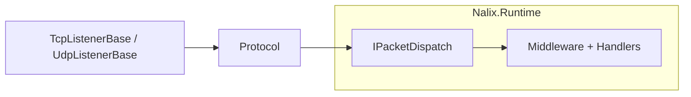

# Nalix.Network

`Nalix.Network` is the core transport layer of the Nalix framework. It handles TCP and UDP listeners, connection lifecycle management, protocol bridge logic, session storage, and socket-level infrastructure.

!!! note "For most projects, start with Nalix.Hosting"
    `Nalix.Hosting` wraps this package with a fluent builder that handles startup wiring automatically. Use `Nalix.Network` directly only when you need full control over listener and protocol construction.

## Where It Fits


```mermaid
flowchart LR
    A["TcpListenerBase / UdpListenerBase"] --> B["Protocol"]
    B --> C["IPacketDispatch"]
    subgraph Runtime ["Nalix.Runtime"]
        C --> D["Middleware + Handlers"]
    end
```

## Core Components

### Listeners

| Listener | Transport | Description |
|---|---|---|
| `TcpListenerBase` | TCP | High-performance listener using `SocketAsyncEventArgs`. Handles socket acceptance, connection lifecycle, and framed receive loops. |
| `UdpListenerBase` | UDP | Stateless datagram listener with session-authenticated endpoint mapping. |

Both listeners support:

- `Activate(CancellationToken)` / `Deactivate(CancellationToken)`
- `GenerateReport()` for runtime diagnostics
- Configurable backlog, timeout enforcement, and transport-specific limits

### Protocol

The `IProtocol` interface and `Protocol` base class define how raw network data is interpreted and forwarded to the dispatch layer.

Key responsibilities:

- **Connection acceptance** - `ValidateConnection(IConnection)` controls whether new connections are accepted.
- **Post-accept hook** - `OnAccept(IConnection, CancellationToken)` runs after a connection is admitted and registered.
- **Frame forwarding** - `ProcessMessage(object? sender, IConnectionEventArgs args)` pushes validated frames into `PacketDispatchChannel`.
- **Connection state** - `IsAccepting` controls whether the protocol accepts new connections (atomic property backed by `Interlocked`). `src/Nalix.Network/Protocols/Protocol.Core.cs` also exposes `SetConnectionAcceptance(bool)` as the public convenience API for toggling that state.

```csharp
public sealed class MyProtocol : Protocol
{
    private readonly IPacketDispatch _dispatch;

    public MyProtocol(IPacketDispatch dispatch) => _dispatch = dispatch;

    public override void ProcessMessage(object? sender, IConnectionEventArgs args)
        => _dispatch.HandlePacket(args.Lease, args.Connection);

    protected override bool ValidateConnection(IConnection connection)
    {
        // Custom admission control
        return true;
    }
}
```

### Connections

- **`IConnection`** — Abstract representation of a client connection with identity, transport adapters, permission level, and cipher state.
- **`SocketConnection`** — Concrete socket-based implementation.
- **`ConnectionHub`** - In-memory registry of active connections. Supports lookup by ID, forced disconnects, bulk broadcast, and `GenerateReport()`.
- **`ConnectionGuard`** — Socket-level admission control that rejects endpoints before application resources are allocated.

## Options

Nalix.Network provides focused option types for each transport concern:

| Options class | Controls |
|---|---|
| `NetworkSocketOptions` | Port, backlog, timeout enforcement |
| `ConnectionQuotaOptions` | Per-IP concurrent connection and rate limits |
| `ConnectionGuardOptions` | Global connection ceiling, error thresholds, packet rate, and progressive bans |
| `ConnectionBanStoreOptions` | Ban persistence store policies |
| `ConnectionBlacklistStoreOptions` | IP blacklist store policies |
| `TrustedProxyOptions` | Remote IP resolution behavior when behind load balancers/proxies |
| `NetworkWebSocketOptions` | WebSocket handshakes, frame sizes, and protocols |
| `ConnectionHubOptions` | Hub behavior and capacity |
| `TimingWheelOptions` | Idle timeout configuration |
| `NetworkCallbackOptions` | Callback flood protection thresholds |
| `DatagramGuardOptions` | UDP source rate limiting and cleanup |

Several network option types support `Validate()` for startup-time verification, including `NetworkSocketOptions`, `ConnectionQuotaOptions`, `ConnectionGuardOptions`, and `DatagramGuardOptions`.

## Relationship with Nalix.Runtime

`Nalix.Network` focuses on **how** data moves between the network and the server. It delegates **what** to do with that data to `IPacketDispatch`, which is implemented in `Nalix.Runtime` via `PacketDispatchChannel`.

## Related Packages

- [Nalix.Runtime](./nalix-runtime.md) - Dispatch pipeline and middleware
- [Nalix.Hosting](./nalix-hosting.md) - Fluent bootstrap
- [Nalix.Abstractions](./nalix-abstractions.md) - Shared contracts and primitives

## Key API Pages

- [Protocol](../api/network/protocol.md)
- [TCP Listener](../api/network/tcp-listener.md)
- [UDP Listener](../api/network/udp-listener.md)
- [WebSocket Listener](../api/network/websocket-listener.md)
- [Connection](../api/network/connection/connection.md)
- [Connection Guard](../api/network/connection/connection-guard.md)
- [Connection Hub](../api/network/connection/connection-hub.md)
- [WebSocket Connection](../api/network/websocket-connection.md)
- [Network Options](../api/options/network/options.md)
