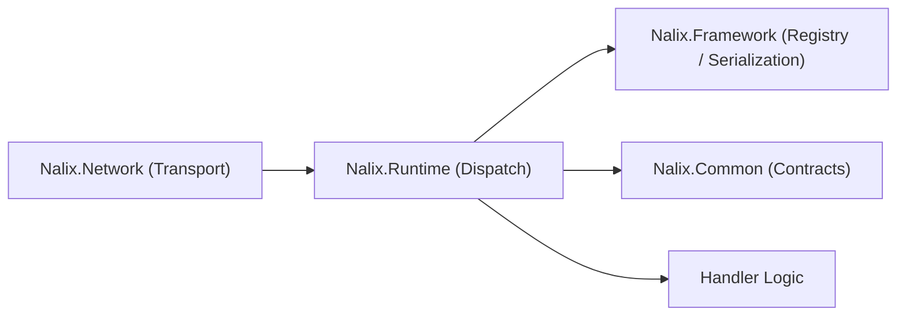

# Nalix.Runtime

`Nalix.Runtime` is the high-performance orchestration layer of the Nalix framework, specifically designed to power **Server-Side** packet processing. It provides the multi-threaded dispatch pipeline, middleware execution engine, handler compilation, and session state infrastructure.

!!! info "The Engine of the Server"
    While `Nalix.SDK` is designed for client-side consumption, `Nalix.Runtime` is the engine that handles the heavy lifting on the server, managing worker affinity, request routing, and industrial-grade session persistence.

!!! note "Typically consumed via Nalix.Network.Hosting"
    Most projects consume `Nalix.Runtime` indirectly through `Nalix.Network.Hosting`, which wires up the dispatcher and middleware automatically. Use `Nalix.Runtime` directly only when you need full control over the dispatch pipeline.

## Where It Fits



## Core Components

### Packet Dispatch

`PacketDispatchChannel` is the engine that processes all incoming network traffic. It manages:

- **Shard-aware worker loops** — Multiple workers (scaled to CPU core count) pull from the dispatch queue in parallel, preventing head-of-line blocking.
- **Priority queueing** — Packets are prioritized by `PacketPriority` (`URGENT`, `HIGH`, `MEDIUM`, `LOW`, `NONE`).
- **Deserialization** — Uses the `PacketRegistry` to convert raw bytes into typed packet instances.
- **Middleware execution** — Runs the configured middleware chain before handler invocation.
- **Handler invocation** — Calls the matched handler method with the appropriate context.
- **Return handling** — Translates handler return values into outbound network responses.

```csharp
PacketDispatchChannel dispatch = new(options =>
{
    options.WithLogging(logger)
           .WithErrorHandling((ex, opcode) =>
           {
               logger.Error($"dispatch-error opcode=0x{opcode:X4}", ex);
           })
           .WithMiddleware(new MyAuditMiddleware<IPacket>())
           .WithHandler(() => new AccountHandlers())
           .WithHandler(() => new MatchHandlers());
});

dispatch.Activate();
```

### Middleware Pipeline

The runtime supports two middleware layers:

| Layer | Interface | Access | Use case |
| :--- | :--- | :--- | :--- |
| Buffer middleware | `INetworkBufferMiddleware` | Raw `IBufferLease` | Decryption, decompression, frame validation |
| Packet middleware | `IPacketMiddleware<TPacket>` | `PacketContext<TPacket>` | Permissions, rate limiting, timeouts, auditing |

Middleware is registered during dispatch construction and executes in registration order.

### Handler Compilation

Handler methods are discovered and compiled during `Build()`:

- Methods annotated with `[PacketOpcode]` are matched to packet types
- Handler delegates are pre-compiled using expression trees or IL emit to avoid reflection during the hot path
- Handler metadata (permissions, timeouts, rate limits) is resolved once and cached in `PacketMetadata`

### Session Resume

The built-in session resume flow is handled by `SessionHandlers` and backed by `ISessionStore`. It uses the unified `SessionResume` packet with `SessionResumeStage` to manage request/response stages:

1. Client sends a `SessionResume` with `Stage = REQUEST` and a session token
2. Server validates the token against `ISessionStore`
3. Server restores connection state and sends `SessionResume` with `Stage = RESPONSE`

### Routing

Attribute-based routing maps opcodes to handler methods:

```csharp
[PacketController("AccountHandlers")]
public sealed class AccountHandlers
{
    [PacketOpcode(0x2001)]
    [PacketPermission(PermissionLevel.USER)]
    [PacketTimeout(5000)]
    public async ValueTask<AccountResponse> Login(
        IPacketContext<LoginRequest> context)
    {
        // Handler logic
    }
}
```

## Handler Return Types

The dispatch pipeline supports multiple return shapes. The internal return handler converts each into the appropriate outbound behavior:

| Return type | Behavior |
| :--- | :--- |
| `TPacket` | Serializes and sends the packet to the caller |
| `Task<TPacket>` / `ValueTask<TPacket>` | Awaits, then serializes and sends |
| `string` | Sends as a text response |
| `byte[]` / `Memory<byte>` | Sends as raw bytes |
| `void` / `Task` / `ValueTask` | No response; side-effect only |

## Diagnostics

Call `dispatch.GenerateReport()` to inspect runtime state:

- Number of active workers
- Queue depth
- Registered handler count
- Middleware chain

## Related Packages

- [Nalix.Network](./nalix-network.md) — Transport and listeners
- [Nalix.Network.Hosting](./nalix-network-hosting.md) — Fluent bootstrap
- [Nalix.Network.Pipeline](./nalix-network-pipeline.md) — Built-in middleware
- [Nalix.Framework](./nalix-framework.md) — Packet registry and serialization
- [Nalix.Common](./nalix-common.md) — Shared contracts and primitives

## Key API Pages

- [Packet Dispatch](../api/runtime/routing/packet-dispatch.md)
- [Packet Dispatch Options](../api/runtime/routing/packet-dispatch-options.md)
- [Middleware Pipeline](../api/runtime/middleware/pipeline.md)
- [Packet Attributes](../api/runtime/routing/packet-attributes.md)
- [Handler Return Types](../api/runtime/routing/handler-results.md)
- [Dispatch Options](../api/runtime/options/dispatch-options.md)
- [Session Resume](../api/security/session-resume.md)
