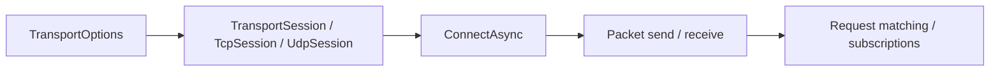

# Nalix.SDK

`Nalix.SDK` is the client-side transport package for connecting .NET applications to a Nalix server over TCP or UDP.

!!! tip "Start with `TcpSession`"
    `TcpSession` is the main client transport in the current source tree. It already exposes the shared transport lifecycle and the packet send / receive flow that most client applications need.

## Client flow



## Core pieces

- `TransportSession`
- `TcpSession`
- `UdpSession` (with 7-byte session token support)
- `TransportOptions`
- `RequestOptions`
- transport extensions such as `ControlExtensions`, `RequestExtensions`, `HandshakeExtensions`, `CipherExtensions`, and `TcpSessionSubscriptions`
- thread dispatching helpers such as `IThreadDispatcher` and `InlineDispatcher`
- protocol string helpers such as `ProtocolStringExtensions`

## Sessions

Use `TransportSession` as the shared abstraction when you are writing code that should not depend on the concrete transport (TCP/UDP).

Use `TcpSession` for the normal client runtime. It includes:

- managed socket connect/disconnect flow
- packet serialization and framed send helpers
- a background receive loop
- raw buffer and packet events through `TransportSession`

### Quick example

```csharp
TransportOptions options = ConfigurationManager.Instance.Get<TransportOptions>();
options.Address = "127.0.0.1";
options.Port = 57206;

TcpSession client = new(options, catalog);
client.OnConnected += (_, _) => { };
client.OnDisconnected += (_, ex) => { };

await client.ConnectAsync(options.Address, options.Port);
await client.HandshakeAsync(); // X25519 handshake
await client.SendAsync(myPacket);
await client.DisconnectAsync();
client.Dispose();
```

## Request and control helpers

The extension layer covers the common client flows:

- X25519 cryptographic handshakes
- `RequestAsync<TResponse>(...)`
- `AwaitControlAsync(...)` and `SendControlAsync(...)`

### Quick example

```csharp
await client.HandshakeAsync(ct);

Control request = client.NewControl(opCode: 1, type: ControlType.NOTICE).Build();
Control reply = await client.RequestAsync<Control>(
    request,
    RequestOptions.Default.WithTimeout(3_000),
    r => r.Type == ControlType.PONG);
```

The request helpers subscribe before sending, so they avoid the usual response race.

## Transport options

`TransportOptions` belongs to `Nalix.SDK`, even though it is commonly loaded through `ConfigurationManager`.

It controls:

- address and port
- connect timeout
- reconnect policy
- keep-alive interval
- socket tuning
- max packet size
- compression and encryption settings

## Key API pages

- [Transport Session](../api/sdk/transport-session.md)
- [TCP Session](../api/sdk/tcp-session.md)
- [Session Extensions](../api/sdk/tcp-session-extensions.md)
- [Cipher Updates](../api/sdk/cipher-extensions.md)
- [Request Options](../api/sdk/options/request-options.md)
- [Session Diagnostics](../api/sdk/diagnostics.md)
- [Thread Dispatching](../api/sdk/thread-dispatching.md)
