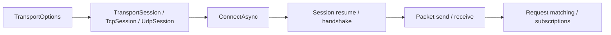

# Nalix.SDK

`Nalix.SDK` is the client-side transport package for connecting .NET applications to a Nalix server over TCP or UDP.

!!! tip "Start with `TcpSession`"
    `TcpSession` is the main client transport in the current source tree. It already exposes the shared transport lifecycle and the packet send / receive flow that most client applications need.

## Client flow



## Core pieces

- `TransportSession`
- `TcpSession`
- `UdpSession` (with 8-byte session token support)
- `TransportOptions`
- `RequestOptions`
- transport extensions such as `ControlExtensions`, `RequestExtensions`, `HandshakeExtensions`, `ResumeExtensions`, `CipherExtensions`, and `TcpSessionSubscriptions`
- thread dispatching helpers such as `IThreadDispatcher` and `InlineDispatcher`
- protocol string helpers such as `ProtocolStringExtensions`

## Sessions

Use `TransportSession` as the shared abstraction when you are writing code that should not depend on the concrete transport (TCP/UDP).

Use `TcpSession` for the normal client runtime. It includes:

- managed socket connect/disconnect flow
- packet serialization and framed send helpers
- a background receive loop
- raw buffer and packet events through `TransportSession`

### Quick example

```csharp
TransportOptions options = ConfigurationManager.Instance.Get<TransportOptions>();
options.Address = "127.0.0.1";
options.Port = 57206;

TcpSession client = new(options, catalog);
client.OnConnected += (_, _) => { };
client.OnDisconnected += (_, ex) => { };

await client.ConnectAsync(options.Address, options.Port);
await client.HandshakeAsync(); // X25519 handshake
await client.SendAsync(myPacket, encrypt: true); // Send with optional encryption override
await client.DisconnectAsync();
client.Dispose();
```

## Request and control helpers

The extension layer covers the common client flows:

- X25519 cryptographic handshakes
- session resume with token rotation support
- `RequestAsync<TResponse>(...)`
- `AwaitControlAsync(...)` and `SendControlAsync(...)`

### Quick example

```csharp
await client.HandshakeAsync(ct);

Control request = client.NewControl(opCode: 1, type: ControlType.NOTICE).Build();
Control reply = await client.RequestAsync<Control>(
    request,
    RequestOptions.Default.WithTimeout(3_000),
    r => r.Type == ControlType.PONG);
```

The request helpers subscribe before sending, so they avoid the usual response race.

## Client Bootstrap

`Bootstrap.AutoInitialize()` is a module initializer, so loading `Nalix.SDK` calls `Bootstrap.Initialize()` automatically.

Source-verified bootstrap behavior:

1. Switches the active configuration file to `client.ini` under `Directories.ConfigurationDirectory`.
2. Sets `PacketOptions.EnablePooling = false` for client-side defaults.
3. Loads `TransportOptions` so a client template exists in `client.ini`.
4. Calls `ConfigurationManager.Instance.Flush()` to persist those defaults.

Call `Bootstrap.Initialize()` manually only when you need to force the same setup after custom configuration initialization.

## Transport Options

`TransportOptions` belongs to `Nalix.SDK`, even though it is commonly loaded through `ConfigurationManager`.

| Property | Default | Validation / source note |
|---|---:|---|
| `Address` | `"127.0.0.1"` | Required. |
| `Port` | `57206` | `1..65535`. |
| `ConnectTimeoutMillis` | `5000` | `0..Int32.MaxValue`; `0` means no timeout. |
| `ReconnectEnabled` | `true` | Boolean toggle. |
| `ReconnectMaxAttempts` | `0` | `0..Int32.MaxValue`; `0` means unlimited attempts. |
| `ReconnectBaseDelayMillis` | `500` | `0..30000`. |
| `ReconnectMaxDelayMillis` | `30000` | `0..30000`. |
| `KeepAliveIntervalMillis` | `20000` | `0..Int32.MaxValue`; `0` disables heartbeats. |
| `NoDelay` | `true` | Controls TCP_NODELAY. |
| `BufferSize` | `65536` | `2048..1048576` bytes. |
| `Algorithm` | `Chacha20Poly1305` | Cipher suite selection. |
| `CompressionEnabled` | `true` | Outbound compression toggle. |
| `CompressionThreshold` | `512` | Compression trigger size in bytes. |
| `EncryptionEnabled` | `true` | Packet encryption toggle. |
| `AsyncQueueCapacity` | `1024` | `1..65536`. |
| `MaxUdpDatagramSize` | `1400` | `64..65507`; includes the 8-byte token/header. |
| `ServerPublicKey` | `null` | Optional pinned X25519 public key string. |
| `ResumeEnabled` | `true` | Attempts resume before a fresh handshake. |
| `ResumeTimeoutMillis` | `3000` | `100..Int32.MaxValue`. |
| `ResumeFallbackToHandshake` | `true` | Falls back to handshake when resume fails. |
| `TimeSyncEnabled` | `true` | Allows `SyncTimeAsync` to update the internal global clock. |

`Secret` and `SessionToken` are marked `[ConfiguredIgnore]`, so they are runtime state rather than persisted INI values.

## Request Options

| Property | Default | Validation / source note |
|---|---:|---|
| `TimeoutMs` | `5000` | Must be `>= 0`; `0` waits indefinitely. |
| `RetryCount` | `0` | Must be `>= 0`; retries occur only after `TimeoutException`. |
| `Encrypt` | `false` | Requires the active session to be `TcpSession`. |

Each retry receives its own `TimeoutMs` window. Fatal connection or send errors propagate immediately and are not retried.

## Key API pages

- [Transport Session](../api/sdk/transport-session.md)
- [TCP Session](../api/sdk/tcp-session.md)
- [Handshake Extensions](../api/sdk/handshake-extensions.md)
- [Session Extensions](../api/sdk/tcp-session-extensions.md)
- [Cipher Updates](../api/sdk/cipher-extensions.md)
- [Request Options](../api/options/sdk/request-options.md)
- [Session Diagnostics](../api/sdk/diagnostics.md)
- [Thread Dispatching](../api/sdk/thread-dispatching.md)
