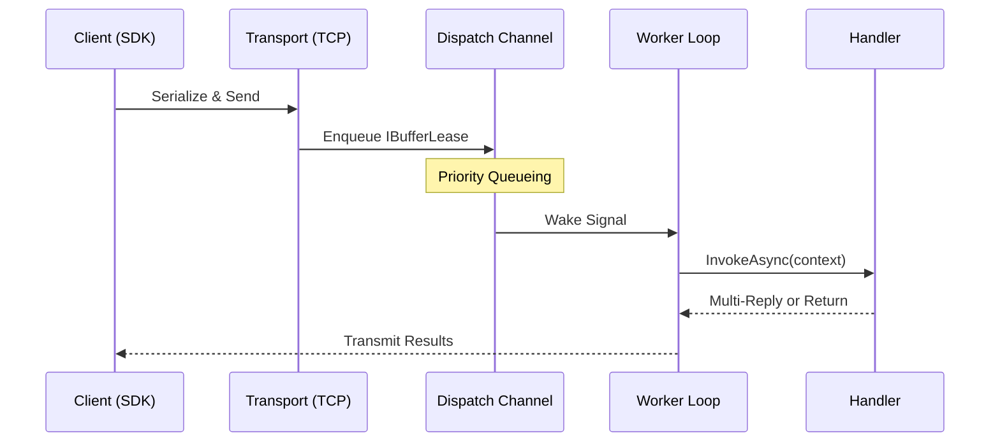

# Quickstart

Welcome to Nalix. This guide will walk you through building a high-performance "Ping" service from scratch using TCP. You'll learn how to define packets, implement handlers, and connect a client—all with zero-allocation efficiency.

## 🏗️ Project Setup

Nalix is composed of specialized packages. For most projects, you'll need the following:

### 📄 Contracts (Shared)
```bash
dotnet add package Nalix.Common
dotnet add package Nalix.Framework
```

### 🖥️ Server
```bash
dotnet add package Nalix.Network.Hosting
dotnet add package Nalix.Network.Pipeline
dotnet add package Nalix.Logging
```

### 📱 Client (SDK)
```bash
dotnet add package Nalix.SDK
```

---

## 1. Define Your Packets

Packets in Nalix are simple POCOs decorated with serialization metadata. Create a shared `Contracts` project so both the server and client stay in sync.

```csharp
[SerializePackable(SerializeLayout.Explicit)]
public sealed class PingRequest : PacketBase<PingRequest>
{
    public const ushort OpCodeValue = 0x1001;

    [SerializeOrder(0)]
    [SerializeDynamicSize(64)]
    public string Message { get; set; } = string.Empty;

    public PingRequest() => OpCode = OpCodeValue;
}

[SerializePackable(SerializeLayout.Explicit)]
public sealed class PingResponse : PacketBase<PingResponse>
{
    public const ushort OpCodeValue = 0x1002;

    [SerializeOrder(0)]
    [SerializeDynamicSize(64)]
    public string Message { get; set; } = string.Empty;

    public PingResponse() => OpCode = OpCodeValue;
}
```

## 2. Implement the Server

The server uses the `NetworkApplication` builder to glue handlers, protocols, and hosting together.

### The Handler
```csharp
[PacketController("General")]
public sealed class PingHandler
{
    [PacketOpcode(PingRequest.OpCodeValue)]
    public PingResponse Handle(IPacketContext<PingRequest> context)
    {
        return new PingResponse { Message = $"Pong: {context.Packet.Message}" };
    }
}
```

### The Program
```csharp
using Nalix.Common.Networking.Packets;
using Nalix.Common.Networking.Protocols;
using Nalix.Framework.DataFrames.SignalFrames;
using Nalix.Network.Hosting;
using Nalix.Network.Options;
using Nalix.Runtime.Dispatching;

using var app = NetworkApplication.CreateBuilder()
    .AddHandlers<PingHandler>()
    .Configure<NetworkSocketOptions>(options => options.Port = 5000)
    .AddTcp<PingProtocol>()
    .Build();

await app.RunAsync();

public sealed class PingProtocol : IProtocol
{
    private readonly IPacketDispatch _dispatch;

    public PingProtocol(IPacketDispatch dispatch) => _dispatch = dispatch;

    public void ProcessMessage(object sender, IConnectEventArgs args)
        => _dispatch.HandlePacket(args.Lease, args.Connection);
}
```

## 3. Connect the Client

Use the `Nalix.SDK` for a thread-safe, high-level client experience.

```csharp
using Nalix.SDK.Options;
using Nalix.SDK.Transport;
using Nalix.SDK.Transport.Extensions;

// 1. Build the registry
var registry = new PacketRegistry(cfg =>
{
    cfg.RegisterPacket<PingRequest>()
       .RegisterPacket<PingResponse>();
});

// 2. Initialize session
await using var client = new TcpSession(new TransportOptions { Address = "127.0.0.1", Port = 5000 }, registry);
await client.ConnectAsync();

// 3. Request/Response
var response = await client.RequestAsync<PingResponse>(
    new PingRequest { Message = "Hello Nalix!" },
    options: RequestOptions.Default.WithTimeout(5_000));
Console.WriteLine(response.Message); // Output: Pong: Hello Nalix!
```

---

## 🔄 Runtime Architecture

The following diagram illustrates how a packet flows from the client, through the server's priority-aware dispatch queue, and finally into your handler.



## 🛡️ Next Steps

Now that you've mastered the basics, explore the power of the Nalix runtime:

- **[Security & Permissions](./api/runtime/routing/packet-attributes.md)**: Enforce `PermissionLevel.USER` or `SYSTEM_ADMINISTRATOR` on handlers.
- **[Middleware Pipeline](./api/runtime/middleware/pipeline.md)**: Add logging, rate-limiting, and metric collection.
- **[Zero-Allocation Design](./api/framework/memory/buffer-and-pooling.md)**: Learn how `BufferLease` keeps your GC overhead at near-zero.
- **[Deployment Guides](./guides/production-end-to-end.md)**: Best practices for hosting in Linux, Windows, or Kubernetes.
