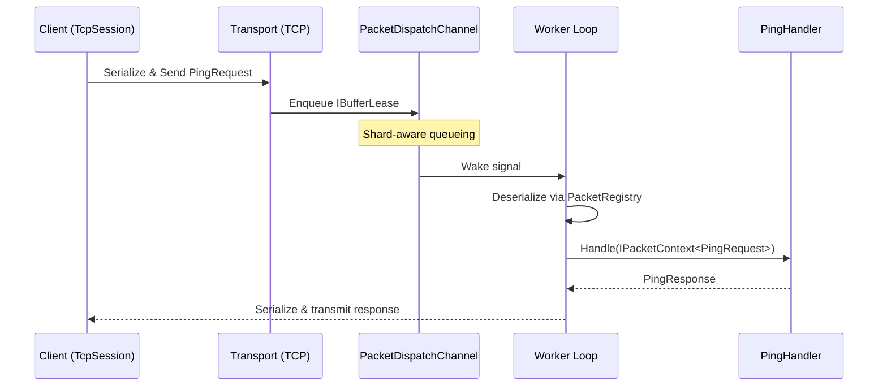

# Quickstart

This guide walks you through building a complete Ping/Pong service using Nalix over TCP. By the end, you will have a working server that receives a `PingRequest` and returns a `PingResponse`, and a client that sends the request and prints the reply.

## What You Will Build

- A shared **contracts** project with `PingRequest` and `PingResponse` packet definitions
- A **server** using `NetworkApplication` that routes packets to a handler
- A **client** using `TcpSession` that sends a request and receives the response

## Prerequisites

- .NET 10 SDK or later ([download](https://dotnet.microsoft.com/download))
- A terminal or IDE with .NET CLI access

## Step 1: Create the Solution

```bash
mkdir NalixPingPong && cd NalixPingPong
dotnet new sln

dotnet new classlib -n Contracts
dotnet new console -n Server
dotnet new console -n Client

dotnet sln add Contracts Server Client
dotnet add Server reference Contracts
dotnet add Client reference Contracts
```

## Step 2: Install Packages

```bash
# Contracts (shared)
dotnet add Contracts package Nalix.Common
dotnet add Contracts package Nalix.Framework

# Server
dotnet add Server package Nalix.Network.Hosting
dotnet add Server package Nalix.Network.Pipeline
dotnet add Server package Nalix.Logging

# Client
dotnet add Client package Nalix.SDK
```

## Step 3: Define Packets

Create the shared packet contracts in the `Contracts` project. Both server and client reference this assembly, ensuring opcode and serialization alignment.

**`Contracts/PingRequest.cs`**

```csharp
using Nalix.Common.Networking.Packets;
using Nalix.Common.Serialization;

namespace Contracts;

[SerializePackable(SerializeLayout.Explicit)]
public sealed class PingRequest : PacketBase<PingRequest>
{
    public const ushort OpCodeValue = 0x1001;

    [SerializeOrder(0)]
    [SerializeDynamicSize(64)]
    public string Message { get; set; } = string.Empty;

    public PingRequest() => OpCode = OpCodeValue;
}
```

**`Contracts/PingResponse.cs`**

```csharp
using Nalix.Common.Networking.Packets;
using Nalix.Common.Serialization;

namespace Contracts;

[SerializePackable(SerializeLayout.Explicit)]
public sealed class PingResponse : PacketBase<PingResponse>
{
    public const ushort OpCodeValue = 0x1002;

    [SerializeOrder(0)]
    [SerializeDynamicSize(64)]
    public string Message { get; set; } = string.Empty;

    public PingResponse() => OpCode = OpCodeValue;
}
```

!!! tip "Why Explicit layout?"
    `SerializeLayout.Explicit` with `[SerializeOrder]` ensures field positions in the byte stream are stable across code changes. This is the recommended layout for production packets. See [Packet System](./concepts/packet-system.md) for details.

## Step 4: Implement the Server

### Handler

A handler is a plain class annotated with `[PacketController]`. Each method annotated with `[PacketOpcode]` handles a specific packet type.

**`Server/PingHandler.cs`**

```csharp
using Contracts;
using Nalix.Common.Networking.Packets;

[PacketController("PingHandler")]
public sealed class PingHandler
{
    [PacketOpcode(PingRequest.OpCodeValue)]
    public PingResponse Handle(IPacketContext<PingRequest> context)
    {
        return new PingResponse
        {
            Message = $"Pong: {context.Packet.Message}"
        };
    }
}
```

### Protocol

The protocol bridges transport events to the dispatch pipeline. For most applications, this is a thin pass-through.

**`Server/PingProtocol.cs`**

```csharp
using Nalix.Common.Networking;
using Nalix.Network.Protocols;
using Nalix.Runtime.Dispatching;

public sealed class PingProtocol : Protocol
{
    private readonly IPacketDispatch _dispatch;

    public PingProtocol(IPacketDispatch dispatch) => _dispatch = dispatch;

    public override void ProcessMessage(object sender, IConnectEventArgs args)
        => _dispatch.HandlePacket(args.Lease, args.Connection);
}
```

### Program

**`Server/Program.cs`**

```csharp
using Nalix.Network.Hosting;
using Nalix.Network.Options;

using var app = NetworkApplication.CreateBuilder()
    .AddPacket<Contracts.PingRequest>()
    .AddHandler<PingHandler>()
    .Configure<NetworkSocketOptions>(options => options.Port = 5000)
    .AddTcp<PingProtocol>()
    .Build();

await app.RunAsync();
```

## Step 5: Connect the Client

**`Client/Program.cs`**

```csharp
using Contracts;
using Nalix.Framework.DataFrames;
using Nalix.SDK.Options;
using Nalix.SDK.Transport;
using Nalix.SDK.Transport.Extensions;

// 1. Build the packet registry
PacketRegistryFactory factory = new();
factory.RegisterPacket<PingRequest>()
       .RegisterPacket<PingResponse>();
var registry = factory.CreateCatalog();

// 2. Create and connect the session
var options = new TransportOptions { Address = "127.0.0.1", Port = 5000 };
await using var client = new TcpSession(options, registry);
await client.ConnectAsync();

// 3. Send a request and await the response
var response = await client.RequestAsync<PingResponse>(
    new PingRequest { Message = "Hello Nalix!" },
    options: RequestOptions.Default.WithTimeout(5_000));

Console.WriteLine(response.Message); // Output: Pong: Hello Nalix!
```

## How It Works

The following diagram shows the complete request/response flow:



## What You Built

You now have a working Nalix stack with:

- **Shared contracts** — packet definitions referenced by both server and client
- **Attributed routing** — `[PacketOpcode]` maps opcodes to handler methods
- **Fluent hosting** — `NetworkApplication.CreateBuilder()` wires up dispatch, protocol, and listeners
- **Type-safe request/response** — `RequestAsync<TResponse>` correlates requests and responses automatically

## Next Steps

- [Architecture](./concepts/architecture.md) — Understand how layers connect
- [Middleware](./concepts/middleware.md) — Add logging, rate limiting, and permissions
- [Packet System](./concepts/packet-system.md) — Advanced serialization layouts and versioning
- [Production Checklist](./guides/production-checklist.md) — Prepare for real traffic
- [Server Blueprint](./guides/server-blueprint.md) — Production-oriented project structure
