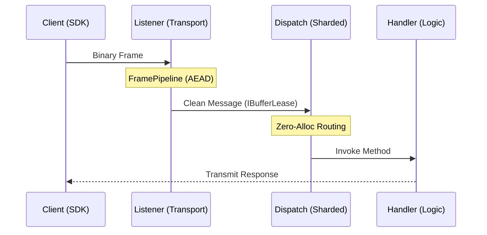

# Quickstart

!!! info "Learning Signals"
    - :fontawesome-solid-layer-group: **Level**: Beginner
    - :fontawesome-solid-clock: **Time**: 15 minutes
    - :fontawesome-solid-book: **Prerequisites**: [Introduction](./introduction.md)

This guide walks you through building a complete **Ping/Pong service** using Nalix over TCP. By the end, you will have a production-grade foundation with a shared contract project, a sharded server, and a type-safe client.

---

## 🗺️ Roadmap

1.  **Define Packets**: Create shared data contracts.
2.  **Identity Setup**: Generate server security keys.
3.  **Server Setup**: Route packets to a handler.
4.  **Client Connectivity**: Send requests and await replies.

---

## Step 1: Create the Solution

We recommend a three-project structure to keep your networking logic clean and reusable.

```bash
mkdir NalixPingPong && cd NalixPingPong
dotnet new sln

# 1. Shared Contracts
dotnet new classlib -n Contracts
dotnet add Contracts package Nalix.Common

# 2. Server Host
dotnet new console -n Server
dotnet add Server reference Contracts
dotnet add Server package Nalix.Network.Hosting

# 3. Client App
dotnet new console -n Client
dotnet add Client reference Contracts
dotnet add Client package Nalix.SDK

dotnet sln add Contracts Server Client
```

---

## Step 2: Define Packets

Create the shared packet contracts in the `Contracts` project. Both server and client reference this assembly, ensuring binary alignment.

=== "PingRequest.cs"

    ```csharp
    using Nalix.Common.Networking.Packets;
    using Nalix.Common.Serialization;

    namespace Contracts;

    [SerializePackable]
    public sealed class PingRequest : PacketBase<PingRequest>
    {
        public const ushort OpCodeValue = 0x1001;

        public string Message { get; set; } = string.Empty;

        public PingRequest() => OpCode = OpCodeValue;
    }
    ```

=== "PingResponse.cs"

    ```csharp
    using Nalix.Common.Networking.Packets;
    using Nalix.Common.Serialization;

    namespace Contracts;

    [SerializePackable]
    public sealed class PingResponse : PacketBase<PingResponse>
    {
        public const ushort OpCodeValue = 0x1002;

        public string Message { get; set; } = string.Empty;

        public PingResponse() => OpCode = OpCodeValue;
    }
    ```

!!! tip "Layout Strategy"
    By default, `[SerializePackable]` uses `SerializeLayout.Auto`, which automatically orders fields for optimal packing. In production environments where binary stability is critical (e.g., cross-version compatibility), you can switch to `SerializeLayout.Explicit` and use `[SerializeOrder(n)]` to lock field positions.

---

## Step 3: Identity Setup

Nalix enforces mandatory security. Before running the server, you must generate a cryptographic identity.

```bash
# Clean and run the certificate tool
dotnet run --project tools/Nalix.Certificate
```

This will generate `certificate.private` and `certificate.public` in your application's identity folder. The server will automatically load the default identity during `Build()`. If your certificate files live somewhere else, call `ConfigureCertificate(...)` before `Build()` so the hosting builder passes that path to the handshake subsystem.

```csharp
using var app = NetworkApplication.CreateBuilder()
    .ConfigureCertificate("./identity/certificate.private")
    // Add packets, handlers, and listeners here.
    .Build();
```

---

## Step 4: Implement the Server

The server requires a **Handler** for logic and a **Protocol** bridge to the network.

=== "Handler.cs"

    ```csharp
    using Contracts;
    using Nalix.Common.Networking.Packets;

    [PacketController("PingHandler")]
    public sealed class PingHandler
    {
        [PacketOpcode(PingRequest.OpCodeValue)]
        public PingResponse Handle(IPacketContext<PingRequest> context)
        {
            return new PingResponse
            {
                Message = $"Pong: {context.Packet.Message}"
            };
        }
    }
    ```

=== "Protocol.cs"

    ```csharp
    using Nalix.Common.Networking;
    using Nalix.Network.Protocols;
    using Nalix.Runtime.Dispatching;

    public sealed class PingProtocol : Protocol
    {
        private readonly IPacketDispatch _dispatch;

        public PingProtocol(IPacketDispatch dispatch) => _dispatch = dispatch;

        public override void ProcessMessage(object? sender, IConnectEventArgs args)
            => _dispatch.HandlePacket(args.Lease, args.Connection);
    }
    ```

=== "Program.cs"

    ```csharp
    using Nalix.Network.Hosting;
    using Nalix.Network.Options;

    using var app = NetworkApplication.CreateBuilder()
        .AddPacket<Contracts.PingRequest>()
        .AddHandler<PingHandler>()
        .Configure<NetworkSocketOptions>(opt => opt.Port = 5000)
        .AddTcp<PingProtocol>()
        .Build();

    await app.RunAsync();
    ```

---

## Step 5: Connect the Client

Nalix SDK provides a `TcpSession` that handles reconnection and type-safe request correlation automatically.

```csharp
using Contracts;
using Nalix.Framework.DataFrames;
using Nalix.SDK.Options;
using Nalix.SDK.Transport;

// 1. Build the packet registry (The 'Catalog')
PacketRegistryFactory factory = new();
factory.RegisterPacket<PingRequest>()
       .RegisterPacket<PingResponse>();
var registry = factory.CreateCatalog();

// 2. Open the session
var options = new TransportOptions { Address = "127.0.0.1", Port = 5000 };
await using var client = new TcpSession(options, registry);
await client.ConnectAsync();

// 3. Request/Response (Type-Safe)
var response = await client.RequestAsync<PingResponse>(
    new PingRequest { Message = "Hello Nalix!" });

// 4. Fire-and-forget (Optional Encryption)
await client.SendAsync(new PingRequest { Message = "Silent Ping" }, encrypt: false);

Console.WriteLine(response.Message); // "Pong: Hello Nalix!"
```

---

## 🛠️ Performance Architecture

Nalix isn't just easy to use; it's built for high-scale environments.



## Recommended Next Steps

<div class="grid items" markdown>

-   :material-sitemap: [**Architecture**](./concepts/fundamentals/architecture.md)
    Deep dive into the sharded dispatch model.

-   :material-shield-key: [**Middleware**](./guides/application/middleware-usage.md)
    Secure your packets with rate-limits and permissions.

-   :material-check-decagram: [**Production Prep**](./guides/deployment/production-checklist.md)
    Checklist for high-traffic deployments.

</div>

