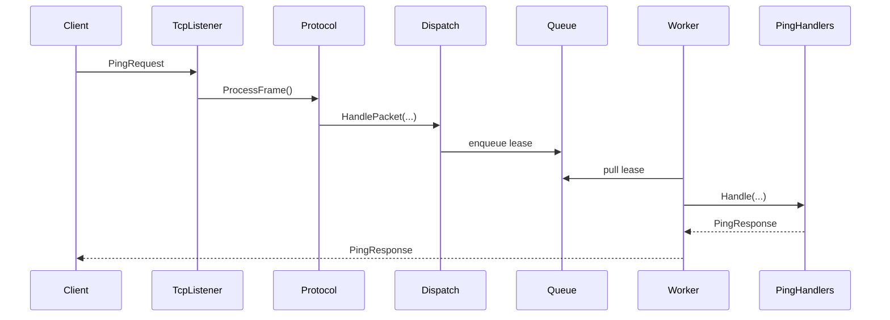

# Quickstart

Run one TCP ping request end to end.

## Install

### Shared contracts

```bash
dotnet add package Nalix.Common
dotnet add package Nalix.Framework
```

### Server

```bash
dotnet add package Nalix.Common
dotnet add package Nalix.Framework
dotnet add package Nalix.Network
dotnet add package Nalix.Network.Hosting
dotnet add package Nalix.Logging
dotnet add package Nalix.Network.Pipeline
```

### Client

```bash
dotnet add package Nalix.Common
dotnet add package Nalix.Framework
dotnet add package Nalix.SDK
```

## Project Structure

```text
QuickStart/
  src/
    QuickStart.Contracts/
      Packets/
        PingRequest.cs
        PingResponse.cs
    QuickStart.Server/
      Handlers/PingHandlers.cs
      Protocols/QuickStartProtocol.cs
      Program.cs
    QuickStart.Client/
      Program.cs
```

Reference `QuickStart.Contracts` from both server and client.

## 1. Packets

### `PingRequest.cs`

```csharp
using Nalix.Common.Networking.Packets;
using Nalix.Common.Networking.Protocols;
using Nalix.Common.Serialization;
using Nalix.Framework.DataFrames;

namespace QuickStart.Contracts.Packets;

[SerializePackable(SerializeLayout.Explicit)]
public sealed class PingRequest : PacketBase<PingRequest>
{
    public const ushort OpCodeValue = 0x1001;

    [SerializeDynamicSize(64)]
    [SerializeOrder(0)]
    public string Message { get; set; } = string.Empty;

    public PingRequest()
    {
        this.OpCode = OpCodeValue;
        this.Protocol = ProtocolType.TCP;
        this.Flags = PacketFlags.SYSTEM;
    }
}
```

### `PingResponse.cs`

```csharp
using Nalix.Common.Networking.Packets;
using Nalix.Common.Networking.Protocols;
using Nalix.Common.Serialization;
using Nalix.Framework.DataFrames;

namespace QuickStart.Contracts.Packets;

[SerializePackable(SerializeLayout.Explicit)]
public sealed class PingResponse : PacketBase<PingResponse>
{
    public const ushort OpCodeValue = 0x1002;

    [SerializeDynamicSize(64)]
    [SerializeOrder(0)]
    public string Message { get; set; } = string.Empty;

    public PingResponse()
    {
        this.OpCode = OpCodeValue;
        this.Protocol = ProtocolType.TCP;
        this.Flags = PacketFlags.SYSTEM;
    }
}
```

## 2. Server

### `PingHandlers.cs`

```csharp
using Nalix.Common.Networking.Packets;
using Nalix.Runtime.Dispatching;
using QuickStart.Contracts.Packets;

namespace QuickStart.Server.Handlers;

[PacketController("PingHandlers")]
public sealed class PingHandlers
{
    [PacketOpcode(PingRequest.OpCodeValue)]
    public PingResponse Handle(IPacketContext<PingRequest> request)
    {
        return new PingResponse { Message = $"pong: {request.Packet.Message}" };
    }
}
```

### `QuickStartProtocol.cs`

```csharp
using Nalix.Common.Networking;
using Nalix.Common.Networking.Packets;
using QuickStart.Server.Protocols;

namespace QuickStart.Server.Protocols;

public sealed class QuickStartProtocol : Protocol
{
    private readonly IPacketDispatch _dispatch;

    public QuickStartProtocol(IPacketDispatch dispatch)
    {
        _dispatch = dispatch;
        this.SetConnectionAcceptance(true);
    }

    public override void ProcessMessage(object sender, IConnectEventArgs args)
        => _dispatch.HandlePacket(args.Lease, args.Connection);
}
```

### `Program.cs`

```csharp
using Microsoft.Extensions.Logging;
using Nalix.Logging;
using Nalix.Network.Hosting;
using Nalix.Network.Options;
using QuickStart.Contracts.Packets;
using QuickStart.Server.Handlers;
using QuickStart.Server.Protocols;

const ushort Port = 57206;

ILogger logger = NLogix.Host.Instance;

using NetworkApplication app = NetworkApplication.CreateBuilder()
    .ConfigureLogging(logger)
    .Configure<NetworkSocketOptions>(options =>
    {
        options.Port = Port;
        options.Backlog = 512;
    })
    .AddPacketAssembly<PingRequest>()
    .AddHandlers<PingHandlers>()
    .AddTcp<QuickStartProtocol>()
    .Build();

using CancellationTokenSource shutdown = new();

Console.CancelKeyPress += (_, eventArgs) =>
{
    eventArgs.Cancel = true;
    shutdown.Cancel();
};

Console.WriteLine($"Server running on tcp://127.0.0.1:{Port}");
Console.WriteLine("Press Ctrl+C to stop.");

await app.RunAsync(shutdown.Token);
```

## 3. Client Test

### `Program.cs`

```csharp
using Nalix.Common.Networking.Packets;
using Nalix.Framework.DataFrames;
using Nalix.Framework.Injection;
using Nalix.SDK.Options;
using Nalix.SDK.Transport;
using Nalix.SDK.Transport.Extensions;
using QuickStart.Contracts.Packets;

const ushort Port = 57206;

PacketRegistryFactory factory = new();
factory.RegisterPacket<PingRequest>()
       .RegisterPacket<PingResponse>();

IPacketRegistry packetRegistry = factory.CreateCatalog();

TransportOptions transport = new()
{
    Address = "127.0.0.1",
    Port = Port
};

await using TcpSession client = new(transport, packetRegistry);
await client.ConnectAsync(transport.Address, transport.Port);

PingResponse response = await client.RequestAsync<PingResponse>(
    new PingRequest { Message = "hello" },
    RequestOptions.Default.WithTimeout(3_000));

Console.WriteLine($"Server replied: {response.Message}");

await client.DisconnectAsync();
```

Run:

```bash
dotnet run --project src/QuickStart.Server
dotnet run --project src/QuickStart.Client
```

Expected output:

```text
Server replied: pong: hello
```

## Runtime Flow



## 4. More Examples

### UDP Ping
For low-latency packets, switch to UDP.

```csharp
// Server
builder.AddUdp<QuickStartProtocol>();

// Client
await using UdpSession client = new(transport, packetRegistry);
await client.ConnectAsync(); // Connect maps the session
await client.SendAsync(new PingRequest { Message = "udp" });
```

### Simple Authentication
Use `PacketPermission` metadata and a middleware to enforce roles.

```csharp
// 1. Add attribute to handler
[PacketPermission(PermissionLevel.ADMIN)]
public PingResponse SecretHandle(IPacketContext<PingRequest> ctx) => new();

// 2. Add middleware to server
builder.ConfigureDispatch(dispatch => {
    dispatch.WithMiddleware(new AuthMiddleware());
});
```

### Simple Middleware
Intercept packets for logging or timing.

```csharp
public class MyLoggingMiddleware<T> : IPacketMiddleware<T> where T : IPacket
{
    public async Task InvokeAsync(PacketContext<T> ctx, Func<CancellationToken, Task> next)
    {
        Console.WriteLine($"Processing {typeof(T).Name}...");
        await next(ctx.CancellationToken);
    }
}
```

## Quick Notes

- `Nalix.Network.Hosting` wraps packet registry setup, dispatch creation, and TCP listener lifecycle for you.
- Keep `QuickStart.Contracts` shared by both sides.
- `SetConnectionAcceptance(true)` is required in the protocol.
- `TcpSession` and `UdpSession` use the same `IPacketRegistry`.

## Next Steps

1. [Production End-to-End](./guides/production-end-to-end.md)
2. [Project Setup Guide](./guides/starter-template.md)
3. [Architecture](./concepts/architecture.md)
