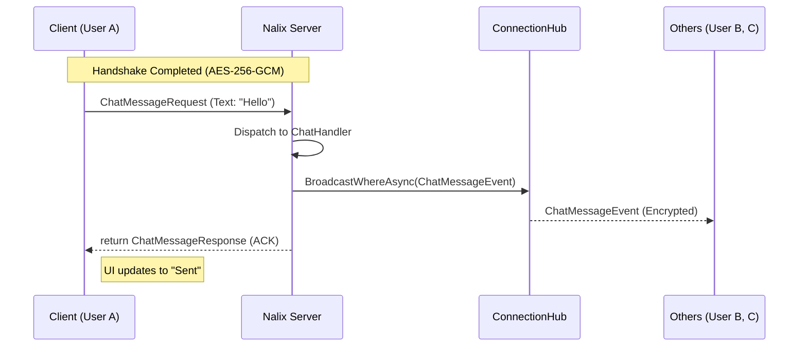

# 🚀 Industrial-Grade Specification: Nalix Secure Chat

## 1. Executive Summary
The **Nalix Secure Chat** project is a high-performance, end-to-end encrypted messaging application. It serves as the flagship example for the **Nalix Framework**, showcasing zero-allocation networking, sharded broadcasting, and mid-stream cryptographic rotation.

---

## 2. Core Architectural Principles

- **Domain-Driven Design (DDD)**: Logic is encapsulated within the Domain layer. Network handlers are thin adaptors.
- **SOLID & SRP**: 
    - `IChatRoomService`: Manages business rules (Single Responsibility).
    - `ChatHandler`: Decouples packet dispatching from business logic.
- **Stateless Handlers**: All session-specific state is persisted in `connection.Attributes` or an external `SessionManager`.

---

## 3. Communication Patterns (The "Nalix Way")

### 🔄 Message Flow Sequence

### 📡 Pattern Mapping
| Pattern | Implementation | Technical Benefit |
| :--- | :--- | :--- |
| **Request-Response** | `async Task<TRes> Handle(...)` | Automatic encryption & response routing by the Runtime. |
| **Multicast** | `IConnectionHub.Broadcast` | High-throughput O(1) sharded delivery. |
| **Telemetry** | `session.PingAsync()` | Real-time RTT tracking via standard Control frames. |
| **Security Update**| `session.UpdateCipherAsync()`| Seamless mid-stream algorithm rotation. |

---

## 🏗 Component Breakdown

### A. Nalix.Example.Chat.Shared (Domain Layer)
- **`ChatOpCodes`**: Exclusive range `0x0110` - `0x011F`.
- **`Packets`**: 
    - `JoinRoomRequest`: Carrying metadata for `connection.Attributes`.
    - `ChatMessageRequest`: The core payload.
    - `ChatMessageEvent`: The broadcasted wrapper.

### B. Nalix.Example.Chat.Server (Application Layer)
- **`ChatHandlers`**: 
    - Uses constructor injection for `IChatRoomService`.
    - Handles packet routing.
- **`ChatRoomService`**: 
    - Business logic: Filtering, room limits, and user tracking.
    - Interacts with `ConnectionHub` for delivery.

### C. Nalix.Example.Chat.Client (Presentation Layer)
- **MVVM Framework**:
    - `NetworkManager`: Wraps `TcpSession`.
    - `ChatViewModel`: Uses `PacketAwaiter` for asynchronous response tracking.
    - **Live Dashboard**: A persistent side-panel showing:
        - `Latency: 15ms`
        - `Sync Drift: -1.2ms`
        - `Cipher: ChaCha20Poly1305`

---

## 🛠 Scalability & Performance
- **Zero-Allocation**: All packets utilize the `PacketBase` object pooling.
- **Memory Safety**: `TimingWheel` ensures abandoned connections are purged within 30s.
- **Multi-Node Ready**: `ISessionManager` abstraction allows for Redis-backed session resumption.

---
> [!IMPORTANT]
> This plan ensures that no business logic leaks into the `Network` or `Transport` layers. The server remains a pure message-orchestration engine.
