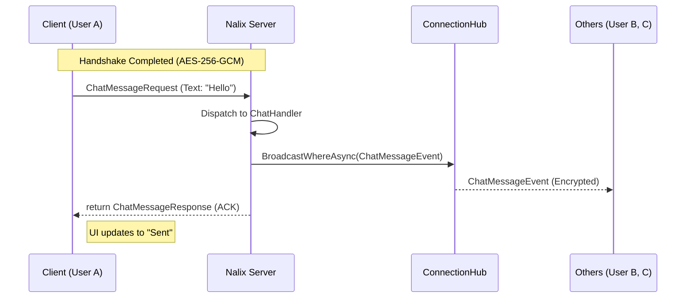

# 🚀 Industrial-Grade Specification: Nalix Secure Chat

## 1. Executive Summary

The **Nalix Secure Chat** project is a high-performance, end-to-end encrypted messaging application. It serves as the flagship example for the **Nalix Framework**, showcasing zero-allocation networking, sharded broadcasting, and mid-stream cryptographic rotation.
To implement a part of it, you need to check the documentation for the correct deployment method. If you still don't understand the deployment method even after reading the documentation, go directly to the source code and read the .cs file. (Please help me identify which document in the .md file is unclear or needs to be read from the source code so I can further optimize the documentation.)

---

## 2. Core Architectural Principles

- **Domain-Driven Design (DDD)**: Logic is encapsulated within the Domain layer. Network handlers are thin adaptors.
- **SOLID & SRP**:
    - `IChatRoomService`: Manages business rules (Single Responsibility).
    - `ChatHandler`: Decouples packet dispatching from business logic.
- **Stateless Handlers**: All session-specific state is persisted in `connection.Attributes` or an external `SessionStore` in ConnecionHub.

---

## 3. Communication Patterns (The "Nalix Way")

### 🔄 Message Flow Sequence

### 📡 Pattern Mapping

| Pattern | Implementation | Technical Benefit |
| :--- | :--- | :--- |
| **Request-Response** | `async Task<TRes> Handle(...)` | Automatic encryption & response routing by the Runtime. |
| **Multicast** | `IConnectionHub.Broadcast` | High-throughput O(1) sharded delivery. |
| **Telemetry** | `session.PingAsync()` | Real-time RTT tracking via standard Control frames. |
| **Security Update**| `session.UpdateCipherAsync()`| Seamless mid-stream algorithm rotation. |

---

## 4. Coding Standards

- Language: C# 13 / .NET 10
- Nullable Reference Types: Enabled
- Use file-scoped namespaces
- Use primary constructors when appropriate
- All async methods must end with Async
- Avoid regions
- XML docs required for all public APIs
- Use ArgumentNullException.ThrowIfNull where applicable
- No LINQ in hot paths
- Prefer readonly struct for packets when possible
- Use ValueTask over Task for hot-path async APIs

## 5. Packet Contract Rules

- All packets inherit PacketBase<`T`>

## 6. Error Handling

- Domain validation failures return protocol error packets, not exceptions
- Exceptions only for invariant violations / infrastructure failures
- All handler exceptions must be logged
- Never leak internal exception messages to clients
- Client can ping error to string, server will log that and need protect DDoS

## 7. Security Constraints

- Validate room membership before broadcast
- Reject messages from unauthenticated sessions
- Rate limit: 50 messages / 5 seconds / user
- Cipher rotation every 30 minutes
- Disconnect on authentication failure

## 8. Performance Constraints

- No heap allocations in hot packet handling paths
- Avoid closure allocations in broadcasts
- Use pooled buffers for all payload transforms
- Must support 10,000 concurrent sessions

## 9. Deliverables

Generate:

1. Shared packet contracts
2. Server handlers
3. Domain services
4. Client network manager
5. MVVM ViewModels

---

## Client UI Framework

- Framework: Avalonia UI 11
- Target Runtime: .NET 10
- Architectural Pattern: MVVM
- MVVM Toolkit: CommunityToolkit.Mvvm
- Dependency Injection: Microsoft.Extensions.DependencyInjection
- Logging: Microsoft.Extensions.Logging

### UI Composition Rules

- Use XAML for all views.
- Use code-behind only for view-specific visual behavior.
- Business logic MUST NOT exist in Views or code-behind.
- ViewModels are the only layer allowed to bind to Views.
- Models/DTOs MUST NOT directly reference Avalonia types.

### UI Requirements

Main Window MUST contain:

- Chat room/channel list panel
- Active message history panel
- Message input box with send command
- Persistent diagnostics sidebar

Diagnostics Sidebar MUST display:

- Current latency (RTT)
- Clock synchronization drift
- Active cipher algorithm
- Cipher version / rotation counter
- Session identifier
- Connection state

### Client Interaction Rules

- NetworkManager owns TcpSession lifecycle.
- ViewModels MUST communicate through NetworkManager abstraction only.
- ViewModels MUST NOT access TcpSession directly.
- PacketAwaiter is responsible for request/response correlation.
- Reconnect and session-resume logic MUST be encapsulated in NetworkManager.

### Threading Rules

- All UI-bound collection updates MUST marshal to Avalonia UI thread.
- Networking callbacks MUST NOT mutate observable collections directly.

---

## 🏗 Solution Architecture

The solution MUST be organized into the following projects.

### A. Nalix.Chat.Contracts

Shared protocol and transport-facing contracts consumed by both client and server.

Responsibilities:

- `ChatOpCodes`
- Packet definitions
- Event contracts
- Serialization schemas
- Shared DTOs / enums / constants

Contents:

- `Packets/JoinRoomRequest.cs`
- `Packets/JoinRoomResponse.cs`
- `Packets/ChatMessageRequest.cs`
- `Packets/ChatMessageAck.cs`
- `Events/ChatMessageBroadcast.cs`
- `Enums/ChatErrorCode.cs`

---

### B. Nalix.Chat.Domain

Pure business domain layer containing chat rules and invariants.

Responsibilities:

- Aggregate/domain models
- Validation rules
- Domain services contracts
- Business invariants
- Domain exceptions

Contents:

- `Rooms/ChatRoom.cs`
- `Users/ChatParticipant.cs`
- `Services/IChatRoomService.cs`
- `Policies/MessageModerationPolicy.cs`
- `Rules/RoomCapacityRule.cs`

Constraints:

- MUST NOT reference networking/transport/UI/framework concerns.
- MUST remain fully unit-testable in isolation.

---

### C. Nalix.Chat.Application

Application orchestration layer bridging handlers to domain.

Responsibilities:

- Command orchestration
- Use-case execution
- Transaction boundaries
- Domain-to-transport mapping

Contents:

- `Services/ChatRoomService.cs`
- `Commands/JoinRoomCommand.cs`
- `Commands/SendMessageCommand.cs`
- `Results/JoinRoomResult.cs`

---

### D. Nalix.Chat.Infrastructure

Nalix server host / networking entrypoint.

Responsibilities:

- Packet handlers
- Session lifecycle hooks
- ConnectionHub integration
- Transport/runtime wiring

Contents:

- `Handlers/JoinRoomHandler.cs`
- `Handlers/ChatMessageHandler.cs`
- `Handlers/SessionResumeHandler.cs`
- `Hosting/ChatServerHost.cs`

Constraints:

- MUST contain no business logic.
- MUST delegate all use-case logic to Application layer.

---

### E. Nalix.Chat.Client.Core

UI-agnostic client application logic.

Responsibilities:

- Network abstraction
- Session lifecycle
- Request/response awaiting
- Client-side state synchronization

Contents:

- `Networking/NetworkClient.cs`
- `Networking/PacketAwaiter.cs`
- `State/ChatStateStore.cs`
- `Services/DiagnosticsService.cs`

Constraints:

- MUST NOT reference Avalonia assemblies.
- Reusable by future mobile/web clients.

---

### F. Nalix.Chat.Client.Avalonia

Avalonia desktop presentation layer.

Responsibilities:

- Views / XAML
- ViewModels
- UI composition
- Avalonia bootstrapping

Contents:

- `Views/MainWindow.axaml`
- `Views/ChatRoomView.axaml`
- `Views/DiagnosticsSidebar.axaml`
- `ViewModels/MainWindowViewModel.cs`
- `ViewModels/ChatRoomViewModel.cs`

Constraints:

- MUST contain no networking/business logic.
- ViewModels interact only with Client.Core abstractions.

---

## 🛠 Scalability & Performance

- **Zero-Allocation**: All packets utilize the `PacketBase` object pooling.
- **Memory Safety**: `TimingWheel` ensures abandoned connections are purged within 30s.
- **Multi-Node Ready**: `ISessionStore` abstraction allows for Redis-backed session resumption.

---
> [!IMPORTANT]
> This plan ensures that no business logic leaks into the `Network` or `Transport` layers. The server remains a pure message-orchestration engine.
