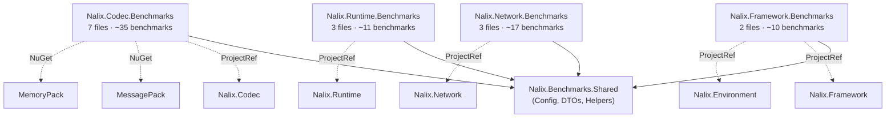

# Nalix Benchmarks — Multi-Project Plan (v3)

Kế hoạch benchmark chuẩn công nghiệp cho **public API only**. Không dùng mock — tất cả đều dùng class thật. Serialization có so sánh với MessagePack, System.Text.Json, MemoryPack.

---

## Constraints

- ✅ **Public API only** — không benchmark class internal (`LocalPool`, `MiddlewarePipeline`, `PacketSender`, etc.)
- ✅ **No mocks** — dùng real `Connection`, `ConnectionHub`, `ObjectPoolManager`, `BufferPoolManager`, `BufferLease`
- ✅ **Serialization comparison** — LiteSerializer vs MessagePack vs System.Text.Json vs MemoryPack

---

## Architecture

```
benchmarks/
├── Directory.Build.props             ← BDN + TFM + Release config
├── Nalix.Benchmarks.sln
│
├── Nalix.Benchmarks.Shared/          ← Config, DTOs, helpers
│   ├── NalixBenchmarkConfig.cs
│   ├── Payloads/
│   │   ├── BenchPayload.cs           ← DTO dùng chung cho serialization
│   │   ├── SmallStruct.cs            ← Unmanaged struct 32B
│   │   └── LargeStruct.cs            ← Unmanaged struct 512B
│   └── Helpers/
│       └── PayloadGenerator.cs       ← Generate random test data
│
├── Nalix.Codec.Benchmarks/           ← Serialization, Transforms, Security
│   ├── Serialization/
│   │   ├── LiteSerializerBenchmarks.cs
│   │   └── SerializerComparisonBenchmarks.cs  ← vs MessagePack, STJ, MemoryPack
│   ├── Transforms/
│   │   ├── FramePipelineBenchmarks.cs
│   │   └── FrameTransformerBenchmarks.cs
│   └── Security/
│       ├── EnvelopeCipherBenchmarks.cs
│       ├── HandshakeBenchmarks.cs
│       └── HashingBenchmarks.cs
│
├── Nalix.Framework.Benchmarks/       ← Pooling (ObjectPool, BufferPool, BufferLease)
│   └── Memory/
│       ├── ObjectPoolBenchmarks.cs
│       └── BufferPoolBenchmarks.cs
│
├── Nalix.Network.Benchmarks/         ← ConnectionHub, ConnectionGuard, Sessions
│   ├── Connections/
│   │   └── ConnectionHubBenchmarks.cs
│   ├── RateLimiting/
│   │   └── ConnectionGuardBenchmarks.cs
│   └── Sessions/
│       └── SessionStoreBenchmarks.cs
│
└── Nalix.Runtime.Benchmarks/         ← TokenBucket, ConcurrencyGate, PacketRegistry
    ├── Throttling/
    │   ├── TokenBucketBenchmarks.cs
    │   └── ConcurrencyGateBenchmarks.cs
    └── Dispatching/
        └── PacketRegistryBenchmarks.cs
```

---

## Proposed Changes

### Shared Infrastructure

#### [NEW] `benchmarks/Directory.Build.props`

```xml
<Project>
  <PropertyGroup>
    <TargetFramework>net10.0</TargetFramework>
    <OutputType>Exe</OutputType>
    <Optimize>true</Optimize>
    <ServerGarbageCollection>true</ServerGarbageCollection>
    <ConcurrentGarbageCollection>true</ConcurrentGarbageCollection>
    <TieredCompilation>false</TieredCompilation>
  </PropertyGroup>
  <ItemGroup>
    <PackageReference Include="BenchmarkDotNet" Version="0.15.*" />
  </ItemGroup>
</Project>
```

#### [NEW] `Nalix.Benchmarks.Shared/NalixBenchmarkConfig.cs`

Global config: `MemoryDiagnoser`, `ThreadingDiagnoser`, P95, Server GC, 3 warmup + 20 iterations.

#### [NEW] `Nalix.Benchmarks.Shared/Payloads/`

- `BenchPayload` — class DTO với string + int + List\<int\> (cho serialization comparison)
- `SmallStruct` — unmanaged struct 32 bytes (cho LiteSerializer fast path)
- `LargeStruct` — unmanaged struct 512 bytes

---

### Project 1 — `Nalix.Codec.Benchmarks`

> **Refs**: `Nalix.Codec`, `Nalix.Benchmarks.Shared`, `MessagePack`, `System.Text.Json`, `MemoryPack`

---

#### `Serialization/LiteSerializerBenchmarks.cs`

Benchmark riêng LiteSerializer, đi sâu vào từng code path:

| Benchmark | Mô tả | Params |
|:---|:---|:---|
| `Serialize_Unmanaged` | Blittable struct → byte[] (fast path) | Struct: Small(32B), Large(512B) |
| `Deserialize_Unmanaged` | byte[] → blittable struct | Same |
| `Serialize_Formatter` | Class → byte[] qua Formatter | BenchPayload |
| `Deserialize_Formatter` | byte[] → class qua Formatter | Same |
| `Fill_IntoSpan` | Zero-copy serialize vào pre-allocated Span | Various |
| `FormatterProvider_Resolve` | Formatter cache lookup latency | — |

---

#### `Serialization/SerializerComparisonBenchmarks.cs`

So sánh head-to-head với 3 thư viện phổ biến:

| Benchmark | LiteSerializer | MessagePack | System.Text.Json | MemoryPack |
|:---|:---|:---|:---|:---|
| **Serialize** | `LiteSerializer.Serialize(obj)` | `MessagePackSerializer.Serialize(obj)` | `JsonSerializer.SerializeToUtf8Bytes(obj)` | `MemoryPackSerializer.Serialize(obj)` |
| **Deserialize** | `LiteSerializer.Deserialize<T>(bytes)` | `MessagePackSerializer.Deserialize<T>(bytes)` | `JsonSerializer.Deserialize<T>(bytes)` | `MemoryPackSerializer.Deserialize<T>(bytes)` |

**Params**: `ItemCount` = 16, 128, 1024 (items trong `BenchPayload.Items` list).

**Đo**: Mean, StdDev, Allocated, Gen0 — cho phép so sánh allocation pressure giữa các lib.

---

#### `Transforms/FramePipelineBenchmarks.cs`

| Benchmark | Mô tả | Params |
|:---|:---|:---|
| `ProcessOutbound_EncryptOnly` | Outbound: chỉ encrypt | PayloadSize: 64B, 512B, 4KB |
| `ProcessOutbound_CompressOnly` | Outbound: chỉ LZ4 compress | Same |
| `ProcessOutbound_Full` | Outbound: compress + encrypt | Same |
| `ProcessInbound_DecryptOnly` | Inbound: chỉ decrypt | Same |
| `ProcessInbound_DecompressOnly` | Inbound: chỉ LZ4 decompress | Same |
| `ProcessInbound_Full` | Inbound: decrypt + decompress | Same |

**Đo**: Mean, Allocated (expect near-zero vì dùng pooled buffers).

---

#### `Transforms/FrameTransformerBenchmarks.cs`

| Benchmark | Mô tả | Params |
|:---|:---|:---|
| `Encrypt_AEAD` | ChaCha20-Poly1305 | 64B, 1KB |
| `Decrypt_AEAD` | ChaCha20-Poly1305 | Same |
| `Encrypt_Symmetric` | Salsa20 stream | Same |
| `Decrypt_Symmetric` | Salsa20 stream | Same |
| `Compress_LZ4` | LZ4 compress | 64B, 512B, 4KB |
| `Decompress_LZ4` | LZ4 decompress | Same |

---

#### `Security/EnvelopeCipherBenchmarks.cs`

| Benchmark | Mô tả | Params |
|:---|:---|:---|
| `Encrypt_ChaCha20Poly1305` | AEAD envelope encrypt | 64B, 1KB |
| `Decrypt_ChaCha20Poly1305` | AEAD envelope decrypt | Same |
| `Encrypt_Salsa20Poly1305` | AEAD envelope encrypt (Salsa20) | Same |
| `Decrypt_Salsa20Poly1305` | AEAD envelope decrypt (Salsa20) | Same |
| `Encrypt_Chacha20` | Symmetric stream encrypt | Same |
| `Decrypt_Chacha20` | Symmetric stream decrypt | Same |
| `Encrypt_Salsa20` | Symmetric stream encrypt | Same |
| `Decrypt_Salsa20` | Symmetric stream decrypt | Same |

---

#### `Security/HandshakeBenchmarks.cs`

| Benchmark | Mô tả |
|:---|:---|
| `ComputeMasterSecret` | X25519 HKDF-Extract from 2 shared secrets |
| `ComputeServerProof` | HKDF-Expand for server proof |
| `ComputeClientProof` | HKDF-Expand for client proof |
| `DeriveSessionKey` | Full session key derivation chain |

---

#### `Security/HashingBenchmarks.cs`

| Benchmark | Mô tả | Params |
|:---|:---|:---|
| `Keccak256_Hash` | Keccak-256 | 32B, 4KB |
| `HmacKeccak256_Compute` | HMAC-Keccak256 | 32B, 256B |
| `Poly1305_ComputeTag` | Poly1305 MAC tag | 64B, 1KB |
| `Pbkdf2_DeriveKey` | PBKDF2 key derivation | Iterations: 1000, 10000 |

---

### Project 2 — `Nalix.Framework.Benchmarks`

> **Refs**: `Nalix.Framework`, `Nalix.Environment`, `Nalix.Benchmarks.Shared`

#### `Memory/ObjectPoolBenchmarks.cs`

Dùng real `ObjectPoolManager`:

| Benchmark | Mô tả | Params |
|:---|:---|:---|
| `Get_Return_SingleThread` | Get + Return 1 object | — |
| `Get_Return_MultiThread` | N threads concurrent Get/Return | Threads: 1, 4, 8, 16 |
| `Prealloc` | Preallocate N objects | Count: 100, 1000 |
| `CacheHitRate` | Measure hit rate sau warmup | — |

#### `Memory/BufferPoolBenchmarks.cs`

Dùng real `BufferPoolManager` + `BufferLease`:

| Benchmark | Mô tả | Params |
|:---|:---|:---|
| `Rent_Return` | BufferPoolManager.Rent + Return | Size: 256B, 1KB, 4KB |
| `Rent_Return_MultiThread` | Multi-thread buffer rent | Threads: 1, 4, 8 |
| `BufferLease_RentDispose` | `BufferLease.Rent()` → `.Dispose()` | Size: 256B, 1KB, 4KB |
| `BufferLease_CopyFrom` | `BufferLease.CopyFrom(span)` | Size: 64B, 1KB |
| `BufferLease_RetainDispose` | Rent → Retain → Dispose × 2 | — |

---

### Project 3 — `Nalix.Network.Benchmarks`

> **Refs**: `Nalix.Network`, `Nalix.Benchmarks.Shared`

#### `Connections/ConnectionHubBenchmarks.cs`

Dùng real `ConnectionHub` + real `Connection`:

| Benchmark | Mô tả | Params |
|:---|:---|:---|
| `RegisterConnection` | Register 1 real connection | Pre-filled: 0, 1K, 10K |
| `UnregisterConnection` | Unregister 1 connection | Same |
| `GetConnection_ByUlong` | Lookup by `ulong` ID | Pre-filled: 1K, 10K |
| `GetConnection_BySnowflake` | Lookup by `ISnowflake` | Same |
| `GetConnection_BySpan` | Lookup by `ReadOnlySpan<byte>` | Same |
| `ListConnections` | Full snapshot | Pre-filled: 100, 1K, 10K |
| `ListConnections_ByEndpoint` | Snapshot by IP | Pre-filled: 1K, 10 IPs |

> [!IMPORTANT]
> Dùng real `Connection` objects. Setup cần tạo loopback TCP sockets hoặc sử dụng `Connection` constructor trực tiếp nếu public. Cần verify constructor accessibility trước khi implement.

---

#### `RateLimiting/ConnectionGuardBenchmarks.cs`

Dùng real `ConnectionGuard` + real `IPEndPoint`:

| Benchmark | Mô tả | Params |
|:---|:---|:---|
| `TryAccept_SingleIP` | Accept từ 1 IP | — |
| `TryAccept_DistinctIPs` | Accept từ 1000 IPs khác nhau | — |
| `TryAccept_RejectPath` | IP vượt limit → reject | — |
| `OnConnectionClosed` | Release callback | — |

---

#### `Sessions/SessionStoreBenchmarks.cs`

Dùng real `InMemorySessionStore` + real `SessionEntry`:

| Benchmark | Mô tả | Params |
|:---|:---|:---|
| `Store_NewSession` | Insert new session | — |
| `Store_UpdateExisting` | Overwrite existing | — |
| `Consume_Hit` | Consume valid token | — |
| `Consume_Miss` | Consume non-existing | — |
| `Consume_Expired` | Consume expired session | — |

---

### Project 4 — `Nalix.Runtime.Benchmarks`

> **Refs**: `Nalix.Runtime`, `Nalix.Benchmarks.Shared`

#### `Throttling/TokenBucketBenchmarks.cs`

Dùng real `TokenBucketLimiter`:

| Benchmark | Mô tả | Params |
|:---|:---|:---|
| `Evaluate_AllowedPath` | Token available → consume | — |
| `Evaluate_ThrottledPath` | Token depleted → soft throttle | — |
| `Evaluate_HardLockout` | Repeated violations → lockout | — |
| `Evaluate_MultiEndpoint` | N endpoints concurrent | Endpoints: 100, 1K |
| `Evaluate_DynamicPolicy` | Dynamic RateLimitPolicy overload | — |

---

#### `Throttling/ConcurrencyGateBenchmarks.cs`

Dùng real `ConcurrencyGate`:

| Benchmark | Mô tả | Params |
|:---|:---|:---|
| `TryEnter_Immediate` | Enter with available capacity | — |
| `TryEnter_AtCapacity` | Enter when all slots used | — |
| `EnterAsync_WithQueue` | Async queued entry | Queue: 10, 100 |
| `Lease_FullCycle` | Acquire → use → dispose | — |

---

#### `Dispatching/PacketRegistryBenchmarks.cs`

Dùng real `PacketRegistry` static methods:

| Benchmark | Mô tả | Params |
|:---|:---|:---|
| `TryDeserialize_KnownOpcode` | Deserialize registered packet type | — |
| `TryDeserialize_UnknownOpcode` | Unknown opcode fast fail | — |

---

## Dependency Graph



---

## Summary

| Project | Files | ~Benchmarks | Key Classes |
|:---|---:|---:|:---|
| **Shared** | 4 | — | Config, DTOs, Helpers |
| **Codec** | 7 | 35 | LiteSerializer, FramePipeline, FrameTransformer, EnvelopeCipher, HandshakeX25519, Keccak/Poly/HMAC |
| **Framework** | 2 | 10 | ObjectPoolManager, BufferPoolManager, BufferLease |
| **Network** | 3 | 17 | ConnectionHub, ConnectionGuard, InMemorySessionStore |
| **Runtime** | 3 | 11 | TokenBucketLimiter, ConcurrencyGate, PacketRegistry |
| **Total** | **19** | **~73** | |

---

## Verification Plan

### Build
```bash
dotnet build benchmarks/Nalix.Benchmarks.sln -c Release
```

### Discovery
```bash
dotnet run -c Release --project benchmarks/Nalix.Codec.Benchmarks/ -- --list flat
dotnet run -c Release --project benchmarks/Nalix.Framework.Benchmarks/ -- --list flat
dotnet run -c Release --project benchmarks/Nalix.Network.Benchmarks/ -- --list flat
dotnet run -c Release --project benchmarks/Nalix.Runtime.Benchmarks/ -- --list flat
```

### Sanity Run
```bash
dotnet run -c Release --project benchmarks/Nalix.Codec.Benchmarks/ -- --filter '*SerializerComparison*' --job short
```
