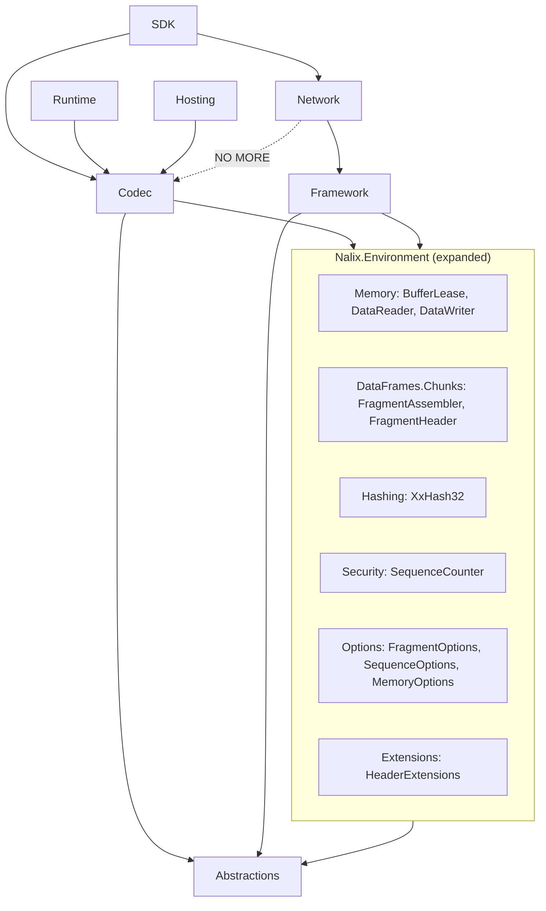

# Di chuyển Memory, Chunks, XxHash32, SequenceCounter, Options → Nalix.Environment

## Mục tiêu

Loại bỏ hoàn toàn dependency `Nalix.Network → Nalix.Codec` bằng cách di chuyển tất cả các module mà Network cần xuống `Nalix.Environment`.

## Tình trạng hiện tại

`ProcessFrame` đã được chuyển thành abstract — ✅  
`Nalix.Codec.Transforms` (FramePipeline) không còn dùng trong Network — ✅  
`Nalix.Codec.Internal.Throw` không còn dùng trong Network — ✅

### Remaining `using Nalix.Codec.*` in Nalix.Network

| File | Codec dependency | Dùng gì |
|------|-----------------|---------|
| `SocketConnection.cs` | `Memory`, `DataFrames.Chunks`, `Options` | `BufferLease`, `FragmentAssembler`, `FragmentOptions` |
| `SocketConnection.Send.cs` | `Memory`, `DataFrames.Chunks` | `BufferLease`, `FragmentStreamId`, `FragmentHeader` |
| `SocketTcpTransport.cs` | `Memory` | `BufferLease.ByteArrayPool` |
| `SocketUdpTransport.cs` | `Memory` | `BufferLease.ByteArrayPool` |
| `UdpListener.Receive.cs` | `Memory`, `Extensions` | `BufferLease`, `AsHeaderRef` |
| `UdpListener.Core.cs` | `Options` | `SequenceOptions` |
| `TcpListener.Core.cs` | `Options` | `SequenceOptions` |
| `SocketEndpoint.cs` | `Security.Hashing` | `XxHash32.Compute` |
| `Datagram.Guard.cs` | `Security.Hashing` | `XxHash32.Compute` |
| `TransportSequencer.cs` | `Security` | `SequenceCounter` |

## Proposed Changes

### Phase 1: Di chuyển vào Nalix.Environment

---

#### 1.1 Memory (3 files)

##### [NEW] `Nalix.Environment/Memory/BufferLease.cs`
- Move từ `Nalix.Codec/Memory/BufferLease.cs`
- Namespace: `Nalix.Environment.Memory`
- Dependencies: chỉ `Nalix.Abstractions` — ✅ clean

##### [NEW] `Nalix.Environment/Memory/DataReader.cs`
- Move từ `Nalix.Codec/Memory/DataReader.cs`
- Namespace: `Nalix.Environment.Memory`
- **Phải giải quyết**: dùng `Nalix.Codec.Internal.Throw.EndOfStream()` → tạo throw helper mới trong Environment

##### [NEW] `Nalix.Environment/Memory/DataWriter.cs`
- Move từ `Nalix.Codec/Memory/DataWriter.cs`
- Namespace: `Nalix.Environment.Memory`
- **Phải giải quyết**:
  - `Nalix.Codec.Internal.Throw` → tạo throw helper mới trong Environment
  - `SerializationStaticOptions.Instance.MaxWriterCapacity` → tạo `MemoryOptions` trong Environment chứa `MaxWriterCapacity`, Codec-side `SerializationStaticOptions` sẽ đọc từ đó

##### [NEW] `Nalix.Environment/Memory/MemoryOptions.cs`
- Options class mới trong Environment
- Chứa `MaxWriterCapacity` (default 128MB) — tách ra từ `SerializationOptions`
- `Nalix.Codec.Options.SerializationOptions` sẽ giữ `MaxArrayLength`, `MaxStringLength` (Codec-specific)
- `DataWriter.Expand()` sẽ đọc `MemoryOptions.Instance.MaxWriterCapacity` thay vì `SerializationStaticOptions`

##### [NEW] `Nalix.Environment/Internal/Throw.cs`
- Throw helper mới cho Memory module
- Chỉ chứa: `EndOfStream()`, `AdvanceOutOfBound()`, `FixedBufferExpansion()`
- `Nalix.Codec.Internal.Throw` sẽ giữ nguyên LZ4/Cipher/Serialization/Transform throws (delegate tới đây nếu cần hoặc duplicate)

---

#### 1.2 DataFrames.Chunks (4 files)

##### [NEW] `Nalix.Environment/DataFrames/Chunks/FragmentAssembler.cs`
- Move từ `Nalix.Codec/DataFrames/Chunks/`
- Namespace: `Nalix.Environment.Fragments`
- Dùng `BufferLease` → đã move cùng phase → ✅

##### [NEW] `Nalix.Environment/DataFrames/Chunks/FragmentAssemblyResult.cs`
- Namespace: `Nalix.Environment.Fragments`
- Dùng `BufferLease` → ✅

##### [NEW] `Nalix.Environment/DataFrames/Chunks/FragmentHeader.cs`
- Namespace: `Nalix.Environment.Fragments`

##### [NEW] `Nalix.Environment/DataFrames/Chunks/FragmentStreamId.cs`
- No external deps → ✅ clean

---

#### 1.3 Hashing (1 file)

##### [NEW] `Nalix.Environment/Hashing/XxHash32.cs`
- Move từ `Nalix.Codec/Security/Hashing/XxHash32.cs`
- Namespace: `Nalix.Environment.Hashing`
- XxHash32 là non-cryptographic hash, thuộc infrastructure — phù hợp Environment hơn Security
- Dependencies: chỉ `System.Numerics`, `System.Runtime.*` → ✅ no project deps

---

#### 1.4 Security (1 file)

##### [NEW] `Nalix.Environment/Security/SequenceCounter.cs`
- Move từ `Nalix.Codec/Security/SequenceCounter.cs`
- Namespace: `Nalix.Environment.Security`
- Dependencies: chỉ `Nalix.Abstractions.Security.ISequenceCounter` → ✅

---

#### 1.5 Options (2 files move + 1 new)

##### [NEW] `Nalix.Environment/Options/FragmentOptions.cs`
- Move từ `Nalix.Codec/Options/FragmentOptions.cs`
- Namespace: `Nalix.Environment.Options`
- **Phải update**: `using Nalix.Codec.DataFrames.Chunks` → `using Nalix.Environment.DataFrames.Chunks`

##### [NEW] `Nalix.Environment/Options/SequenceOptions.cs`
- Move từ `Nalix.Codec/Options/SequenceOptions.cs`
- Namespace: `Nalix.Environment.Options`
- No Codec deps → ✅

---

#### 1.6 Extensions (1 file)

##### [NEW] `Nalix.Environment/Extensions/HeaderExtensions.cs`
- Move từ `Nalix.Codec/Extensions/HeaderExtensions.cs`
- Namespace: `Nalix.Environment.Extensions`
- Dependencies: chỉ `Nalix.Abstractions.Primitives.PacketHeader` → ✅

---

### Phase 2: Cleanup trong Nalix.Codec

##### [DELETE] `Nalix.Codec/Memory/BufferLease.cs`
##### [DELETE] `Nalix.Codec/Memory/DataReader.cs`
##### [DELETE] `Nalix.Codec/Memory/DataWriter.cs`
##### [DELETE] `Nalix.Codec/DataFrames/Chunks/FragmentAssembler.cs`
##### [DELETE] `Nalix.Codec/DataFrames/Chunks/FragmentAssemblyResult.cs`
##### [DELETE] `Nalix.Codec/DataFrames/Chunks/FragmentHeader.cs`
##### [DELETE] `Nalix.Codec/DataFrames/Chunks/FragmentStreamId.cs`
##### [DELETE] `Nalix.Codec/Security/Hashing/XxHash32.cs`
##### [DELETE] `Nalix.Codec/Security/SequenceCounter.cs`
##### [DELETE] `Nalix.Codec/Options/FragmentOptions.cs`
##### [DELETE] `Nalix.Codec/Options/SequenceOptions.cs`
##### [DELETE] `Nalix.Codec/Extensions/HeaderExtensions.cs`

##### [MODIFY] [Throw.cs](file:///e:/Cs/Nalix/src/Nalix.Codec/Internal/Throw.cs)
- Giữ nguyên Codec-specific throws (LZ4, Cipher, Serialization, Transform)
- Remove `AdvanceOutOfBound`, `FixedBufferExpansion` (đã move sang `MemoryThrow`)
- `EndOfStream` vẫn giữ (dùng bởi nhiều Codec internals) hoặc delegate

##### [MODIFY] [SerializationOptions.cs](file:///e:/Cs/Nalix/src/Nalix.Codec/Options/SerializationOptions.cs)
- Remove `MaxWriterCapacity` (moved to `MemoryOptions`)
- Giữ `MaxArrayLength`, `MaxStringLength`

##### [MODIFY] [SerializationStaticOptions.cs](file:///e:/Cs/Nalix/src/Nalix.Codec/Serialization/Internal/SerializationStaticOptions.cs)
- `MaxWriterCapacity` giờ đọc từ `MemoryOptions` hoặc redirect

##### [MODIFY] Tất cả Codec files dùng `Nalix.Codec.Memory` → update sang `Nalix.Environment.Memory`
- ~20 files trong Codec (Serialization, Formatters, Extensions, etc.)

---

### Phase 3: Update Nalix.Network

##### [MODIFY] [Nalix.Network.csproj](file:///e:/Cs/Nalix/src/Nalix.Network/Nalix.Network.csproj)
```diff
 <ItemGroup>
-    <ProjectReference Include="..\Nalix.Codec\Nalix.Codec.csproj" />
     <ProjectReference Include="..\Nalix.Framework\Nalix.Framework.csproj" />
     <ProjectReference Include="..\Nalix.Abstractions\Nalix.Abstractions.csproj" />
     <PackageReference Include="Microsoft.Extensions.Logging.Abstractions" Version="10.0.7" />
 </ItemGroup>
```

> [!NOTE]
> `Nalix.Framework` → `Nalix.Environment` → `Nalix.Abstractions`, nên Network vẫn có transitive access tới Environment.

##### [MODIFY] All Network source files — update `using` statements:
| Old | New |
|-----|-----|
| `using Nalix.Codec.Memory;` | `using Nalix.Environment.Memory;` |
| `using Nalix.Codec.DataFrames.Chunks;` | `using Nalix.Environment.DataFrames.Chunks;` |
| `using Nalix.Codec.Security.Hashing;` | `using Nalix.Environment.Hashing;` |
| `using Nalix.Codec.Security;` | `using Nalix.Environment.Security;` |
| `using Nalix.Codec.Options;` | `using Nalix.Environment.Options;` |
| `using Nalix.Codec.Extensions;` | `using Nalix.Environment.Extensions;` |

Files: `SocketConnection.cs`, `SocketConnection.Send.cs`, `SocketTcpTransport.cs`, `SocketUdpTransport.cs`, `UdpListener.Receive.cs`, `UdpListener.Core.cs`, `TcpListener.Core.cs`, `SocketEndpoint.cs`, `Datagram.Guard.cs`, `TransportSequencer.cs`

---

### Phase 4: Update other consumers

##### All other projects using moved types — update `using` statements:
- **Nalix.SDK** (6+ files) — `Memory`, `Chunks`
- **Nalix.Runtime** (1 file) — `Memory`
- **Nalix.Hosting** (1+ files) — `Memory`, `SequenceOptions`
- **Tests** (~20 files) — `Memory`, `Chunks`
- **Benchmarks** (1 file) — `Chunks`

---

## Dependency Graph After Changes



---

## Summary of File Operations

| Category | Count |
|----------|-------|
| Files moved (Codec → Environment) | 12 |
| New files created in Environment | 2 (MemoryOptions, MemoryThrow) |
| Files deleted from Codec | 12 |
| Files modified in Codec (using updates) | ~25 |
| Files modified in Network (using updates + remove csproj ref) | ~11 |
| Files modified in other projects (using updates) | ~25 |
| **Total files touched** | **~75** |

---

## Verification Plan

### Automated Tests
```powershell
dotnet build e:\Cs\Nalix\src\Nalix.sln
dotnet test e:\Cs\Nalix\tests\Nalix.Codec.Tests
dotnet test e:\Cs\Nalix\tests\Nalix.Network.Tests
dotnet test e:\Cs\Nalix\tests\Nalix.Framework.Tests
dotnet test e:\Cs\Nalix\tests\Nalix.SDK.Tests
```

### Build Verification
- Verify `Nalix.Network.csproj` has **no** reference to `Nalix.Codec`
- Verify `Nalix.Environment.csproj` has **no** reference to `Nalix.Codec` (no circular dep)
- All moved types resolve correctly through transitive `Environment` reference
