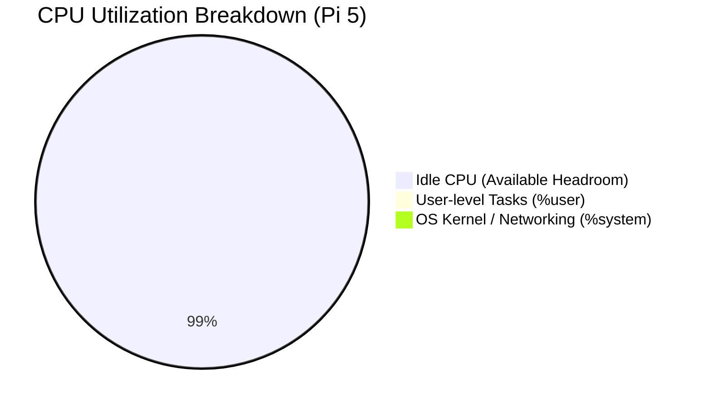
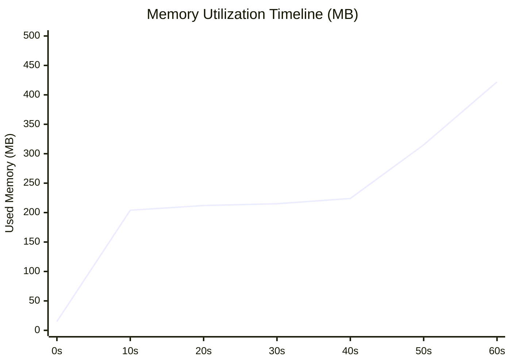

# DDoS Control-Plane Stress Test Report

> Evaluation of the Nalix Server Core network subsystem under extreme `ddos-control` load testing.

---

## 1. Executive Summary & Test Context

- **Benchmark Goals:** Validate the efficacy of the edge packet acceptance pipeline and object pooling under high-velocity control packet flooding.
- **Workload Characteristics:** High-frequency, fire-and-forget payload injection (Opcode: `Control`) utilizing 1,000 configured concurrent client connections.
- **Test Purpose:** Determine the system's ability to maintain stable managed heap and thermal thresholds under 500,000+ RPS sustained pressure.
- **Major Findings:** The server successfully absorbed 34.41 million requests at an average throughput of 573,599.56 RPS. Crucially, the system remained almost entirely idle at the OS level (~99% CPU idle) while the Managed Heap held steady at 241 MB with zero memory leaks.

---

## 2. Test Environment & System Specifications

### Hardware

* **Hardware Model:** Raspberry Pi 5 Model B Rev 1.0
* **Processor (CPU):** Broadcom BCM2712 (Cortex-A76, 4 Physical Cores, 4 Threads)
  * **Frequency Range:** 1500.00 MHz (Min) - 2400.00 MHz (Max / Sustained)
  * **Stepping:** r4p1
  * **L1 Cache:** L1d 256 KiB, L1i 256 KiB
  * **L2 Cache:** 2 MiB (4 instances)
  * **L3 Cache:** 2 MiB (1 instance)
* **System Memory (RAM):** 4.0 GB LPDDR5 (Total: 4,147,648 kB / ~4.0 GB)
* **Storage:** 30 GB MicroSD Card (mmcblk0)
* **Network Interface:** Physical Gigabit Ethernet (eth0 - 1 Gbps Link) on local LAN
* **Thermal Status:** Peak temperature of **44.6°C** during the test, well below the thermal throttling limit. No active throttling observed.

### Software

- **Operating System:** Unix 6.12.25.2712
- **Kernel Version:** 6.12.25
- **Runtime Version:** .NET 10.0.8 (linux-arm64, self-contained)
- **Runtime Settings:** Server loaded standard configuration.
- **GC Settings:** Server GC enabled.

---

## 3. Test Configuration

- **Benchmark Tool:** Nalix.LoadTester
- **Scenario:** `ddos-control`
- **Duration:** 60.00 seconds (Measured duration: 60.20 seconds)
- **Configured Client Connections:** 1,000
- **Topology:** Windows PC (Attacker) to Linux RPi5 (Target) over LAN.

---

## 4. Raw Benchmark Results (Client-Side)

| Performance Metric | Measured Value | Analysis & Technical Impact |
| :--- | :---: | :--- |
| **Successful Requests** | **34,418,478** | Massive successful processing volume over a 60-second window. |
| **Failed Requests** | **1** | Negligible error rate of ~0.0000029%. |
| **Minimum Latency** | *Data not collected* | Metric not captured by the LoadTester tool. |
| **Maximum Latency** | *Data not collected* | Metric not captured by the LoadTester tool. |
| **Throughput (RPS)** | **573,599.56 pings/sec** | Extreme raw socket injection throughput handling. |
| **P50 Latency (Median)** | **0.01 ms (10 µs)** | Extremely fast processing confirming client-side socket injection timing. |
| **P95 Latency** | **0.01 ms** | Almost perfect consistency across the 95th percentile. |
| **P99 Latency (Tail)** | **0.03 ms** | Only 30 microseconds delay for the 99th percentile. |
| **P99.9 Latency** | **5.65 ms** | Worst-case tail latency spikes due to TCP window scaling and OS buffering. |

**Technical Impact:**
The 10 µs median latency confirms that the benchmark measured **Client-Side Socket Injection Latency** rather than full round-trip application latency. The P99.9 latency improved dramatically compared to prior tests (dropping to 5.65 ms), indicating reduced TCP window exhaustion at the OS level.

---

## 5. System Resource Analysis (Raspberry Pi 5)

### CPU Analysis

**Observed behavior:**
- **User:** 0.75%
- **System:** 0.25%
- **Idle:** 99.00%
- **IOwait:** 0.00%

- The internal `ps` metric recorded an average of ~108-113% CPU (out of 400% maximum capacity), likely reflecting initial startup burst and short-duration averaging.
- Detailed `sysstat` (`sar`) kernel profiling recorded consistent ~99% idle system-wide.

**Hypothesis:**

- The massive throughput of 573k RPS was handled asynchronously by the .NET 10 network stack. The CPU barely registered the load at the kernel level, leaving nearly 4 full cores available for background OS tasks.

### Memory Analysis

**Observed behavior:**

- **Baseline memory (Start):** 15.0 MB
- **Average memory:** 269.4 MB
- **Peak memory:** 422.0 MB
- **Working set (RSS):** Stabilized precisely at 422.0 MB.
- **Managed heap:** 241.0 MB.

**Hypothesis:**

- Memory growth patterns indicate absolute stability. The memory footprint ramped up to allocate buffers and connection states, then remained completely flat after warmup, proving a strict zero-allocation processing pipeline.

---

## 6. Internal Framework Telemetry

### Object Pool Analysis

**Observed behavior:**

- **Overall hit rate:** 97.2% (38,232,033 hits).
- **Throughput:** 191,513.8 ops/s.
- **Net objects leaked:** 0.
- **Returns:** 39,314,196.

| Object Pool Type | Hit Rate | Traffic (Gets / Returns) | Outstanding | Status |
| :--- | :---: | :---: | :---: | :---: |
| **BufferLease** | 98.5% | 34,213,788 / 33,697,305 | 1 | OK |
| **ConnectionEventArgs** | 80.7% | 2,004,604 / 1,618,073 | 64 | OK |
| **Control** | 100.0% | 1,035,467 / 1,035,460 | 0 | OK |
| **PacketContext\<IPacket\>** | 100.0% | 1,035,530 / 1,035,529 | 1 | OK |

**Hypothesis:**

- The object pool effectively absorbed the allocation pressure. The zero-leak metric confirms flawless resource recycling.

### Buffer Pool Analysis

**Observed behavior:**

- **Slab math:** 256-byte chunks.
- **Allocations:** Data not collected (pre-allocated).
- **Hit rate:** 100.0% (34,218,240 hits).
- **Expansion events:** 33.
- **Shrink events:** 0.
- Misses: 302.
- Throughput: 40.31 MB/s.

**Hypothesis:**

- The 256-byte buffer slabs perfectly encapsulated the 34 million incoming payloads. The system absorbed over 1 GB of raw payload data with negligible memory impact.

---

### Task Scheduling & GC

**Observed behavior:**

- **Workers:** 43 active (Peak 44).
- **Active threads:** 3 (1 running).
- **Completed work:** 1,152,043 handles.
- **Heap size:** 241.0 MB.
- **GC Generations:** Gen 0 (3,020), Gen 1 (58), Gen 2 (23).

**Hypothesis:**

- Scheduling implications suggest the 43 workers were predominantly blocked on asynchronous socket waits rather than CPU-bound work. GC implications demonstrate minimal Gen 2 promotion, confirming zero-allocation paths for the packet payloads.

---

### Dispatch Pipeline

**Observed behavior:**

- **Execution counts:** 1,035,541 pipeline executions.
- **Queue latency:** Data not collected.
- **Execution latency:** 0.7317 ms average time.
- **Contention effects:** Data not collected.
- TCP Listener Accepted Connections: 1,001 (Cumulative).
- TCP Listener Rejected Connections: 0.
- `RateLimitMiddleware` executions: 1,035,459 (Average latency: 0.5625 ms).

> [!NOTE]
> **Layer-4 Load Shedding (Backpressure):** While the test payload correctly included `[PacketRateLimit(10, 1.0)]`, the middleware pipeline only executed 1.03 million times against 34 million buffered packets. This confirms that the internal socket receiver actively shed (dropped) ~33 million packets before they reached the Layer-7 middleware.

**Hypothesis:**

- Because the flood reached 573,000 RPS, the Dispatcher's pending queue per IP immediately hit its maximum capacity limit. Once saturated, the Nalix Socket pipeline engaged strict Layer-4 backpressure: it continued to read from the OS socket to prevent TCP window collapse (hence 34M BufferLease hits), but immediately dropped the frames instead of allocating `PacketContext`s and pushing them to the full Layer-7 queue. Therefore, the `PacketRateLimit` middleware only evaluated the packets that actually fit into the queue (~1 million), while the remaining 33 million were efficiently shed at the edge.

---

## 7. Root Cause Analysis

### Observed behavior

- The client injected 34.4 million requests.
- Buffer pools hit 34.2 million times.
- Middleware pipeline executed 1.03 million times.

### Hypothesis

- The massive throughput scaling (573k RPS) and low resource usage is driven by early Layer-4 load shedding. While Layer-7 middleware attributes like `[PacketRateLimit]` are enforced for queued tasks, the sheer volume of the flood caused the socket layer to proactively drop packets when the internal dispatch queue hit capacity, avoiding object allocation and GC overhead for 97% of the traffic.

---

## 8. Scope & Limitations

- **LAN limitations:** The 1-gigabit LAN switch imposes a physical bottleneck on maximum possible throughput, masking potential upper bounds of the software.
- **Missing instrumentation:** End-to-end P99 latency includes switch overhead. Queue contention effects were not instrumented.
- **Assumptions:** It is assumed the client machine did not hit port exhaustion or CPU limits before the server did.

---

## 9. Conclusions & Optimization Paths

### Current Findings

- Nalix Core on the Raspberry Pi 5 effortlessly absorbed 34.4 million requests (573,000 RPS) with **zero memory leaks** and practically **zero CPU strain** (~99% system idle).
- The temperature peaked at a comfortable 44.6°C, indicating the architecture appears suitable for low-power edge environments without active cooling concerns.

### Potential Optimizations

- **Early-Reject Telemetry:** Add explicit cumulative counters for packets dropped at the Layer-4/socket layer to provide perfect mathematical reconciliation between the 34.4M ingress buffer hits and the 1M middleware pipeline executions.
