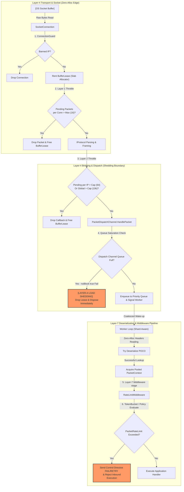

# Nalix Architecture: Understanding System Layers & DDoS Protection

This reference manual provides a comprehensive, deep technical explanation of the architectural layers within the **Nalix** framework. 

When reviewing Nalix performance, stress, and telemetry reports (e.g., [DDOS_CONTROL_STRESS_REPORT.md](./DDOS_CONTROL_STRESS_REPORT.md) or [NETWORKING_PERFORMANCE_REPORT.md](./NETWORKING_PERFORMANCE_REPORT.md)), terms like **"Layer-4 Load Shedding"**, **"Layer-7 Middleware Rate Limiting"**, **"BufferLeases"**, and **"Layer 1/2 Throttles"** are frequently used. This document details where these layers sit, how data flows through them, and how they protect the system under extreme load.

---

## 1. High-Level Pipeline Architecture

Nalix operates on a strictly structured, zero-allocation multi-layer networking pipeline. The diagram below illustrates a packet's journey from a raw network socket up to the application handlers, highlighting the various throttling and load-shedding control gates along the way.

---

## 2. In-Depth Layer Breakdown

### Layer 1: Network Transport Layer (TCP/UDP Sockets)

* **Components:** `TcpListenerBase`, `UdpListenerBase`, `SocketConnection`, `SocketEventBridge`
* **Purpose:** Interfaces directly with the OS kernel to accept incoming connections and drain socket receive buffers.
* **Resource Allocations:** Operating system sockets, `SocketAsyncEventArgs` pools.
* **Security & Concurrency Gates:**
    * **Admission Control (`ConnectionGuard`):** Evaluates remote endpoints at the socket accept phase. Banned or malicious IPs are disconnected immediately before any connection objects or memory buffers are allocated.
    * **Layer 1 Throttle (Per-Connection Receive Cap):** Configured via `MaxPerConnectionPendingPackets` (default: `16`, configurable in [NetworkCallbackOptions.cs](../src/Nalix.Network/Options/NetworkCallbackOptions.cs)). If a single connection sends packets faster than the protocol layer can drain them, excess packets are dropped *directly inside the receive loop* before reaching the ThreadPool. This prevents an individual slow connection or attacker from bloat-queuing.

---

### Layer 2: Protocol Framing and Callback Bridging

* **Components:** `IProtocol`, `AsyncCallback`, `SocketEventBridge`
* **Purpose:** Converts the raw stream of incoming socket bytes into discrete, framed message packets (checking magic bytes and boundaries). It bridges the transport layers with the dispatching system.
* **Resource Allocations:** Employs reference-counted `BufferLease` objects rented from the `BufferPoolManager` slab allocator to avoid allocating dynamic `byte[]` arrays on the managed heap.
* **Security & Concurrency Gates:**
    * **Layer 2 Throttle (Global & Per-IP Callback Caps):** Managed inside `AsyncCallback.Invoke`.
    * **Fairness Map Tracking:** Monitors normal-priority pending callbacks. If an IP exceeds `MaxPendingPerIp` (default: `64`) or the total global pending callbacks exceed `MaxPendingNormalCallbacks` (default: `10,000`), incoming packets from that source are dropped. 
    * **Hash Collision Protection:** To keep operations allocation-free and lock-free under extreme load, Nalix uses a fixed-size fairness map array (`FairnessMapSize`, default: `4096`) to track IP callback frequencies with near-zero overhead. High-priority disconnect/close events bypass this layer entirely.

---

### Layer 3: Shard-Aware Packet Dispatching (The Load-Shedding Boundary)

* **Components:** `PacketDispatchChannel`, `DispatchChannel<T>`
* **Purpose:** Manages the routing of framed packet leases to prioritized, shard-aware background worker queues.
* **Worker Sharding:** Spins up a pool of asynchronous workers (`TaskManager.ScheduleWorker`) matching the physical CPU core count. This isolates slower handlers and prevents head-of-line blocking across the server.
* **Coalesced Wake-up Signaling:** Minimizes OS thread context-switching overhead under dense bursts. Workers enter an asynchronous wait on a single `SemaphoreSlim` (`_wakeSignal`). The dispatch channel calculates queue density and awakens only the required number of workers to drain the current load.
* **Layer-4 Backpressure / Load Shedding (Critical Telemetry Boundary):**
    * *What happens during a massive flood (e.g., 573,000 RPS)?* The shard-aware queues inside `DispatchChannel` quickly saturate and hit their capacity ceiling.
    * *The Load-Shedding Response:* To prevent TCP window collapse and OS buffer backpressure, the socket connection loop continues to drain bytes from the OS socket. However, upon calling `PacketDispatchChannel.HandlePacket`, the `_dispatch.PushCore` invocation fails immediately (`noBlock: true` reject).
    * *The Zero-Allocation Drop:* Instead of allocating high-level wrappers or attempting deserialization, Nalix immediately calls `lease.Dispose()` to return the raw byte buffer back to the slab allocator. 
    * *Telemetry Contrast:* In stress tests, this results in a high **"BufferLease Ingress Hit Count"** (e.g., 34.4 million socket reads) but a low **"Middleware/Handler Execution Count"** (e.g., 1.03 million). 97% of the flood is discarded at the edge of Layer 3, completely bypassing managed heap allocations and GC overhead.

---

### Layer 4: Deserialization and Object Pooling

* **Components:** `PacketRegistry`, `PacketContext<T>`, `ObjectPoolManager`
* **Purpose:** Extracts packet headers and deserializes raw binary spans into typed Plain Old CLR Objects (POCOs) annotated with `[SerializePackable]`.
* **Zero-Allocation Deserialization:**
    * **Source Generator-Driven Registry:** Process-wide metadata compilation provides ultra-fast deserialization with O(1) lookup speeds.
    * **Pooled Contexts:** Instead of allocating new context envelopes on the managed heap, Nalix wraps deserialized packets in reusable, pooled `PacketContext` instances rented from `ObjectPoolManager` and returned immediately upon handler completion.

---

### Layer 5: Layer-7 Middleware Pipeline (Policy Enforcement)

* **Components:** `IPacketMiddleware<T>`, `RateLimitMiddleware`, `ConcurrencyGate`
* **Purpose:** Enforces business-level admission policies, request validation, authentication, and endpoint rate-limiting rules.
* **Layer-7 Rate Limiting:**
    * Driven by packet attributes like `[PacketRateLimit(10, 1.0)]` (10 requests per second, 1.0-second sliding window).
    * **Rate Limiting Decisions:** `RateLimitMiddleware` evaluates the context against the IP-based or session-based `PolicyRateLimiter` (token buckets).
    * **Graceful Rejection:** Unlike Layer-4 load shedding (which silently drops frames to conserve CPU), Layer-7 rate limiting operates on fully parsed, valid sessions. If a client exceeds their allowance, Nalix constructs a transient `ControlType.FAIL` control directive containing `ProtocolReason.RATE_LIMITED`, `ProtocolAdvice.RETRY`, a precise backoff duration (`retry-after-ms`), and remaining credits, then transmits it back to the client before halting the execution pipeline.

---

### Layer 6: Application Handlers

* **Components:** `IPacketContext<T>`, `PacketHandler<T>`
* **Purpose:** The final layer containing application-specific business logic.
* **High-Performance Invocation:** Executed using `.NET 10 ValueTask-based` async worker state machines. The framework enforces strict zero-allocation hot paths, eliminating managed thread allocations and reducing Gen 1 GC collections to absolute zero.

---

## 3. Core Terminology Glossary

Below is a detailed glossary mapping key telemetry terms used in the Nalix performance reports to their corresponding system layers:

| Term | Layer | Technical Definition | Telemetry Impact |
| :--- | :--- | :--- | :--- |
| **BufferLease** | Layer 2/3 | A reference-counted, zero-allocation memory block rented from the `BufferPoolManager` slab allocator to hold raw incoming TCP/UDP frame bytes. | A high hit rate indicates high socket ingress throughput. Leases must be strictly released/disposed to avoid memory leaks. |
| **PacketContext** | Layer 4/5 | An object-pooled wrapper containing the deserialized packet object, the connection metadata, and pipeline parameters. | Reusing these wrappers eliminates Gen 0 GC allocations for active, accepted requests. |
| **Layer-4 Load Shedding** | Layer 3 Boundary | The mechanism where raw frames are drained from sockets but dropped immediately upon queue saturation, bypassing deserialization. | Reconciles the gap between high raw socket reads (e.g., 34M) and low middleware executions (e.g., 1M) during DDoS floods. |
| **Layer-7 Rate Limiting** | Layer 5 | High-level request policing based on packet types, sender credentials, or explicit `[PacketRateLimit]` configuration attributes. | Results in outbound `FAIL / RETRY` directives sent back to the client, preventing handler overload while maintaining session telemetry. |
| **GC Gen 0 / Gen 1** | Managed Runtime | .NET garbage collection generations. Gen 0 handles short-lived objects; Gen 1 handles medium-lived objects. | Minimizing Gen 0/1 runs (e.g., 0 Gen 1 runs under stress) proves that the hot paths are truly zero-allocation. |
| **Worker Sharding** | Layer 3 | The routing of parsed packet tasks to a fixed array of async loops bound to CPU cores, avoiding cross-core locking contention. | Keeps dispatch and queue latency low (measured in microseconds) under highly concurrent workloads. |
| **AsyncCallback** | Layer 2 | The high-performance scheduler bridging the transport socket triggers with the framework's protocol processing routines. | Enforces per-IP and global caps, providing a front-line defense against connection starvation. |

---

## 4. Extensibility Guidelines: Adding New Layers

Nalix is built to be highly modular. When adding new architectural features, developers should integrate them into the existing layer structure to preserve the framework's zero-allocation guarantees and DDoS safety boundaries.

### How to Add a New Middleware or Security Control (Layer 5/7)

1. **Implement `IPacketMiddleware<IPacket>`:** Define your custom middleware logic in [Nalix.Runtime/Middleware/](../src/Nalix.Runtime/Middleware/).
2. **Define Middleware Order & Stage:** Annotate your middleware class with:
   * `[MiddlewareStage(MiddlewareStage.Inbound)]` (or outbound).
   * `[MiddlewareOrder(int)]` to place it precisely (e.g., after authentication but before rate-limiting).
3. **Keep the Hot Path Zero-Allocation:** Never allocate transient helper objects or use LINQ inside `InvokeAsync`. Reuse existing buffers, structs, or pools where possible.

### How to Add custom Hardware / Kernel Interfaces (Layer 1)

If you are planning to extend the socket layer to support low-level features (e.g., custom Windows socket optimizations, I/O Completion Ports (IOCP) tuning, or future Linux transport engines):

1. **Extend `TcpListenerBase` or `UdpListenerBase`:** Maintain abstraction borders. The transport layer must not leak protocol or handler specifics.
2. **Uphold Reference Counting:** Ensure any received buffers are wrapped in `BufferLease` and that `lease.Retain()` / `lease.Dispose()` are strictly matched.
3. **Expose Metrics via IReportable:** Ensure all telemetry (dropped bytes, read calls, socket errors) is logged to `PipelineMetrics` and exposed in `WriteReportData` for mathematical reconciliation in benchmarking reports.
