# NALIX CORE NETWORKING PERFORMANCE & BENCHMARK REPORT

> **Scalability Stress Testing and Sustained Soak Testing on .NET 10**

---

## 1. Test Environment & System Specifications

To establish a clear baseline and ensure transparency, all benchmarks and soak tests were executed on the following hardware and software configuration:

* **Processor (CPU):** 13th Gen Intel(R) Core(TM) i7-13620H (10 Cores [6 Performance, 4 Efficient], 16 Logical Processors)
* **System Memory (RAM):** 16 GB
* **Operating System Platform:** Windows (x64)
* **Runtime Version:** .NET 10.0 (Release build configuration)

### Runtime Configurations

* **Direct Native Execution:** Bypassed the dotnet CLI host wrapper overhead by launching the compiled native release binary directly at `example/Backend/bin/Release/net10.0/Backend.exe`.
* **Enforced Server GC:** Enforced dedicated heap and garbage collection threads per logical processor via `$env:DOTNET_gcServer=1` and `$env:DOTNET_gcConcurrent=1`.
* **JIT Pre-Optimization (Disable Quick JIT):** Enforced `$env:DOTNET_TC_QuickJit=0` to disable the default Tiered compilation warmup phase, forcing .NET 10 to fully optimize the machine code on its very first invocation.
* **Dynamic Profile-Guided Optimization (PGO):** Activated `$env:DOTNET_TieredPGO=1` and `$env:DOTNET_ReadyToRun=1`.
* **Lightweight Observability (`EnableMetrics = true`):** Enabled lock-free atomic `Interlocked` counters inside [ObjectPoolManager.cs](src/Nalix.Framework/Memory/Objects/ObjectPoolManager.cs#L256-L288) (configured at [Startup.cs](example/Backend/Startup.cs#L75-L84)) to gather real-time traffic statistics for the dashboard with minimal CPU overhead (utilizing lock-free atomic operations instead of heavy synchronized blocks or diagnostics).

---

## 2. Test Phase 1: High-Concurrency Scalability Stress Test (15 Seconds)

We utilized the end-to-end [Nalix.LoadTester](tools/Nalix.LoadTester/Program.cs) load testing tool to fire concurrent requests to the TCP socket port of the Backend server for **15 seconds** continuously under three separate scalability scenarios:

| Metric | Scenario 1: Baseline (100 Clients) | Scenario 2: High Load (500 Clients) | Scenario 3: Extreme Stress (1,000 Clients) |
| :--- | :---: | :---: | :---: |
| **Concurrent Clients** | 100 connections | 500 connections | 1,000 connections |
| **Elapsed Duration** | 15.02 seconds | 15.03 seconds | 15.03 seconds |
| **Successful Pings** | 376,590 pings | 455,302 pings | 502,438 pings |
| **Failed Pings** | 1,280 pings | 6,901 pings | 13,908 pings |
| **Peak Throughput** | **25,080.12 RPS** | **30,284.16 RPS** | **33,433.10 RPS** |
| **Average Latency** | **0.59 ms** | **1.66 ms** | **3.05 ms** |
| **Connection Error Rate** | 0.33% | 1.49% | 2.69% |

*Analysis:* Nalix Core demonstrated outstanding scalability. Under extreme stress (1,000 concurrent clients), it maintained a throughput of **33,433.10 RPS** while keeping average latency down to a micro-level of **3.05 ms**.

---

## 3. Test Phase 2: Sustained Soak Test (40-Minute Run)

To verify long-term stability and memory safety under sustained load, the client initiated **500 concurrent connections** to the loopback address, yielding maximum possible throughput for **2,359 seconds (~39.3 minutes)**.

| Metric | Soak Test Result Value |
| :--- | :--- |
| **Soak Test Duration** | 2,359 seconds (39.3 minutes) |
| **Concurrent Connections** | 500 connections |
| **Successful Pings** | **79,999,361** |
| **Failed Pings (Timeouts / Resets)** | 925,673 (1.14% connection error rate) |
| **Average Throughput (RPS)** | **33,915.2 pings/sec** |
| **Total Sent Network Traffic** | **2.33 GB** |
| **Total Received Network Traffic** | **2.34 GB** |
| **Combined Network Exchange** | **4.67 GB** |

*Analysis:* The average RPS climbed to **33,915.2 RPS** (compared to Scenario 2's 15-second result of 30,284.16 RPS). A potential hypothesis for this throughput increase under sustained load is the combined effect of JIT Tiered PGO compilation warming up, TCP connection stabilization, cache warming, ThreadPool adaptation, and GC behavior stabilization over time. The physical memory footprint remained completely stable, demonstrating that the server handles sustained millions of operations without resource leaks or compounding latency.

---

## 4. Heap Leasing & System Telemetry Deep Dive

### 4.1. Thread Pool & GC Performance

The server maintained strict control of system memory and garbage collection sweeps under peak soak test load:

| Memory / GC Metric | Metric Value | Technical Impact Analysis |
| :--- | :---: | :--- |
| **Workers Running** | 62 / 62 (Peak 62) | Full core utilization across worker threads. |
| **Physical Working Set (RAM)** | **166.0 MB** | Extremely flat memory usage; zero accumulation. |
| **Private Memory** | 236.0 MB | Consistent virtual memory layout. |
| **Managed Heap Size** | **156.0 MB** | Memory does not expand, proving stable leasing. |
| **Gen 0 GC Collections** | 9,898 | Lightweight gen-0 cleanups of temp business objects. |
| **Gen 1 GC Collections** | 26 | Almost no objects survived to Gen 1. |
| **Gen 2 GC Collections (Full GC)** | **14** | 14 Gen 2 collections over 39.3 minutes under continuous load. |
| **Completed Work Handles** | 331,674,669 | Over 331 million task handles completed. |
| **Wait Time (P99)** | **0.0 ms** | Zero thread blockages or thread pool starvation. |

---

### 4.2. Buffer Pools (Slab Allocator) Mathematics

To minimize memory fragmentation and GC pauses, the framework implements a zero-allocation Pinned Slab Allocator. It leases the majority of the managed heap upfront on the Pinned Object Heap (POH).

* **Overall Buffer Hit Rate:** **100.0%** (242,126,592 cache hits, 0 misses, 0 expands/shrinks).
* **Throughput:** **24.36 MB/s** (150.18 MB total buffer volume).

#### Buffer Pool Pre-Allocation Allocation Math

```plaintext
Buffer Slabs Allocation:
--------------------------------------------------------------------------------------
- 256 B Pool  : 2,457 buffers  x 256 bytes      =     628,992 bytes (  0.60 MB)
- 1,024 B Pool: 2,457 buffers  x 1,024 bytes    =   2,515,968 bytes (  2.40 MB)
- 4,096 B Pool: 4,915 buffers  x 4,096 bytes    =  20,131,840 bytes ( 19.20 MB)
- 16,384B Pool: 4,915 buffers  x 16,384 bytes   =  80,527,360 bytes ( 76.80 MB)
- 32,768B Pool: 1,638 buffers  x 32,768 bytes   =  53,673,984 bytes ( 51.19 MB)
--------------------------------------------------------------------------------------
TOTAL PREALLOCATED BUFFER CAPACITY (SLAB POOL)  = 157,478,144 bytes (~150.18 MB)
```

```mermaid
gantt
    title Managed Heap Allocation (156.0 MB)
    dateFormat  X
    axisFormat %s
    section Pinned Buffer Pools (Slab Allocator)
    150.18 MB (96.27% of Heap) : 0, 150
    section Dynamic Business Logic Overhead
    5.82 MB (3.73% of Heap) : 150, 156
```



Because **96.27%** of the entire managed heap is preallocated and pinned, the garbage collector does not need to compact or sweep buffer memory. Only **5.82 MB** of the heap experiences dynamic allocation, which explains the low frequency of Gen 2 collections.

---

### 4.3. Lock-Free Object Pool Performance

With the lightweight `EnableMetrics = true` engine running, the Object Pool Manager tracks allocations dynamically using lock-free `Interlocked` counters:

* **Overall Object Hit Rate:** **100.0%** (484,970,809 hits, 11,325 misses).
* **Creation Rate:** **4.8 objects/sec** (extremely flat).
* **Active Net Objects:** **86** (only 86 objects in use; remainder returned to pools).
* **Leaked Objects:** **0** (absolute leak protection under peak concurrency).
* **Peak Throughput:** **197,818.0 operations/sec** handled by the pool.

#### High-Traffic Object Pools Telemetry

| Object Pool Type | Hit Rate | Traffic (Gets / Returns) | Outstanding | Status |
| :--- | :---: | :---: | :---: | :---: |
| **BufferLease** | 100.0% | 161,540,963 / 161,540,431 | 1 | OK |
| **Control** | 100.0% | 161,538,996 / 161,538,264 | 0 | OK |
| **PacketContext\<Control\>** | 100.0% | 80,944,348 / 80,944,319 | 0 | OK |
| **PacketContext\<IPacket\>** | 100.0% | 80,944,882 / 80,944,854 | 1 | OK |

---

### 4.4. Microsecond-Latency Dispatch Pipeline

The dispatcher acts as the central router for Nalix. Tiered PGO compiled the dispatcher loops down to native CPU execution speeds:

* **Wake Signals:** 7,523,531 reads.
* **Total Dispatch Executions:** **80,944,823** executions.
* **Dispatcher Loop Time (Average):** **0.0336 ms (33.6 micro-seconds)** under peak load.

> [!WARNING]
> **Middleware Execution Bypass:** The remarkably fast middleware latency numbers recorded below reflect the pipeline's *bypass overhead*. The benchmark's test packets did not have the required middleware attributes attached, causing the dispatcher to skip their execution logic entirely.

* **Middleware Overhead (Skipped/Bypassed):**
  * `TimeoutMiddleware`: **0.0314 ms** (31.4 μs)
  * `PacketTagMiddleware`: **0.0311 ms** (31.1 μs)
  * `RateLimitMiddleware`: **0.0329 ms** (32.9 μs)
  * `PermissionMiddleware`: **0.0333 ms** (33.3 μs)
  * `ConcurrencyMiddleware`: **0.0316 ms** (31.6 μs)

> [!NOTE]
> **Measurement Boundaries:** The latency numbers reported above (e.g. 33.6 μs dispatch latency) measure the internal execution time of the application-layer dispatch pipeline. They do **not** represent full end-to-end network latency. These metrics exclude socket syscall overhead, kernel-level thread scheduling, packet serialization/deserialization, OS context switching, and network transmission delay.

---

## 5. BENCHMARKING SCOPE & LIMITATIONS

To ensure an objective and transparent evaluation, readers must note the following environmental limitations:

### 5.1. Loopback Interface Constraints

* **Bypassing Physical Hardware:** All benchmark scenarios were conducted strictly over the local loopback interface (`127.0.0.1`). Consequently, network traffic was processed entirely inside the host OS kernel and did not exit onto physical hardware.
* **No Network Hops or Packet Loss:** Localhost testing eliminates network interface cards (NICs), routers, switches, physical transmission lines, queueing delays, packet jitter, and packet loss.
* **Production Expectations:** Sustained throughput will be lower, and latency will be significantly higher and more variable under real-world multi-host deployments, WAN conditions, or public Internet routing.

### 5.2. Analysis of Client-Side Connection Errors (Hypotheses)

The benchmark client registered connection error rates of 0.33% to 2.69% across the test scenarios. Since kernel-level tracing (ETW) and packet-level captures (Wireshark) were not actively conducted, we propose the following hypotheses for these drops:

1. **OS Ephemeral Port Exhaustion:** The OS loopback TCP stack may exhaust available ephemeral ports when spawning thousands of test connections in rapid succession, resulting in temporary socket allocation failures.
2. **Thread Scheduling Jitter:** CPU scheduler delays on a single machine running both high-concurrency client workers and the server could cause individual client tasks to miss their strict 1,000ms read deadline.
3. **Socket Listen Queue Overrun:** Spikes in concurrent connection attempts might overrun the server's TCP socket backlog queue (`o.Backlog = 1024`), prompting the OS kernel to reject or drop connection requests.

---

## 6. KEY ARCHITECTURAL TAKEAWAYS

The benchmarking results validate the efficiency of Nalix Core v12.5.0:

1. **Flawless Pinned Heap Leasing:** Pinning **96.27%** of the heap via the Slab Allocator upfront significantly reduces garbage collection pauses and compaction overhead by limiting the dynamic sweep area, resulting in 14 Gen 2 collections over the 39.3-minute continuous load test.
2. **Minimal Middleware Bypass Overhead:** Achieving pipeline bypass loop times under **34 μs** for packets skipping middleware execution demonstrates the efficiency of dynamic JIT compilation (PGO) and native pre-optimization (ReadyToRun) on .NET 10.
3. **Low-Overhead Observability:** Splitting heavy diagnostics from active metrics via the `EnableMetrics` engine successfully restores live telemetry on the dashboard (Gets, Returns, Hit Rate) while preserving high performance.
