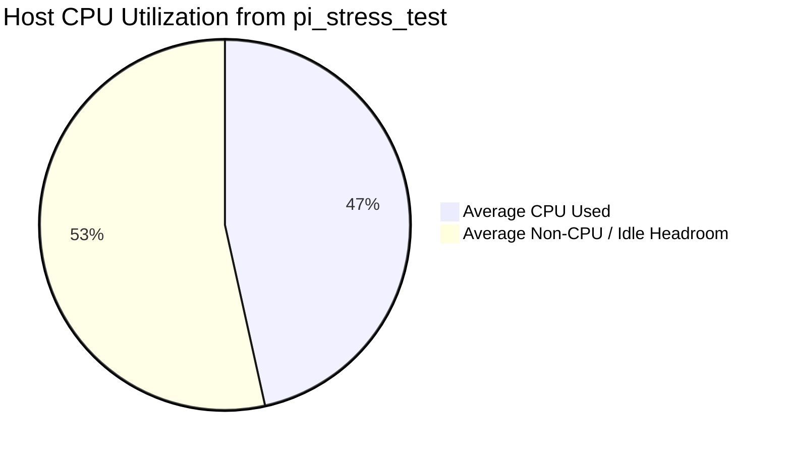

# NALIX CORE RASPBERRY PI 5: CONTROLLED DDOS SIMULATION ANALYSIS

> **Comprehensive telemetry analysis of listener admission pressure, Layer-4 load shedding, pool behavior, and runtime stability on Raspberry Pi 5.**

---

## 1. Executive Summary & Test Context

This report analyzes a controlled adversarial overload simulation against **Nalix Core** running on a Raspberry Pi 5. The test profile is different from the previous small-payload and large-payload benchmark reports: instead of measuring clean request/response throughput alone, this run stresses how the framework behaves when connection churn, listener admission pressure, dispatch queue saturation, and early packet dropping occur at the same time.

The strongest measured signal is not thermal throttling or raw bandwidth exhaustion. The Pi remained thermally safe, with temperature peaking at **47.2°C** and the throttling flag remaining at **`0x0`** across the capture window. CPU pressure existed, with average CPU utilization at **46.52%**, transient peaks at **100%**, and load average reaching **16.10** on a 4-core device. This indicates runnable queue pressure, but not enough evidence to claim a pure CPU bottleneck because kernel/user/iowait split was not collected.

The system pressure concentrated around the socket/listener/dispatch boundary. The host observed **11,269 ESTABLISHED**, **4,098 SYN_RECV**, and **11,598 CLOSE_WAIT** sockets. Nalix accepted **130,435** TCP connections, rejected **29,133**, and recorded **21,760 QueueFullRejections**. Downstream, the dispatch plane reported **555,581** pipeline executions while the connection plane reported **3,934,415** dropped packets. Using `PipelineMetrics.TotalExecutions + TotalPacketsDropped` as an approximate observable ingress denominator, the Layer-4 drop ratio is **87.63%**.

Unlike the earlier small-payload report where the object pool maintained **99.6%** hit rate and small fixed memory growth, this attack simulation generated much stronger pool churn. The buffer allocator remained structurally safe, with average hit rate **99.9951%**, **671** misses, **71** expands, and **0** fallbacks. Object pooling was less clean: final cache hit rate was **89.61%**, total cache misses reached **3,586,989**, `UnhealthyPoolCount` peaked at **6**, and two pools remained unhealthy in the final snapshot. The telemetry still reported **`TotalLeaked = 0`**, so the data supports object-pool pressure and delayed returns, not a confirmed leak.

| Finding | Measured Evidence | Engineering Interpretation |
| :--- | :---: | :--- |
| Thermal status | temp max **47.2°C**, throttled **`0x0`** | No evidence of thermal or power-induced throttling. |
| CPU/load pressure | CPU avg **46.52%**, peak **100%**, load1 max **16.10** | Runnable queue pressure exists; CPU-only bottleneck is not confirmed. |
| Memory/swap pressure | memory max **3,827 MB**, swap max **1,241 MB** | Significant memory pressure occurred during the overload window. |
| Socket state pressure | EST **11,269**, SYN_RECV **4,098**, CLOSE_WAIT **11,598** | Connection churn and delayed close/drain behavior were visible. |
| Listener admission | accepted **130,435**, rejected **29,133**, queue-full **21,760** | Listener queue saturation is strongly evidenced. |
| Dispatch shedding | dropped **3,934,415**, executed **555,581**, approx drop ratio **87.63%** | Layer-4 shedding protected L7 middleware and handlers. |
| Buffer allocator | hit rate avg **99.9951%**, misses **671**, fallback **0** | Slab pool stayed on the zero-fallback path but expanded under pressure. |
| Object pool | hit rate final **89.61%**, misses **3,586,989**, leaked **0** | Object churn is real; confirmed leak is not supported. |
| Runtime scheduler | workers **30/31**, threads max **72**, handles max **10,171** | Worker groups were fully occupied and OS resource pressure increased. |

---

## 2. Data Sources & Parsing Summary

| File | Rows | Time Range | Role in Analysis |
| :--- | ---: | :--- | :--- |
| `pi_stress_test_20260606_193549.csv` | 432 | 2026-06-06 19:35:49 -> 2026-06-06 19:52:48 | Host monitor: temperature, throttle flag, CPU/load, memory/swap, rx/tx counters, TCP socket states. |
| `buffers_metrics.csv` | 270 | 2026-06-06 19:34:32 -> 2026-06-06 19:50:42 | Pinned slab allocator: hit rate, misses, expands/shrinks, fallback count, per-bucket pool state. |
| `object_pools_metrics.csv` | 278 | 2026-06-06 19:34:32 -> 2026-06-06 19:50:42 | Lock-free object pool manager: hit/miss behavior, active objects, unhealthy pools, leaked-object counter. |
| `tasks_metrics.csv` | 270 | 2026-06-06 19:34:32 -> 2026-06-06 19:50:42 | Runtime scheduler: worker groups, OS threads/handles, managed heap, GC generations, completed work items. |
| `connections_metrics.csv` | 312 | 2026-06-06 19:34:32 -> 2026-06-06 19:50:43 | Connection plane: total managed connections, ingress/egress rates, dropped packets, AsyncCallback fairness pressure. |
| `listener_metrics.csv` | 270 | 2026-06-06 19:34:32 -> 2026-06-06 19:50:43 | Listener admission: accepted/rejected connections, queue-full rejection, limiter rejection, backlog, pending proxy handshake. |
| `dispatch_metrics.csv` | 272 | 2026-06-06 19:34:32 -> 2026-06-06 19:51:00 | Dispatch plane: pipeline executions, average pipeline time, wake signals, active executions, pending priority queues. |
| `connection_guard_metrics.csv` | 277 | 2026-06-06 19:34:32 -> 2026-06-06 19:50:42 | Connection guard: endpoint attempts, rejection rate, concurrent tracked endpoints. |
| `concurrency_gate_metrics.csv` | 271 | 2026-06-06 19:34:32 -> 2026-06-06 19:50:42 | Concurrency gate: acquired/queued/rejected operations and circuit-breaker trip status. |
| `policy_rate_limiter_metrics.csv` | 269 | 2026-06-06 19:34:32 -> 2026-06-06 19:50:42 | Shared policy limiter: tracked endpoints, token parameters, hard-block counter. |
| `token_bucket_limiter_metrics.csv` | 273 | 2026-06-06 19:34:32 -> 2026-06-06 19:50:42 | Token bucket limiter: endpoint count, hard blocks, capacity/refill policy. |
| `sessions_metrics.csv` | 27 | 2026-06-06 19:34:32 -> 2026-06-06 19:50:32 | Session store behavior: active/consumed/expired/stored session counters. |
| `instances_metrics.csv` | 272 | 2026-06-06 19:34:32 -> 2026-06-06 19:50:42 | Instance cache behavior: factory/cache hit telemetry and object creation counts. |
| `protocol_metrics.csv` | 270 | 2026-06-06 19:34:32 -> 2026-06-06 19:50:43 | Protocol layer: accepting/disposed state, total messages and errors for TCP/WebSocket. |

> [!NOTE]
> **Measurement Boundary**
> This report is driven by server-side telemetry CSV files. Client-side request latency, P50/P95/P99 latency, and clean RPS were not included in the uploaded dataset. Internal counters such as `PipelineMetrics.AverageTimeMs` therefore must not be interpreted as complete end-to-end network latency.

---

## 3. System Resource Telemetry

### 3.1. Host Temperature, CPU, Load, Memory, and Socket State

| Area | Metric | Minimum | Maximum | Average | Interpretation |
| :--- | :--- | ---: | ---: | ---: | :--- |
| Host | `temp_c` | 32.30 | 47.20 | 40.07 | Thermal headroom; no throttling evidence when paired with `throttled=0x0`. |
| Host | `cpu_usage_pct` | 0 | 100 | 46.52 | Average CPU does not confirm sustained saturation; peak shows burst pressure. |
| Host | `load1` | 0.01 | 16.10 | 5.45 | Load above 4 on a 4-core Pi indicates runnable queue pressure. |
| Host | `mem_used_mb` | 459 | 3,827 | 1,769.63 | System memory grew substantially during the attack window. |
| Host | `swap_used_mb` | 0 | 1,241 | 219.94 | Swap activity indicates memory pressure or OS paging, not necessarily leak. |
| Socket | `established` | 3 | 11,269 | 1,138.77 | Maximum established TCP connections visible from host sampling. |
| Socket | `syn_recv` | 0 | 4,098 | 323.56 | Half-open TCP pressure during connection burst. |
| Socket | `close_wait` | 0 | 11,598 | 953.43 | Delayed local close completion after remote FIN; not proof of leak alone. |
| Listener | `TCP.Metrics.TotalAccepted` | 0 | 130,435 | 45,115.77 | Connections admitted into Nalix listener. |
| Listener | `TCP.Metrics.QueueFullRejections` | 0 | 21,760 | 4,699.30 | Strong listener queue saturation evidence. |
| Dispatch | `TotalPacketsDropped` | 0 | 3,934,415 | 1,823,333.96 | Layer-4 load-shedding counter. |
| Dispatch | `PipelineMetrics.TotalExecutions` | 10 | 555,581 | 138,821.17 | Packets that survived into pipeline execution. |
| Buffer | `HitRate` | 1.00 | 1 | 1.00 | Slab allocator hit ratio. |
| Buffer | `TotalMisses` | 0 | 671 | 290.83 | Slow-path/miss pressure; small relative to hit volume. |
| Object | `CacheHitRate` | 79.10 | 100 | 90.70 | Object-pool reuse ratio; declined from ideal under churn. |
| Object | `UnhealthyPoolCount` | 0 | 6 | 2.69 | Number of pools reporting failure streaks. |
| Runtime | `WorkersRunning` | 30 | 30 | 30 | Workers fully occupied throughout sampling. |
| Runtime | `Process.Threads` | 5 | 72 | 29.75 | OS thread pressure. |
| Runtime | `Process.Handles` | 140 | 10,171 | 1,301.18 | Handle pressure; needs classification before leak claim. |
| Runtime | `Process.ManagedHeapMB` | 158 | 1,862 | 579.94 | Managed heap expansion. |
| Runtime | `Process.GCGen2` | 11 | 617 | 231.43 | Full GC count; suggests long-lived allocation pressure. |



**Observed behavior:**

- Temperature peaked at **47.2°C**, with `throttled` remaining **`0x0`**.
- CPU utilization averaged **46.52%** and reached a transient maximum of **100%**.
- Load averages peaked at **load1=16.10**, **load5=10.05**, and **load15=5.30**.
- Memory usage grew from **459 MB** to **3,164 MB**, with a peak of **3,827 MB**.
- Swap usage reached **1,241 MB** and ended at **1,023 MB**.
- TCP socket pressure was visible through **4,098 SYN_RECV** and **11,598 CLOSE_WAIT** peaks.

**Hypothesis:**

The machine was not thermally limited. The load average exceeding the 4-core CPU count suggests a runnable backlog, but the average CPU value alone does not prove sustained CPU saturation. The memory and swap values indicate runtime/OS memory pressure during the burst. Because heap dumps and process-level allocation traces were not collected, memory growth should be interpreted as pressure, pool expansion, retained connection state, or delayed cleanup rather than a confirmed memory leak.

---

## 4. Network, Listener Admission, and Socket Drainage

### 4.1. Network Throughput Boundary

| Metric | Measured Value | Analysis |
| :--- | :---: | :--- |
| Host RX delta | **1,065,552,334 bytes** | Captured at host level across the `pi_stress_test` window. |
| Host TX delta | **289,840,502 bytes** | Captured at host level across the `pi_stress_test` window. |
| Avg RX throughput | **8.37 Mbps** | Average across 1019s, including non-peak intervals. |
| Avg TX throughput | **2.28 Mbps** | Average across 1019s, including non-peak intervals. |
| In-process ingress peak | **254.88 Mbps** | Peak `IngressBytesPerSecond` from Nalix connection telemetry. |
| In-process egress peak | **6.15 Mbps** | Peak `EgressBytesPerSecond` from Nalix connection telemetry. |
| TotalBytesReceived | **553,926,605 bytes** | Nalix-managed receive counter. |
| TotalBytesSent | **25,488,632 bytes** | Nalix-managed send counter. |

**Observed behavior:** The in-process ingress peak reached **254.88 Mbps**, while the average host RX throughput across the full capture window was only **8.37 Mbps**. This does not prove physical Gigabit link saturation. It does, however, show bursty ingress pressure inside the process.

**Hypothesis:** The limiting path is more likely inside the connection/listener/dispatch chain than at raw Ethernet bandwidth. A `tcpdump` or `sar -n DEV,TCP,ETCP` capture would be required to separate physical NIC pressure from application-level queue pressure.

### 4.2. Listener Admission Control

| Listener Metric | Peak | Final | Engineering Meaning |
| :--- | ---: | ---: | :--- |
| `TCP.Metrics.TotalAccepted` | 130,435 | 130,435 | Connections admitted into TCP listener. |
| `TCP.Metrics.TotalRejected` | 29,133 | 29,133 | All listener-level rejections. |
| `TCP.Metrics.QueueFullRejections` | 21,760 | 21,760 | Application accept queue rejected new work because it reached capacity. |
| `TCP.Metrics.LimiterRejections` | 3,603 | 3,603 | Connections rejected by admission limiter. |
| `TCP.Metrics.AcceptQueueDepth` | 8,192 | 0 | Peak depth of listener-side queue. |
| `TCP.Configuration.Backlog` | 16,384 | 16,384 | Configured socket backlog. |
| `TCP.Connections.ActiveConnections` | 9,053 | 2,623 | Managed active connections. |
| `TCP.Metrics.ProxyProtocolErrors` | 3,090 | 3,090 | Proxy protocol parse failures. |
| `TCP.Metrics.PendingProxyConnections` | 1,024 | 0 | Connections waiting for proxy handshake. |
| `TCP.Metrics.TotalErrors` | 0 | 0 | Reported listener errors. |

*Analysis:* The listener accepted **130,435** connections but rejected **29,133**, with **21,760** of those being `QueueFullRejections`. The accept queue depth reached **8,192** while backlog was configured at **16,384**. This is stronger evidence of listener-side admission pressure than CPU pressure alone.

> [!CAUTION]
> **CLOSE_WAIT Interpretation**
> `CLOSE_WAIT` peaked at **11,598**. This means the remote peer initiated termination while the local side had not yet completed closure. It indicates connection drainage lag or delayed close handling under stress. It is **not** enough to claim a confirmed socket leak without socket lifecycle tracing.

---

## 5. Dispatch Pipeline & Layer-4 Load Shedding

### 5.1. Dispatch Counters

| Dispatch Metric | Peak | Average | Interpretation |
| :--- | ---: | ---: | :--- |
| `TotalPackets` | 18,619 | 346.13 | Observable dispatch queue packet count. |
| `TotalPacketsDropped` | 3,934,415 | 1,823,333.96 | Packets shed before full pipeline execution. |
| `PipelineMetrics.TotalExecutions` | 555,581 | 138,821.17 | Packets that reached pipeline execution. |
| `PipelineMetrics.AverageTimeMs` | 5,392.11 | 1,337.09 | Internal pipeline time; includes queueing/contended execution, not end-to-end latency. |
| `PipelineMetrics.ActiveExecutions` | 16 | 1.78 | Concurrent active pipeline executions. |
| `PendingPerPriority.HIGH` | 1,627 | 10.35 | High-priority pending queue pressure. |
| `PendingPerPriority.URGENT` | 5,275 | 60.21 | Urgent-priority pending queue pressure. |
| `ReadyConnections` | 5,303 | 123.49 | Connections ready for dispatch. |
| `WakeSignals` | 596,893 | 171,967.82 | Dispatcher wake-up signals. |

The Layer-4 shedding boundary is the most important signal in this run.

```plaintext
Approximate Ingress Reconciliation:
--------------------------------------------------------------------------------------
PipelineMetrics.TotalExecutions =      555,581
TotalPacketsDropped             =    3,934,415
--------------------------------------------------------------------------------------
Approximate observable ingress   =    4,489,996
Approximate drop ratio           =       87.63 %
```

This approximation assumes that the two dominant observable paths were packets executed by the pipeline and packets dropped by the connection/dispatch boundary. It does **not** include packets rejected before dispatch telemetry, packets rejected by the OS, or packets lost outside the process.

> [!WARNING]
> **Layer-4 Load Shedding Boundary**
> The drop/execution gap indicates that most observable ingress did not enter the full Layer-7 middleware and handler path. This protects `PacketContext` allocation, handler invocation, and downstream GC pressure, but it also means overload handling intentionally sacrifices client-visible acceptance to preserve process stability.

### 5.2. Middleware Timing

| Middleware | Executions | Errors | Average Time |
| :--- | ---: | ---: | ---: |
| `TimeoutMiddleware` | 555,419 | 0 | 557.1837 ms |
| `PacketTagMiddleware` | 555,419 | 0 | 557.0213 ms |
| `RateLimitMiddleware` | 555,579 | 0 | 559.0010 ms |
| `PermissionMiddleware` | 555,579 | 0 | 559.3074 ms |
| `ConcurrencyMiddleware` | 555,419 | 0 | 557.6250 ms |

**Observed behavior:** `PipelineMetrics.AverageTimeMs` reached **5392.11 ms** and averaged **1337.09 ms**. The final middleware metrics clustered around **557-559 ms**.

**Hypothesis:** These high values likely include queueing and contention time, not pure middleware function execution time. The previous reports already treat middleware bypass timings as internal pipeline/queue measurements rather than end-to-end network latency. This run lacks separate queue-wait and execution-time counters, so it cannot isolate native middleware cost from scheduler delay.

---

## 6. Nalix Core Memory Internals

### 6.1. Pinned Buffer Pool / Slab Allocator

The buffer pool did not behave like a failed subsystem. It did, however, show real dynamic resizing. The final state concentrated demand in the **256 B** and **4,096 B** buckets.

| Buffer Metric | Value | Technical Impact |
| :--- | :---: | :--- |
| Overall HitRate | **99.9964% final / 99.9951% average** | Very high reuse ratio. |
| TotalHits | **18,587,904** | Large socket ingress volume reused slab buffers. |
| TotalMisses | **671** | Misses exist but are tiny relative to total hits. |
| FallbackCount | **0** | No fallback path was observed. |
| TotalExpands | **71** | Pools expanded under burst pressure. |
| TotalShrinks | **8** | Trimming executed after pressure dropped. |
| PeakMemoryUsageBytes | **228,755,456 bytes (218.16 MiB)** | Maximum slab memory footprint. |
| ThroughputMBps | **5.87 MB/s peak** | Buffer accounting throughput counter. |

```plaintext
Buffer Slabs Allocation (Final Snapshot):
----------------------------------------------------------------------------------------------------------------------------------
-   256 B Pool : 75,932 buffers x   256 bytes =   19,438,592 bytes ( 18.54 MiB) | in-use 8,332, hits 18,473,216, expands 66, shrinks 4
- 1,024 B Pool :  2,457 buffers x 1,024 bytes =    2,515,968 bytes (  2.40 MiB) | in-use 0, hits 768, expands 0, shrinks 0
- 4,096 B Pool : 10,540 buffers x 4,096 bytes =   43,171,840 bytes ( 41.17 MiB) | in-use 2,000, hits 113,920, expands 5, shrinks 4
- 16,384 B Pool :  4,915 buffers x 16,384 bytes =   80,527,360 bytes ( 76.80 MiB) | in-use 1, hits 0, expands 0, shrinks 0
- 32,768 B Pool :  1,638 buffers x 32,768 bytes =   53,673,984 bytes ( 51.19 MiB) | in-use 1, hits 0, expands 0, shrinks 0
----------------------------------------------------------------------------------------------------------------------------------
TOTAL FINAL BUFFER CAPACITY = 199,327,744 bytes (190.09 MiB)
```

| Bucket | Initial | Final Total | Free | In Use | Hits | Expands | Shrinks | Miss Rate | Bytes Returned |
| :---: | ---: | ---: | ---: | ---: | ---: | ---: | ---: | ---: | :---: |
| **256 B** | 2,457 | 75,932 | 67,600 | 8,332 | 18,473,216 | 66 | 4 | 0.0034% | 45MB |
| **1,024 B** | 2,457 | 2,457 | 2,457 | 0 | 768 | 0 | 0 | 0.0000% | 0KB |
| **4,096 B** | 4,915 | 10,540 | 8,540 | 2,000 | 113,920 | 5 | 4 | 0.0316% | 15MB |
| **16,384 B** | 4,915 | 4,915 | 4,914 | 1 | 0 | 0 | 0 | 0.0000% | 0KB |
| **32,768 B** | 1,638 | 1,638 | 1,637 | 1 | 0 | 0 | 0 | 0.0000% | 0KB |

```mermaid
gantt
    title Final Buffer Capacity by Bucket (MiB)
    dateFormat  X
    axisFormat %s
    section 256B
    18.54 MiB : 0, 19
    section 1024B
    2.40 MiB : 0, 2
    section 4096B
    41.17 MiB : 0, 41
    section 16384B
    76.80 MiB : 0, 77
    section 32768B
    51.19 MiB : 0, 51
```



*Analysis:* The **256 B** bucket expanded from **2,457** to **75,932** buffers and handled **18,473,216** hits. The **4,096 B** bucket expanded from **4,915** to **10,540** buffers and handled **113,920** hits. The larger **16,384 B** and **32,768 B** pools remained mostly unused, with only one buffer in use each at the final snapshot. This pattern is consistent with a small-frame flood plus occasional larger receive/reassembly allocations.

### 6.2. Lock-Free Object Pool Manager

The object pool telemetry is more stressed than the buffer pool telemetry. The top-level hit rate declined from an initial perfect state to **89.61%** final, with **3,586,989** total cache misses and **3,622,757** total created objects.

| Object Pool Metric | Value | Technical Impact |
| :--- | :---: | :--- |
| CacheHitRate | **89.61% final / 90.70% average** | Reuse remained high, but no longer matched clean benchmark behavior. |
| TotalCacheHits | **30,938,977** | Majority of object requests were served from pools. |
| TotalCacheMisses | **3,586,989** | Significant allocation churn under connection pressure. |
| TotalCreated | **3,622,757** | Pool growth and new instance creation were active. |
| NetObjects | **78,565 peak / 22,312 final** | Outstanding objects remained elevated after the burst. |
| TotalLeaked | **0** | No telemetry-confirmed object leak. |
| UnhealthyPoolCount | **6 peak / 2 final** | Some pools entered failure streaks. |
| Throughput | **41,445.53 ops/s peak** | High pool operation volume. |

#### High-Traffic Object Pools

| Object Pool Type | Gets | Hits | Misses | Hit Rate | Outstanding | Trimmed | Status |
| :--- | ---: | ---: | ---: | ---: | ---: | ---: | :---: |
| **BufferLease** | 17,851,853 | 16,288,103 | 1,563,750 | 91.24% | 1 | 6,103 | `OK` |
| **ConnectionEventArgs** | 6,795,895 | 5,439,633 | 1,356,262 | 80.04% | 4,003 | 9,954 | `Unhealthy` |
| **PooledConnectEventContext** | 6,645,972 | 6,019,484 | 626,488 | 90.57% | 4,005 | 15,530 | `OK` |
| **ObjectMap`2** | 137,522 | 120,800 | 16,722 | 87.84% | 8,242 | 4,120 | `Unhealthy` |
| **PooledSocketReceiveContext** | 131,327 | 119,759 | 11,568 | 91.19% | 2,000 | 2,071 | `OK` |
| **PooledSocketAsyncEventArgs** | 307,269 | 301,248 | 6,021 | 98.04% | 2,049 | 0 | `OK` |
| **TimingWheel+TimeoutTask** | 135,993 | 130,035 | 5,958 | 95.62% | 2,001 | 0 | `OK` |
| **ProxyHeaderContext** | 152,358 | 152,163 | 195 | 99.87% | 0 | 0 | `OK` |

#### Final Unhealthy Pools

| Pool | Outstanding | Consecutive Failures | Last Access |
| :--- | ---: | ---: | :--- |
| **ConnectionEventArgs** | 4,003 | 3 | 2026-06-06T12:50:31.1262718Z |
| **ObjectMap`2** | 8,242 | 3 | 2026-06-06T12:50:31.1256726Z |

> [!CAUTION]
> **Object Pool Pressure, Not Confirmed Leak**
> `ConnectionEventArgs` ended with **4,003** outstanding objects and `ObjectMap<string, object>` ended with **8,242** outstanding objects. Both reported consecutive failures. However, top-level `TotalLeaked` stayed at **0**, so the correct interpretation is pool pressure, delayed returns, retention, or max-capacity behavior. A confirmed leak requires heap snapshots or object lifecycle tracing.

---

## 7. Task Scheduler, Worker Groups, Handles, and GC

### 7.1. Runtime Counters

| Runtime Metric | Minimum | Maximum | Average | Interpretation |
| :--- | ---: | ---: | ---: | :--- |
| `WorkersRunning` | 30 | 30 | 30 | Active workers stayed fully occupied. |
| `WorkersTotal` | 30 | 31 | 30.67 | Worker capacity remained around 30-31. |
| `Process.Threads` | 5 | 72 | 29.75 | OS thread pressure increased under load. |
| `Process.Handles` | 140 | 10,171 | 1,301.18 | Handle count spiked; classification is required before leak claims. |
| `Process.ManagedHeapMB` | 158 | 1,862 | 579.94 | Managed heap expanded substantially. |
| `Memory.WorkingSetMB` | 233 | 3,252 | 1,003.69 | Process resident memory grew with pressure. |
| `Memory.PrivateMB` | 397 | 4,180 | 1,402.87 | Private memory reached beyond physical RAM size, matching swap pressure. |
| `Process.GCGen0` | 13 | 3,430 | 848.97 | Short-lived allocations were active. |
| `Process.GCGen1` | 12 | 673 | 244 | Medium-lived object promotion occurred. |
| `Process.GCGen2` | 11 | 617 | 231.43 | Full GC pressure rose sharply versus clean runs. |
| `Process.CompletedWorkItems` | 19,362 | 9,915,809 | 3,347,091.81 | Scheduler completed almost 10M work items. |

### 7.2. Worker Group Snapshot

| Worker Group | Running | Total | Concurrency |
| :--- | ---: | ---: | :---: |
| `cleanup` | 1 | 1 | - |
| `log` | 1 | 1 | 1/3 |
| `net/dispatch` | 16 | 16 | - |
| `net/tcp/57206` | 9 | 9 | - |
| `net/ws/57207` | 2 | 2 | - |
| `time` | 1 | 1 | - |

### 7.3. Recurring Services Snapshot

| Recurring Task | Total Runs | Interval | Failures | Tag |
| :--- | ---: | ---: | ---: | :---: |
| `tcp.proxy.Sweep.57206` | 1,798 | 500 ms | 0 | `net` |
| `hub.throughput.cleanup.0360E033` | 917 | 1,000 ms | 0 | `N/A` |
| `conn.limit.cleanup.02099316` | 34 | 30,000 ms | 0 | `service` |
| `token.bucket.cleanup.021093C0` | 22 | 45,000 ms | 0 | `service` |
| `concurrency.gate.cleanup.00D3A00F` | 17 | 60,000 ms | 0 | `service` |
| `conn.limit.reload.cleanup.02099316` | 17 | 60,000 ms | 0 | `service` |
| `conn.limit.save.cleanup.02099316` | 17 | 60,000 ms | 0 | `service` |

**Observed behavior:** `net/dispatch` was **16/16**, `net/tcp/57206` was **9/9**, and `WorkersRunning` stayed fixed at **30**. `Process.Threads` peaked at **72**, `Process.Handles` peaked at **10,171**, and `Process.ManagedHeapMB` peaked at **1,862 MB**. Gen2 collections increased from **11** to **617**.

**Hypothesis:** The runtime was not idle; it was operating in a fully occupied worker configuration. The combination of listener queue rejections, dispatch drops, high pending urgent queue, object-pool misses, and Gen2 growth suggests scheduler contention and object retention during overload. This does not prove ThreadPool starvation by itself, but it strongly supports scheduler pressure.

---

## 8. Admission Policy, Guard, and Rate Limiting

| Control Plane | Metric | Peak | Final | Interpretation |
| :--- | :--- | ---: | ---: | :--- |
| ConnectionGuard | `TotalAttempts` | 149,269 | 149,269 | Accepted/attempted guard checks. |
| ConnectionGuard | `TotalRejections` | 13,275 | 13,275 | Guard-level connection rejections. |
| ConnectionGuard | `RejectionRate` | 11.68 | 8.89 | EWMA rejection percentage reported by guard. |
| ConnectionGuard | `TotalConcurrent` | 9,837 | 2,001 | Concurrent endpoint pressure. |
| ConnectionGuard | `TrackedEndpoints` | 48,060 | 32,827 | Endpoint table size. |
| ConcurrencyGate | `TotalAcquired` | 0 | 0 | Acquired per-opcode gate permits. |
| ConcurrencyGate | `TotalQueued` | 0 | 0 | Queued operations behind gate. |
| ConcurrencyGate | `TotalRejected` | 0 | 0 | Rejected by concurrency gate. |
| ConcurrencyGate | `CircuitBreaker.Trips` | 0 | 0 | Circuit breaker trips. |
| PolicyRateLimiter | `CheckCounter` | 0 | 0 | Policy checks performed. |
| PolicyRateLimiter | `SharedEngine.TrackedEndpoints` | 42,682 | 35,195 | Tracked endpoints in shared limiter. |
| PolicyRateLimiter | `SharedEngine.HardBlockedCount` | 0 | 0 | Hard blocks. |
| TokenBucket | `HardBlockedCount` | 0 | 0 | Token bucket hard blocks. |

*Analysis:* Policy-level controls were present, but the strongest defensive action happened earlier: listener queue rejection and Layer-4 packet shedding. The shared policy limiter tracked **42,682** endpoints, but hard-block counts remained **0**. This means the attack profile was largely absorbed by admission pressure and dispatch shedding rather than long-term hard blocking.

---

## 9. Cross-Layer Correlation

| Layer | Evidence | Interpretation |
| :--- | :--- | :--- |
| Host | temp **47.2°C**, throttled **`0x0`**, CPU avg **46.52%**, load1 max **16.10** | No thermal/power bottleneck; runnable backlog likely existed. |
| Socket | EST **11,269**, SYN_RECV **4,098**, CLOSE_WAIT **11,598** | High churn and delayed connection drainage. |
| Listener | accepted **130,435**, rejected **29,133**, queue-full **21,760** | Admission control reached capacity. |
| Dispatch | dropped **3,934,415**, executed **555,581**, approx drop ratio **87.63%** | Layer-4 boundary shed most observable ingress before L7. |
| Buffer Pool | hit rate **99.9951%**, expands **71**, fallback **0** | Slab allocator absorbed the raw-byte workload without fallback. |
| Object Pool | cache hit final **89.61%**, misses **3,586,989**, unhealthy final **2** | Object churn and delayed returns became visible. |
| GC/Scheduler | workers **30/31**, heap peak **1,862 MB**, Gen2 **617** | Runtime pressure rose, but process remained observable. |

The pressure chain is therefore clearer than in the earlier AI-generated version: traffic first stressed the socket and listener layers, then saturated admission queues, then forced dispatch-level shedding. The buffer allocator kept the raw ingress path cheap, but object pools and runtime counters show that accepted work still created meaningful retention and scheduling pressure. The system protected itself primarily by refusing and dropping work before it reached full Layer-7 execution.

---

## 10. Bottleneck Decision Matrix

| Component | Evidence Level | Evidence | Decision |
| :--- | :---: | :--- | :--- |
| Thermal | No evidence | temp max 47.2°C and throttled stayed `0x0` | Not the limiting factor. |
| Power | No evidence | throttled stayed `0x0` | No undervoltage/power throttling evidence. |
| CPU | Moderate evidence | avg 46.52%, peak 100%, load1 peak 16.10 on 4 cores | Runnable queue pressure exists, but sustained CPU saturation is not proven without `%user/%system/%iowait`. |
| Network bandwidth | Weak evidence | host avg RX 8.37 Mbps, in-process ingress peak 254.88 Mbps | Link saturation is not proven. |
| Memory pressure | Strong evidence | mem peak 3827 MB, swap peak 1241 MB, heap peak 1862 MB | Significant memory pressure occurred. |
| Listener accept queue | Strong evidence | QueueFullRejections 21760, AcceptQueueDepth 8192 | Listener admission control became a front-line limiter. |
| Dispatch / Layer-4 shedding | Strong evidence | 3,934,415 dropped vs 555,581 executions; approx drop ratio 87.63% | Dispatch boundary intentionally discarded overload before L7. |
| Buffer pool | Moderate evidence | HitRate 99.9951%, misses 671, expands 71, fallback 0 | Slab allocator handled traffic, but 256B/4096B pools expanded. |
| Object pool | Strong evidence | CacheHitRate min 79.10%, misses 3,586,989, UnhealthyPoolCount peak 6 | Object pools experienced churn and two pools ended unhealthy. |
| Task scheduler | Strong evidence | WorkersRunning fixed at 30, net/dispatch 16/16, net/tcp 9/9 | Worker groups were fully occupied during the pressure window. |
| GC | Moderate evidence | Gen2 grew from 11 to 617; managed heap peak 1862 MB | Long-lived allocation pressure occurred; leak is not confirmed. |
| Confirmed memory leak | Insufficient evidence | TotalLeaked = 0; no heap dump | Cannot claim confirmed leak. |
| Confirmed socket leak | Insufficient evidence | CLOSE_WAIT peak 11598; no socket lifecycle trace | Delayed close/drain lag is visible, but leak is not proven. |

---

## 11. Root Cause Analysis

### Observed behavior

- The host remained thermally safe: **47.2°C** max temperature and **`0x0`** throttling state.
- CPU had transient full usage but moderate average usage: **46.52%** average and **100%** peak.
- Load average exceeded physical core count: **load1=16.10** on 4 cores.
- Memory and swap pressure were real: **3,827 MB** system memory used and **1,241 MB** swap used.
- Listener admission control activated: **29,133** rejected connections and **21,760** queue-full rejections.
- Dispatch load shedding dominated: **3,934,415** dropped packets versus **555,581** pipeline executions.
- Buffer pools remained healthy enough for the raw-byte path: **99.9951%** average hit rate and **0** fallbacks.
- Object pool stress was visible: **3,586,989** misses, final **89.61%** cache hit rate, and **2** unhealthy pools at the final snapshot.
- `TotalLeaked` remained **0**, so telemetry does not confirm an object leak.

### Hypothesis

The primary pressure point was the **listener admission + dispatch shedding boundary**. The listener queue filled under connection churn, causing queue-full rejections. Packets that passed admission frequently hit the dispatch load-shedding boundary, where Nalix disposed raw leases before allocating full L7 contexts. This design protected the managed heap and application handlers, but accepted connections still held enough state to drive memory pressure, object-pool misses, and Gen2 collection growth.

`CLOSE_WAIT` likely grew because remote clients closed faster than the server could drain and finalize local socket cleanup. The final state is consistent with delayed cleanup under stress, abrupt client disconnect behavior, or insufficient close-loop throughput. A socket leak is possible but not confirmed.

### What likely saturated first

The strongest evidence points to the **listener accept queue and dispatch queue boundary**, not thermal, power, or physical network bandwidth. The secondary pressure points were runtime scheduler occupancy and object-pool churn.

### What did not fail

The telemetry does not show thermal throttling, power throttling, buffer fallback allocation, listener internal errors, dispatch parser errors, or telemetry-confirmed object leaks. The framework remained observable and continued recording metrics throughout the run.

---

## 12. Scope, Limitations, and Next Instrumentation

This report is limited by the available CSV telemetry. The following data was not included and should be collected in the next run:

- Client-side benchmark result: successful requests, failed requests, RPS, P50/P95/P99/P99.9.
- `sar_cpu.log`: `%user`, `%system`, `%iowait`, `%idle`, and per-core saturation.
- `sar -n DEV,TCP,ETCP`: NIC utilization, retransmits, TCP resets, passive/active opens.
- `tcpdump`: packet size distribution and connection behavior.
- `perf record` / `perf top`: kernel hot paths such as TCP receive, copy, interrupt handling, scheduler.
- `dotnet-counters`: ThreadPool queue length, allocation rate, GC heap size, exception count.
- `dotnet-gcdump` or `dotnet-dump`: object retention and heap histogram near peak memory.
- Socket lifecycle tracing: accept/read/FIN/close timestamps to explain `CLOSE_WAIT`.
- Queue wait time vs execution time: separate dispatch queue delay from middleware execution cost.
- Explicit per-layer drop counters: Layer 1 receive cap, Layer 2 callback cap, Layer 3 dispatch queue drop, L7 rate-limit rejection.

---

## 13. Conclusions & Optimization Path

1. **Layer-4 shedding worked as the main defensive boundary.** The approximate observable drop ratio was **87.63%**, showing that the framework rejected the majority of observable overload before full Layer-7 processing.

2. **Listener queue pressure is the clearest bottleneck.** `QueueFullRejections` reached **21,760**, and the accept queue depth reached **8,192**. This is more directly supported than a pure CPU bottleneck.

3. **Buffer pools remained structurally healthy but not static.** The allocator maintained **99.9951%** average hit rate and **0** fallbacks, but **71** expands show that static capacity was not sufficient for the entire burst.

4. **Object pools deserve the next investigation pass.** `ConnectionEventArgs` and `ObjectMap<string, object>` ended unhealthy with thousands of outstanding objects. This is not a confirmed leak because `TotalLeaked` remained **0**, but it is a strong signal for delayed returns, retention, or sizing pressure.

5. **Runtime pressure was real.** Workers were fully occupied, handles peaked at **10,171**, managed heap reached **1,862 MB**, and Gen2 collections reached **617**. The next run should collect allocation and queue wait data to decide whether tuning ThreadPool, object pool capacities, or cleanup cadence is most effective.

| Optimization | Expected Impact | Trade-off | Confidence |
| :--- | :--- | :--- | :---: |
| Add per-layer drop counters | Reconcile socket ingress, callback drops, dispatch shedding, and L7 rejects accurately. | Minor counter overhead. | High |
| Add socket lifecycle tracing | Explain `CLOSE_WAIT` and distinguish delayed close from actual leak. | More log volume under stress. | High |
| Add queue-wait vs execution-time metrics | Separate scheduler delay from middleware execution cost. | Requires metric model change. | High |
| Capture `dotnet-gcdump` at peak memory | Confirms whether heap growth is retained objects, pools, or legitimate connection state. | May pause or perturb process. | Medium |
| Profile with `sar` and `perf` | Separates kernel networking cost from user-space Nalix cost. | Additional profiling overhead. | High |
| Review object pool sizing for `ConnectionEventArgs` and `ObjectMap` | May reduce cache misses and unhealthy states under churn. | Higher steady-state memory. | Medium |
| Tune backlog/somaxconn only after OS telemetry | May absorb larger SYN/accept bursts. | Can increase kernel memory pressure if overdone. | Medium |
