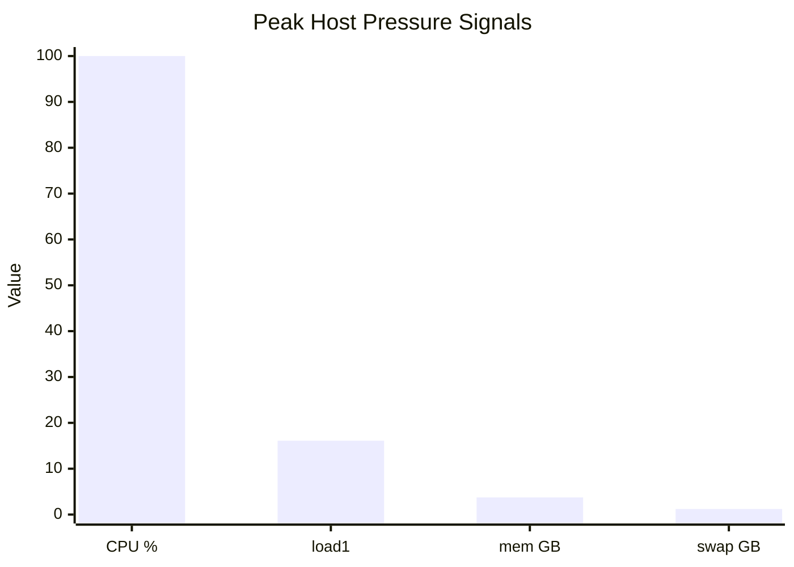

# NALIX CORE RASPBERRY PI 5: CONTROLLED OVERLOAD SIMULATION REPORT

> Compact telemetry analysis of Raspberry Pi 5 behavior under controlled high-connection pressure, listener admission limits, and Layer-4 load shedding.

---

## 1. Executive Summary

This run did **not** show thermal or power throttling. CPU temperature peaked at **47.20°C**, while the throttling flag stayed at **0x0** across the host samples. The stronger signal was queue pressure: CPU averaged **46.52%** but load1 peaked at **16.10** on a 4-core Pi, which means runnable work temporarily exceeded core capacity.

The network path did not prove 1 Gbps link saturation. The host counters moved by **1,065,552,334 RX bytes** and **289,840,502 TX bytes** over roughly **1,019 seconds**, averaging about **8.365 Mbps RX** and **2.275 Mbps TX**. However, short ingress bursts still reached **254.9 Mbps** by Nalix connection telemetry.

The main defensive event happened inside the listener and dispatch layers. The TCP listener accepted **130,435** connections, rejected **29,133**, and recorded **21,760 QueueFullRejections**. At the dispatch boundary, **3,934,415 packets** were dropped while **555,581 pipeline executions** completed.

Using `PipelineMetrics.TotalExecutions + TotalPacketsDropped` as the observable ingress approximation, the estimated Layer-4 drop ratio is **87.63%**. This confirms that the overload defense was mostly an early load-shedding behavior, not full Layer-7 handler execution.

| Area | Key Metric | Value | Interpretation |
| :--- | :--- | ---: | :--- |
| Thermal | Peak temperature / throttled | 47.20°C / 0x0 | No thermal/power throttling evidence |
| CPU | Avg / peak / load1 peak | 46.52% / 100.0% / 16.10 | transient CPU saturation with scheduler backlog |
| Memory | Peak RAM / swap | 3,827 MB / 1,241 MB | memory pressure present; leak not proven |
| Sockets | EST / SYN_RECV / CLOSE_WAIT peak | 11,269 / 4,098 / 11,598 | high connection churn and delayed close drainage |
| Listener | Accepted / rejected / queue-full | 130,435 / 29,133 / 21,760 | listener admission control activated |
| Dispatch | Executed / dropped | 555,581 / 3,934,415 | Layer-4 shedding dominated ingress |
| Buffer Pool | Hit rate / misses / fallback | 100.0% / 671.0 / 0 | slab allocator avoided fallback path |
| Object Pool | Hit rate / leaks / unhealthy | 100.0% / 0 / 6 | no leak counter, but some pools degraded |
| Runtime | Workers / threads / handles | 30.00/31.00 / 72.00 / 10,171 | worker saturation and handle pressure |

---

## 2. Data Sources

| File | Rows | Time Range | Used For |
| :--- | ---: | :--- | :--- |
| pi_stress_test_20260606_193549.csv | 432 | 2026-06-06 19:35:49 → 2026-06-06 19:52:48 | host thermals, CPU load, memory, swap, TCP state |
| listener_metrics.csv | 270 | 2026-06-06 19:34:32.622000 → 2026-06-06 19:50:43.013000 | accept queue, rejections, backlog, proxy errors |
| connections_metrics.csv | 312 | 2026-06-06 19:34:32.333000 → 2026-06-06 19:50:43.992000 | bytes, connection count, callbacks, packet drops |
| dispatch_metrics.csv | 272 | 2026-06-06 19:34:32.162000 → 2026-06-06 19:51:00.392000 | pipeline executions, pending queues, wake signals |
| buffers_metrics.csv | 270 | 2026-06-06 19:34:32.306000 → 2026-06-06 19:50:42.486000 | slab allocator hits, misses, expansion and shrink behavior |
| object_pools_metrics.csv | 278 | 2026-06-06 19:34:32.408000 → 2026-06-06 19:50:42.530000 | object reuse, misses, leaks, unhealthy pools |
| tasks_metrics.csv | 270 | 2026-06-06 19:34:32.266000 → 2026-06-06 19:50:42.468000 | worker groups, thread count, heap, handles, GC |

---

## 3. Host and Socket Telemetry

| Metric | Min | Max | Avg | Technical Impact |
| :--- | ---: | ---: | ---: | :--- |
| `temp_c` | 32.30 | 47.20 | 40.07 | thermals remained controlled |
| `cpu_usage_pct` | 0 | 100.0 | 46.52 | CPU had bursts, but average saturation is not proven |
| `load1` | 0.01 | 16.10 | 5.449 | load exceeded 4 cores during peak backlog |
| `mem_used_mb` | 459.0 | 3,827 | 1,770 | memory pressure increased during the burst |
| `swap_used_mb` | 0 | 1,241 | 219.9 | swap was used; heap dump needed before calling it leak |
| `established` | 3 | 11,269 | 1,139 | high active connection fan-in |
| `syn_recv` | 0 | 4,098 | 323.6 | half-open pressure during connection burst |
| `close_wait` | 0 | 11,598 | 953.4 | local side delayed socket close completion |

**Observed behavior:** `CLOSE_WAIT` peaked at **11,598**, but this alone does not confirm a socket leak. It means the remote peer initiated connection termination while the local application had not yet completed socket closure.

**Hypothesis:** Under high connection churn, the listener/dispatch workers likely prioritized ingress draining and overload defense while socket cleanup lagged behind. A confirmed socket leak would require lifecycle tracing or `ss -tanp` snapshots mapped to the process.



---

## 4. Listener and Layer-4 Load Shedding

| Metric | Peak / Final | Engineering Meaning |
| :--- | ---: | :--- |
| `TCP.Metrics.TotalAccepted` | 130,435 | connections admitted into the framework |
| `TCP.Metrics.TotalRejected` | 29,133 | listener-level rejection path activated |
| `TCP.Metrics.QueueFullRejections` | 21,760 | accept queue saturation signal |
| `TCP.Metrics.LimiterRejections` | 3,603 | policy/limiter rejection contribution |
| `TCP.Metrics.AcceptQueueDepth` | 8,192 | peak application accept queue depth |
| `TCP.Metrics.ProxyProtocolErrors` | 3,090 | invalid or mismatched proxy header traffic |
| `TotalPacketsDropped` | 3,934,415 | frames dropped before full processing |
| `PipelineMetrics.TotalExecutions` | 555,581 | packets that reached pipeline execution |
| Approx. drop ratio | 87.63% | derived from dropped / (dropped + executed) |

> [!WARNING]
> **Layer-4 Load Shedding Boundary**  
> The system dropped approximately **3,934,415** packets before full pipeline execution. This protects deserialization, `PacketContext` allocation, middleware, handlers, and GC, but it also means client-visible acceptance is intentionally reduced under overload.

| Middleware | Executions | Errors | Avg Time |
| :--- | ---: | ---: | ---: |
| `TimeoutMiddleware` | 555,419 | 0 | 557.18 ms |
| `PacketTagMiddleware` | 555,419 | 0 | 557.02 ms |
| `RateLimitMiddleware` | 555,579 | 0 | 559.00 ms |
| `PermissionMiddleware` | 555,579 | 0 | 559.31 ms |
| `ConcurrencyMiddleware` | 555,419 | 0 | 557.62 ms |

**Observed behavior:** Listener admission pressure and dispatch shedding are stronger signals than thermal, power, or bandwidth bottlenecks. `QueueFullRejections` reached **21,760**, while dispatch dropped **3,934,415** frames against **555,581** full executions.

**Hypothesis:** The Pi was not failing at the hardware edge. Nalix was draining sockets and rejecting work at the listener/dispatch boundary to prevent Layer-7 execution from consuming heap and worker time.

---

## 5. Buffer Pool and Object Pool Deep Dive

### 5.1 Buffer Slab Allocator

| Bucket | Initial | Final Total | In Use | Hits | Expands / Shrinks | Miss Rate | Bytes Returned |
| :--- | ---: | ---: | ---: | ---: | :---: | ---: | ---: |
| 256 B | 2,457 | 75,932 | 8,332 | 18,473,216 | 66 / 4 | 0.00344% | 45MB |
| 1,024 B | 2,457 | 2,457 | 0 | 768 | 0 / 0 | 0.00000% | 0KB |
| 4,096 B | 4,915 | 10,540 | 2,000 | 113,920 | 5 / 4 | 0.03159% | 15MB |
| 16,384 B | 4,915 | 4,915 | 1 | 0 | 0 / 0 | 0.00000% | 0KB |
| 32,768 B | 1,638 | 1,638 | 1 | 0 | 0 / 0 | 0.00000% | 0KB |

```plaintext
Buffer Pool Summary
--------------------------------------------------------------------------------------
Overall HitRate        : 100.0%
TotalHits              : 18,587,904
TotalMisses            : 671.0
FallbackCount          : 0
TotalExpands/Shrinks   : 71.00 / 8
PeakMemoryUsageBytes   : 228,755,456
--------------------------------------------------------------------------------------
```

**Observed behavior:** The `256 B` bucket dominated the traffic path with **18,473,216 hits**, expanding from **2,457** to **75,932** buffers. The `4,096 B` bucket also expanded from **4,915** to **10,540** buffers and served **113,920 hits**. `FallbackCount` remained **0**, so the telemetry does not show fallback into a slower array-pool path.

**Hypothesis:** The workload was primarily small-frame or control-heavy, with enough larger receive events to expand the `4,096 B` pool. The allocator absorbed pressure via expansion rather than fallback allocation.

```mermaid
gantt
    title Buffer Pool Final Capacity
    dateFormat X
    axisFormat %s
    section 256 B
    75,932 buffers : 0, 76
    section 4,096 B
    10,540 buffers : 0, 11
    section 16,384 B
    4,915 buffers : 0, 5
    section 32,768 B
    1,638 buffers : 0, 2
```



### 5.2 Object Pool

| Pool Type | Gets | Misses | Hit Rate | Outstanding | Trimmed | Status |
| :--- | ---: | ---: | ---: | ---: | ---: | :--- |
| `Environment.Memory.BufferLease` | 17,851,853 | 1,563,750 | 91.24% | 1 | 6,103 | OK |
| `Network.Connections.ConnectionEventArgs` | 6,795,895 | 1,356,262 | 80.04% | 4,003 | 9,954 | Unhealthy |
| `Network.Internal.Pooling.PooledConnectEventContext` | 6,645,972 | 626,488 | 90.57% | 4,005 | 15,530 | OK |
| `Framework.Memory.Objects.ObjectMap` | 137,522 | 16,722 | 87.84% | 8,242 | 4,120 | Unhealthy |
| `Network.Internal.Pooling.PooledSocketReceiveContext` | 131,327 | 11,568 | 91.19% | 2,000 | 2,071 | OK |
| `Network.Internal.Pooling.PooledSocketAsyncEventArgs` | 307,269 | 6,021 | 98.04% | 2,049 | 0 | OK |

**Observed behavior:** Global object-pool telemetry reported **30,938,977 cache hits**, **3,586,989 misses**, **3,622,757 created objects**, **78,565 net objects**, and **0 leaks**. However, the detailed pool list is more important than the global hit rate: `ConnectionEventArgs` ended as `Unhealthy` with **1,356,262 misses** and **4,003 outstanding**, while `ObjectMap` ended as `Unhealthy` with **16,722 misses** and **8,242 outstanding**.

> [!CAUTION]
> **Pool Health Is Mixed**  
> `TotalLeaked = 0` means telemetry did not report a confirmed object-pool leak. It does **not** mean every pool remained healthy. The unhealthy `ConnectionEventArgs` and `ObjectMap` pools point to retention, delayed returns, or capacity pressure under connection churn.

**Hypothesis:** The connection lifecycle objects were held longer than buffer leases because socket close/drain processing lagged under overload. This matches the `CLOSE_WAIT` peak and queue-full listener behavior, but a heap dump is still required before calling it a leak.

---

## 6. Task Scheduler, GC, and Runtime Pressure

| Runtime Metric | Min | Max | Avg | Interpretation |
| :--- | ---: | ---: | ---: | :--- |
| `WorkersRunning` | 30.00 | 30.00 | 30.00 | workers stayed fully occupied |
| `WorkersTotal` | 30.00 | 31.00 | 30.67 | worker pool size was stable |
| `Process.Threads` | 5 | 72.00 | 29.75 | thread pressure increased |
| `Process.Handles` | 140.0 | 10,171 | 1,301 | handle pressure needs classification |
| `ManagedHeapMB` | 158.0 | 1,862 | 579.9 | long-lived allocation pressure |
| `GC Gen0 / Gen1 / Gen2` | 3,430 / 673.0 / 617.0 | - | - | full-GC count rose under stress |
| `CompletedWorkItems` | 19,362 | 9,915,809 | 3,347,092 | runtime continued draining work |

| Worker Group | Running | Total |
| :--- | ---: | ---: |
| `cleanup` | 1 | 1 |
| `log` | 1 | 1 |
| `net/dispatch` | 16 | 16 |
| `net/tcp/57206` | 9 | 9 |
| `net/ws/57207` | 2 | 2 |
| `task` | 0.0 | 1.0 |
| `time` | 1 | 1 |

**Observed behavior:** `WorkersRunning` stayed at **30**, while `WorkersTotal` peaked at **31**. The runtime also reached **72 process threads**, **10,171 handles**, **1,862 MB managed heap**, and **617 Gen2 collections**.

**Hypothesis:** This is the clearest runtime pressure signal. The worker pool stayed fully occupied while listener and dispatch queues rejected or dropped excess work. Handle and heap growth should be treated as pressure/retention until confirmed by `dotnet-gcdump`, `dotnet-dump`, and handle classification.

---

## 7. Bottleneck Decision and Next Steps

| Component | Evidence Level | Decision |
| :--- | :---: | :--- |
| Thermal / Power | No evidence | temp stayed under 48°C and throttled stayed 0x0 |
| Network bandwidth | Weak evidence | average RX/TX was below 1 Gbps; burst RX reached ~254.9 Mbps |
| Listener accept queue | Strong evidence | `QueueFullRejections = 21,760` and `AcceptQueueDepth = 8,192` |
| Dispatch load shedding | Strong evidence | dropped/executed gap gives ~87.63% observable drop ratio |
| Buffer pool | Moderate evidence of pressure, no fallback | `256 B` and `4096 B` expanded; `FallbackCount = 0` |
| Object pool | Moderate evidence of lifecycle pressure | unhealthy `ConnectionEventArgs` and `ObjectMap`; `TotalLeaked = 0` |
| Scheduler / GC | Strong pressure evidence | workers full, threads/handles/heap/Gen2 rose |
| Confirmed memory leak | Insufficient evidence | heap growth and swap are not enough without dump analysis |
| Confirmed socket leak | Insufficient evidence | `CLOSE_WAIT` needs lifecycle tracing |

### Root Cause Summary

**Observed behavior:** The Pi remained thermally stable, but connection churn pushed the listener queue, dispatch boundary, object pools, and scheduler into pressure. Nalix accepted **130,435** connections, rejected **29,133**, dropped **3,934,415** packets, and still completed **555,581** pipeline executions.

**Hypothesis:** The system saturated first at the listener/dispatch/scheduler boundary rather than hardware thermals or raw bandwidth. Layer-4 load shedding behaved as the main protection mechanism: it drained enough socket input to keep the process alive while refusing work that would otherwise reach Layer-7 middleware and handlers.

### Missing Telemetry for the Next Run

- Client-side benchmark summary: RPS, success/fail, P50/P95/P99/P99.9.
- `sar_cpu.log` with `%user/%system/%iowait/%idle`.
- `tcpdump` or `pcap` to verify packet rate and retransmits.
- `ss -tanp` snapshots to classify `CLOSE_WAIT`.
- `dotnet-counters`, `dotnet-gcdump`, and `dotnet-dump`.
- Per-queue wait time separated from middleware execution time.
- Explicit Layer-4 drop reason counters: queue full, per-IP cap, per-connection cap, fairness cap.
