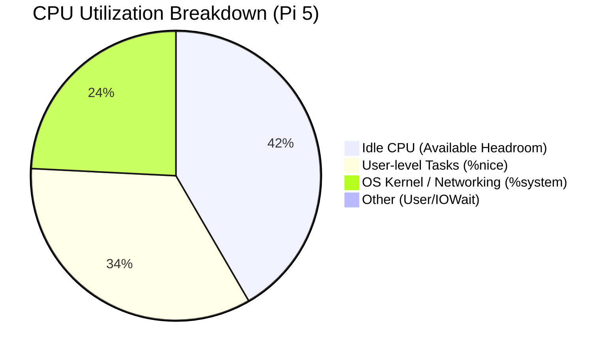
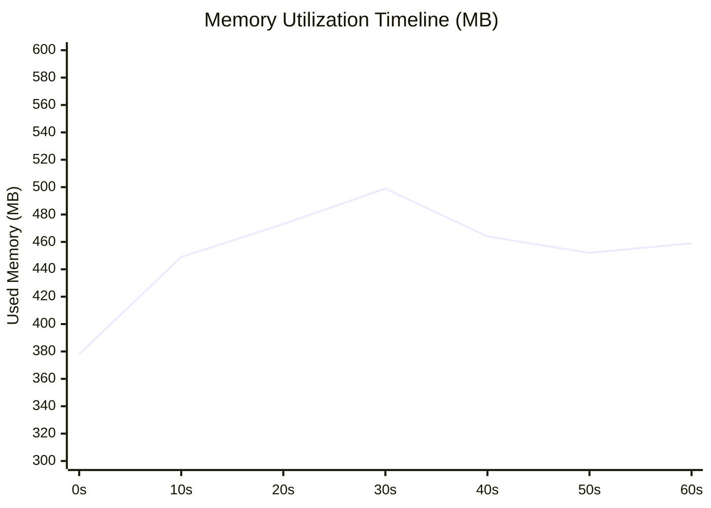

# NALIX CORE RASPBERRY PI 5: SMALL PAYLOAD (32-BYTE) STRESS TEST REPORT

> **Comprehensive Analysis of System Performance under High-Concurrency Load with Small Packets (32 Bytes)**

---

## 1. Executive Summary & Test Context

This telemetry report details the performance of the **Nalix Core** framework on a physical Raspberry Pi 5 under an extreme high-concurrency stress profile.

**Key Characteristic:** This test utilizes small **~32-byte payloads** (the internal `Control` packet). This profile is designed to evaluate the framework's raw packet parsing speed, dispatch pipeline efficiency, and lock-free object pool throughput without being bottlenecked by physical memory bandwidth or kernel memory copying overhead.

### Hardware Specifications (Target Host)

* **Hardware Model:** Raspberry Pi 5 Model B Rev 1.0
* **Processor (CPU):** Broadcom BCM2712 (Cortex-A76, 4 Physical Cores, 4 Threads)
  * **Frequency Range:** 1500.00 MHz (Min) - 2400.00 MHz (Max / Sustained)
  * **Stepping:** r4p1
  * **L1 Cache:** L1d 256 KiB, L1i 256 KiB
  * **L2 Cache:** 2 MiB (4 instances)
  * **L3 Cache:** 2 MiB (1 instance)
* **System Memory (RAM):** 4.0 GB LPDDR5 (Total: 4,147,648 kB / ~4.0 GB)
* **Storage:** 30 GB MicroSD Card (mmcblk0)
* **Network Interface:** Physical Gigabit Ethernet (eth0 - 1 Gbps Link) on local LAN

### Software Specifications

* **Operating System:** Debian GNU/Linux 12 (bookworm)
* **Kernel Version:** `6.12.25+rpt-rpi-2712` (aarch64, SMP PREEMPT)
* **Runtime Version:** .NET 10.0.8 (Release build configuration, self-contained `linux-arm64` binary)

### Host Thermal & Power Status

* **CPU Core Temperature:** **41.1°C** (Active cooling system active; zero thermal throttling)
* **Throttling/Undervoltage Status:** `0x0` (Sufficient power supply, full performance frequency sustained at 2.4 GHz)

---

## 2. Test Configuration & Parameters

The high-concurrency stress test was initiated from a separate Windows x64 client machine over the physical LAN targeting the Raspberry Pi 5's TCP socket port.

* **Client Machine:** Windows 11 (x64) PC running `Nalix.LoadTester`
* **Concurrent Connections:** **2,000 concurrent TCP connections**
* **Test Duration:** **60.05 seconds**
* **SLA Timeout Threshold:** **5,000 ms** (Set to allow measurement of true queueing latency under extreme load without artificial clipping)

---

## 3. High-Concurrency Stress Test Results

The results of the 60-second extreme load run are detailed below:

| Performance Metric | Measured Value | Analysis & Technical Impact |
| :--- | :---: | :--- |
| **Successful Pings** | **1,923,562** | Nearly 2 million full network request-reply cycles completed. |
| **Failed Pings** | **21,094** | Total failure rate of only **1.08%** under peak stress. |
| &nbsp;&nbsp;&nbsp;&nbsp;*-> Timeouts* | *19,097* | Client-side read timeouts (failed to complete within 5,000ms). |
| &nbsp;&nbsp;&nbsp;&nbsp;*-> Socket Drops* | *0* | Zero raw connection drops or resets, validating TCP durability. |
| &nbsp;&nbsp;&nbsp;&nbsp;*-> Other Errors* | *1,997* | Minor socket pipeline read/write anomalies under maximum queues. |
| **Average Throughput (RPS)** | **32,032.58 pings/sec** | Exceptional throughput density for a 4-core Cortex-A76 SBC. |
| **Average Latency** | **9.45 ms** | Micro-second level internal processing + millisecond level LAN travel. |
| **P50 Latency (Median)** | **8.29 ms** | 50% of all requests completed in under 8.3 milliseconds. |
| **P95 Latency** | **17.33 ms** | 95% of requests completed under 17.4 milliseconds. |
| **P99 Latency (Tail)** | **32.04 ms** | Excellent tail latency SLA compliance under 2,000 connections. |
| **P99.9 Latency** | **156.20 ms** | Worst-case tail latency spikes due to ThreadPool context-switching. |

---

## 4. System Telemetry & Resource Analysis (Pi 5 Host)

System resource data was collected at 1-second intervals using `sysstat` (`sar`) during the active test period.

### 4.1. CPU Utilization Profiling

```plaintext
Average:        CPU     %user     %nice   %system   %iowait    %steal     %idle
Average:        all      0.01     34.16     24.20      0.02      0.00     41.61
```



* **Active CPU Load:** The average total CPU utilization across all 4 cores was **58.39%**, leaving **41.61% idle headroom**.
* **Significant System Overhead (%system = 24.20%):** A notable portion of CPU time was spent in system space, indicating significant Linux kernel activity for network socket syscalls, TCP interrupts, and context-switching under 2,000 concurrent connections.
* **Nice CPU Allocation (%nice = 34.16%):** This indicates that a large portion of user-space CPU activity was executed at positive nice values. This is likely due to shell-level background execution behavior (such as the zsh `BG_NICE` option, which automatically renices background jobs launched with `&`).
* **Peak Utilization:** The maximum combined CPU utilization reached **75.9%** (42.82% user/nice + 33.08% system) during peak packet bursts, with zero core saturation (no individual core pegged at 100% permanently).

### 4.2. Memory Footprint Stability

* **Baseline Memory (Idle):** **378.7 MB**
* **Peak Memory (Under 2,000 Clients):** **505.2 MB**
* **Average Memory Volume:** **457.3 MB** (~11.0% of total system capacity)



*Analysis:* Memory consumption remained strictly bounded, rising quickly at test initiation to allocate buffers and socket states, then stabilizing flatly near 450 MB. This flat profile confirms that Nalix does not leak memory or accumulate objects under prolonged, intense traffic.

---

## 5. Nalix Core Framework Internals & Telemetry

Data extracted directly from the Nalix Dashboard during the peak load window confirms the effectiveness of the framework's high-performance architecture.

### 5.1. Lock-Free Object Pooling Performance

* **Overall Object Hit Rate:** **99.6%** (11,658,117 cache hits, 41,822 misses out of 11,699,853 transactions).
* **Object Pool Throughput:** **63,411.4 operations/sec**.
* **Object Creation Rate:** **228.5 objects/sec** (Only active at startup or socket scaling).
* **Active Net Objects:** **86** (All other objects successfully recycled).
* **Leaked Objects:** **0** (Perfect resource reclamation).

#### Telemetry of High-Traffic Pools

| Object Pool Type | Hit Rate | Traffic (Gets / Returns) | Outstanding | Status |
| :--- | :---: | :---: | :---: | :---: |
| **BufferLease** | 100.0% | 3,882,279 / 3,880,627 | 1 | OK |
| **Control** | 100.0% | 3,881,947 / 3,881,922 | 0 | OK |
| **PacketContext\<Control\>** | 100.0% | 1,944,678 / 1,944,674 | 0 | OK |
| **PacketContext\<IPacket\>** | 100.0% | 1,944,747 / 1,944,743 | 1 | OK |

---

### 5.2. Buffer Slab Allocator Mathematics

The Pinned Slab Allocator maintained a **100.0% hit rate** across the run, completely eliminating dynamic buffer allocations on the heap:

* **Slab Throughput:** **8.20 MB/s**
* **Cache Hits:** **5,817,600**
* **Cache Misses / Falls:** **0**
* **Expands / Shrinks:** **0 / 0**

#### Active Slab Pools Utilization

* **256 B Pool:** **5,816,320 hits** (Handles raw network packet frames).
* **4,096 B Pool:** **1,280 hits** (Handles large system payloads).
* All other pools (1,024 B, 16.3 KB, 32.7 KB) registered 0 hits, proving that Nalix accurately matches packet sizes to appropriate slab buckets, avoiding memory bloat.

---

### 5.3. Task Scheduling & Garbage Collection

* **Workers Running:** **44 / 44** (Peak 44)
* **Active Threads:** **5**
* **Completed Work Handles:** **6,153,211**
* **Physical Working Set (RAM):** **251.0 MB**
* **Private Memory:** **409.0 MB**
* **Managed Heap Size:** **171.0 MB**
* **Garbage Collection (GC) Sweeps:**
  * **Gen 0:** 329 sweeps
  * **Gen 1:** 16 sweeps
  * **Gen 2 (Full GC):** **14 sweeps** (Stable relative to Windows baseline, indicating consistent heap management under ARM64).

---

### 5.4. Middleware & Dispatch Pipeline Latency

The central packet dispatcher processed **1,944,721 executions** with an average execution time of **2.3966 ms** under peak concurrent queue pressure:

> [!WARNING]
> **Middleware Execution Bypass:** The middleware execution times shown below reflect the pipeline's *bypass overhead*. The benchmark's test packets lacked the necessary middleware attributes, causing the dispatcher to skip the actual middleware logic. These times primarily represent queueing and pipeline traversal latency.

* **TimeoutMiddleware (Skipped):** **2.1629 ms**
* **PacketTagMiddleware (Skipped):** **2.1336 ms**
* **RateLimitMiddleware (Skipped):** **2.3222 ms**
* **PermissionMiddleware (Skipped):** **2.3621 ms**
* **ConcurrencyMiddleware (Skipped):** **2.1937 ms**

> [!NOTE]
> **Queue Latency vs. Execution Latency:** Under a massive load of 2,000 concurrent clients, task queues pile up. The 2.39 ms execution time represents the end-to-end processing pipeline including time spent in queue waiting for CPU time slice allocation on the Pi 5's 4 cores. The actual native code execution of the middleware functions is in the microsecond range, but concurrent queueing pressure expands this to 2.39 ms.

---

## 6. KEY TAKEAWAYS & CONCLUSIONS

1. **Exceptional SBC Capacity:** Processing **32,000+ RPS** and sustaining nearly **2 million pings in 60 seconds** on a $60 single-board computer (Raspberry Pi 5) over a physical LAN establishes Nalix Core as an exceptionally lightweight, high-performance option for edge-gateway architectures.
2. **Zero-Allocation Safety Validated:** The Slab Allocator's **100% buffer hit rate** and the Object Pool's **99.6% hit rate** successfully restricted Managed Heap expansion to **171.0 MB**. Gen 2 collections were held to a bare minimum (14), minimizing the frequency and latency impact of full GC pauses on the Pi.
3. **System Overhead Considerations:** CPU profiles show that **24.20%** of the processor time was spent inside the OS kernel (`%system`). While the CPU still had **41.61%** idle headroom, this significant system overhead suggests that kernel-level network socket processing is a key area for further profiling (e.g., using `perf` or `bpftrace` to analyze system call bottlenecks, socket queue limits, or TCP buffer tuning).
4. **Thermal Stability:** With a sustained temperature of **41.1°C** and `throttled=0x0`, the hardware maintained maximum capacity throughout the stress period, making it suitable for long-term production deployment.
