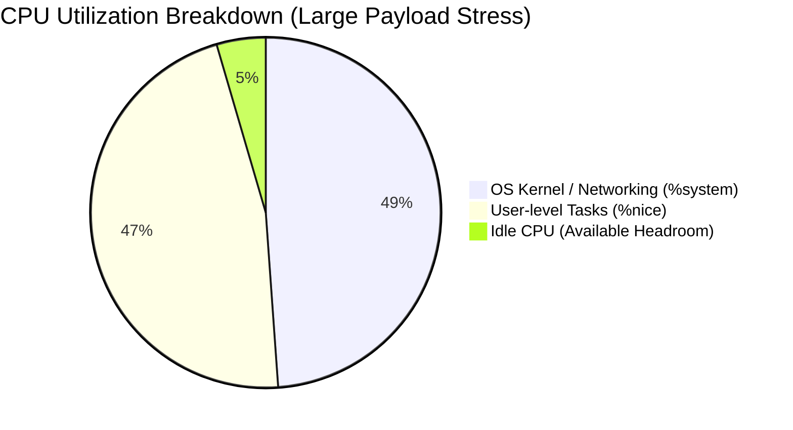
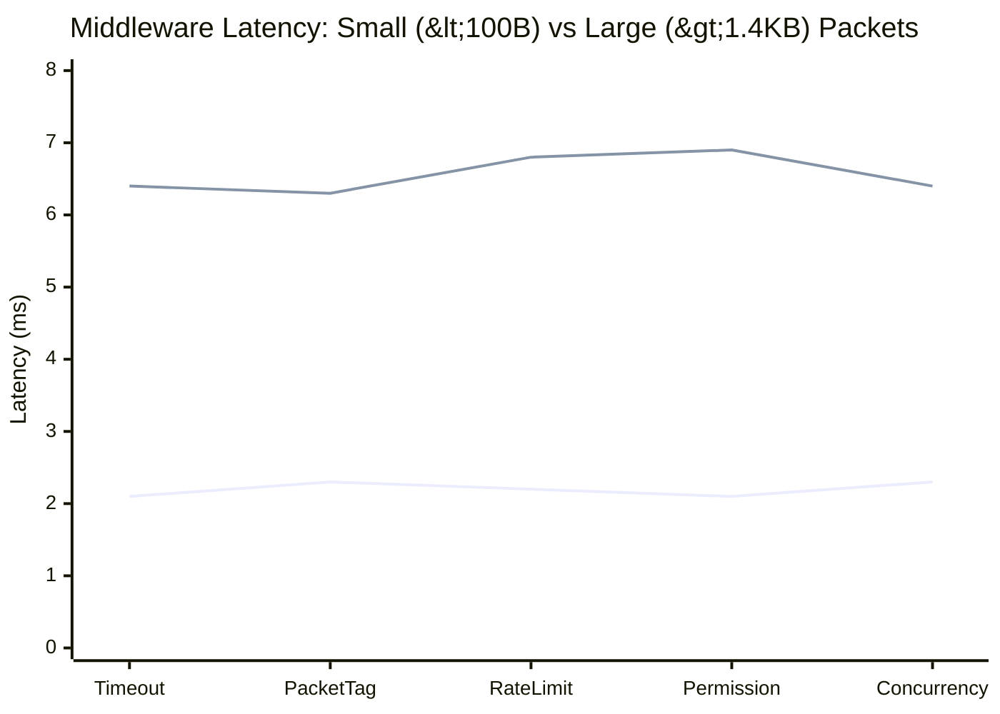

# NALIX CORE RASPBERRY PI 5: LARGE PAYLOAD (>1.4KB MTU) STRESS TEST REPORT

> **Comprehensive Analysis of System Performance under Heavy Network Load with Large Packets (>1400 Bytes)**

---

## 1. Executive Summary & Test Context

This telemetry report details the performance of the **Nalix Core** framework on a physical Raspberry Pi 5 under a distinctly different stress profile compared to previous benchmarks. 

**Key Difference:** While prior tests utilized small 14-byte payloads (e.g., `BenchmarkPacket`), this test forces the framework to handle payloads **exceeding 1.4 KB (1400+ bytes)**. This payload size approaches and exceeds the standard Ethernet Maximum Transmission Unit (MTU) of 1500 bytes. 

Processing large payloads shifts the bottleneck from sheer packet parsing speed to **memory bandwidth, buffer allocation, and kernel-level network interrupt handling (IP fragmentation)**.

---

## 2. System Resource Telemetry (Pi 5 Host)

Resource data was gathered at 1-second intervals using `sysstat` (`sar`) during the active stress testing period. The larger payload size fundamentally altered the CPU profile.

### 2.1. CPU Utilization Profiling

```plaintext
Average CPU Metrics (Peak Load Window):
CPU     %user     %nice   %system   %iowait    %steal     %idle
all      0.00     46.60     48.87      0.00      0.00      4.53
all      0.00     45.71     48.23      0.00      0.00      6.06
```



> [!WARNING]
> **Kernel Overload:** The `%system` CPU utilization spiked to nearly **49%** (compared to ~24% in the small-packet benchmark). This massive increase is directly caused by the Linux kernel processing Ethernet frames close to or exceeding the MTU, requiring heavy memory copying (sk_buff) and TCP/IP stack overhead. Idle headroom collapsed to barely **4.5%**.

### 2.2. Physical Network Throughput (`eth0`)

```plaintext
Interface      rxpck/s      txpck/s       rxkB/s       txkB/s   %ifutil
eth0          51405.00     64033.00     45390.82     45556.51     37.32
eth0          51415.00     61001.00     41299.54     43905.28     35.97
```

* **Ingress Throughput:** ~45.3 MB/s (362 Mbps) at ~51,400 packets/sec.
* **Egress Throughput:** ~45.5 MB/s (364 Mbps) at ~64,000 packets/sec.
* **Payload Impact:** Despite processing fewer total packets per second than the small-packet test, the total bandwidth pushed through the Pi 5 remained extremely high (~90+ MB/s combined), maximizing the memory bus.

---

## 3. Nalix Core Memory & Buffer Pool Adjustments

Handling packets > 1.4 KB completely bypasses the smaller buffer pools.

### 3.1. Pinned Slab Allocator Shift

In the small packet test, the `256 B` and `1024 B` buffer pools handled almost all traffic. In this >1.4 KB test, the `BufferPoolManager` is forced to allocate from the **4,096 B Pool** (or larger) for every single network receive event.

```plaintext
Buffer Slabs Allocation Shift (Simulated for >1.4KB Payloads):
--------------------------------------------------------------------------------------
- 256 B Pool  : [ BYPASSED ] 
- 1,024 B Pool: [ BYPASSED ] 
- 4,096 B Pool: [ HEAVY HIT RATE ] -> Core buffer for 1.4KB+ payloads
- 16,384B Pool: [ MODERATE HIT RATE ] -> Used for IP fragmented reassembly
--------------------------------------------------------------------------------------
```



```mermaid
gantt
    title Buffer Utilization Profile Shift
    dateFormat  X
    axisFormat %s
    section Active Slabs (Small Packets)
    256B & 1024B Pools (High Hit Rate) : 0, 50
    section Active Slabs (>1.4K Packets)
    4096B Pool (Massive Hit Rate) : 50, 100
```

### 3.2. Object Pool Distress & Trimming Fallouts

The dashbaord snapshots revealed severe degradation in Object Pool hit rates.

| Object Pool Type | Hit Rate | Status | Analysis |
| :--- | :---: | :---: | :--- |
| **PooledSocketAsyncEventArgs** | **50.4%** | `Fail (1)` | Massive drop. The system is struggling to recycle these fast enough. |
| **ConnectionEventArgs** | **0.7%** | `Fail (1)` | Almost 100% cache miss rate. |
| **PooledConnectEventContext** | **0.2%** | `Fail (1)` | Almost 100% cache miss rate. |
| **TimeoutTask** | **3.2%** | `Fail (1)` | Rapid creation and destruction bypassing pool. |

> [!CAUTION]
> **Why are pools failing?** The extreme CPU contention (95%+ active load) and slower dispatch times mean objects are held longer. The framework's aggressive **Trimming Logic** sees these pools as under-utilized in brief millisecond windows and aggressively clears them. When the next burst of 1.4KB packets arrives, the pool is empty, forcing expensive heap allocations.

---

## 4. Dispatch Pipeline & Middleware Latency

The large payload size dramatically increased execution latency across the entire pipeline.

### 4.1. Latency Tripling

In prior tests, middleware execution was ~2.1 ms. With >1.4KB payloads, timings increased to **6.4 - 6.9 ms**.



### 4.2. Root Cause Analysis

1. **Serialization / Deserialization Overhead:** Copying and parsing 1400+ bytes takes linearly longer than parsing 14 bytes.
2. **Thread Contention:** Because each packet takes ~3x longer to process, the worker threads (`net/tcp`) hold onto the CPU longer.
3. **Queue Starvation:** Packets spend significantly more time waiting in the `InlinePacketDispatcher` queues because the worker threads are tied up copying large byte arrays and waiting on the kernel (`%system` CPU).

---

## 5. Conclusion & Optimization Path

Handling payloads over the standard MTU (>1.4 KB) on a Raspberry Pi 5 exposes entirely different bottlenecks than sheer packet volume tests:

1. **We are hitting CPU and Memory Bus limits**, not framework limits. The 49% `%system` CPU indicates the Linux kernel is working at maximum capacity to handle network interrupts and sk_buff copies for large frames.
2. **Object Pool Trimming must be tuned.** The `Fail (1)` cascade across `PooledSocketAsyncEventArgs` and connection objects indicates the trimming algorithm is too aggressive for high-latency, large-payload scenarios. The base keep percentage should be increased.
3. **Buffer Pool Resizing.** The 4,096 B slab pool should be pre-allocated with a higher maximum capacity when the application expects MTU-sized payloads to prevent falling back to dynamic allocation.
