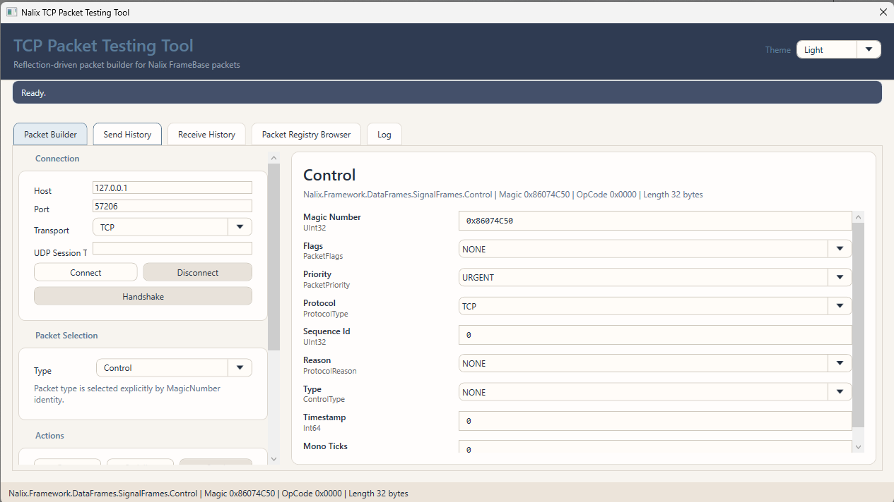
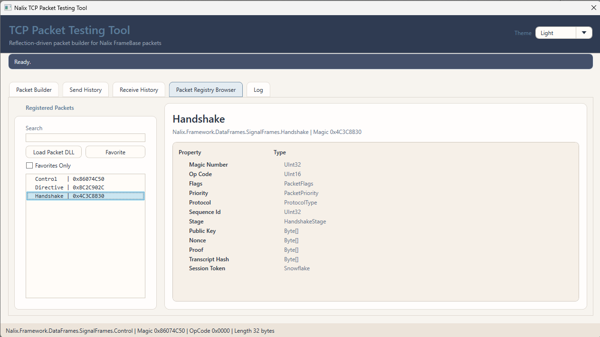

#  **Nalix SDK Tools**


Nalix SDK Tools is a comprehensive desktop utility suite designed for developers building, debugging, and monitoring applications within the Nalix ecosystem. It provides a visual interface for complex networking tasks, making it easier to inspect traffic and validate protocol behavior.

<p align="center">
  
  
</p>

## ✨ Features

- 🏗️ **Packet Builder** – Design and dispatch custom network packets with a real-time field editor.
- 🔍 **Hex Viewer Overlay** – Deep-dive into raw binary payloads with professional-grade hex visualization.
- 📡 **Registry Browser** – Explore all registered packet types, handlers, and protocols in your solution.
- 📜 **Log Monitor** – High-performance, real-time log streaming with advanced filtering and search.
- 🕒 **Packet History** – Record, analyze, and replay network communication sequences for debugging.
- 🎨 **Modern Interface** – Built with WPF and MVVM Toolkit for a smooth, responsive developer experience.

## 🚀 Getting Started

To run the SDK Tools from source:

1.  **Navigate** to the tools directory:
    ```bash
    cd tools/Nalix.SDK.Tools
    ```
2.  **Run** the application:
    ```bash
    dotnet run
    ```

## 🔧 Prerequisites

- **.NET 10 SDK** (required for compilation and execution).
- **Windows OS** (required for WPF desktop environment).
- **Nalix SDK** (automatically referenced via project dependencies).

---

<p align="center">
  Building high-performance distributed systems with ease.
</p>
